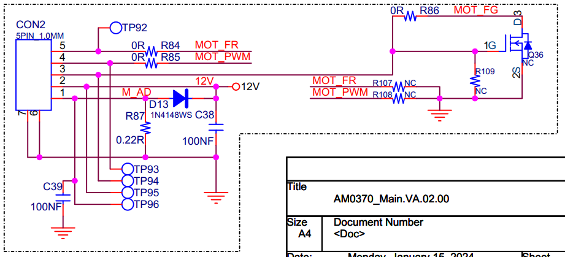

## 直流无刷电机（BLDC）概述

无刷直流电机（Brushless Direct Current Motor, BLDCM）克服了有刷直流电机的先天性缺陷，以电子换向器取代了机械换向器，所以无刷直流电机既具有直流电机良好的调速性能等特点，又具有交流电机结构简单、无换向火花、运行可靠和易于维护等优点。无刷直流电机的实质是直流电源输入，采用电子逆变器将直流电转换为交流电，有转子位置反馈的三相交流永磁同步电机。

描述中几个关键性词解释：
- 有刷直流电机的先天性缺陷：有刷电机的结构复杂，可靠性差，故障多，维护工作量大，寿命短，换向火花易产生电磁干扰等。
- 电子换向器：即电子逆变器。直流电通过逆变电路生成三相交流电驱动电机运转。

<br>

## BLDC在项目中的应用场合

### 原理图



<br>

### 驱动代码

驱动示例链接：https://git.breo.cn/804590/n5-mini-pro/-/tree/main/code/main_board/app/driver?ref_type=heads
- `drv_pwm_input.c`	`drv_pwm_gpio.c`
- `drv_pwm_input.h`	`drv_pwm_gpio.h`

``` c
// drv_pwm_gpio.h 接口文件

int timer_gpio_init(ETIMER_SOURSE tim,ETIMER_REMAP remap,ETIMER_CH channel,ETIMER_MODE mode);
```

``` c
// drv_pwm_input.h 接口文件

typedef enum{
	ETIMER_1 = 1,
	ETIMER_2,
	ETIMER_3,
	ETIMER_4,
	ETIMER_5,
	ETIMER_6,
	ETIMER_7,
	ETIMER_8
}ETIMER_SOURSE;

typedef enum{		//bit[11:10]
	ETR_REMAP_0 = 0,	
	ETR_REMAP_1,
	ETR_REMAP_2,
	ETR_REMAP_3
}ETIMER_REMAP;

typedef enum{		
	ETIMER_CH_1 = 1,	
	ETIMER_CH_2,
	ETIMER_CH_3,
	ETIMER_CH_4
}ETIMER_CH;
	
typedef enum{		
	ETIMER_MODE_NONE = 0X00,
	ETIMER_MODE_PWM = 0x01,
	ETIMER_MODE_INPUT = 0x10
}ETIMER_MODE;

typedef enum{	 
	EC_CMD_SET = 1,			
	EC_CMD_GET			
}ECONTROL_CMD;

typedef enum{	 
	EINPUT_NONE = 0,
	EINPUT_DONE = 1,
	EINPUT_TIMEOUT = 2
}EINPUTEVENT;

struct ec_pi_config
{
	uint32_t psc;				/* 预分频 0~0xFFFF */
    uint32_t period; 			/* 计数值  0~0xFFFF */
    ETIMER_MODE channel[4]; 	/* channel 1~4；参考ETIMER_MODE选择模式 */
    uint32_t value[4];   		/* pwm模式下pluse，input模式下FREQ */
};

struct ec_pwm_input_config
{
    uint8_t channel; 	/* channel 1~4 */
	uint32_t psc;		/* 预分频 1~65536 */
    uint32_t period; 	/* 计数值    0~0xFFFF */
    uint32_t value;   	/* pwm模式下pluse：在period范围内，input模式下FREQ */
};

struct  ec_tim_device
{
    TIM_Module* tim_handle;
	uint32_t int_clock;
	struct ec_pi_config pwm_input;
};

struct capture_list
{
    uint16_t ic_readvalue1;
	uint16_t ic_readvalue2;
	uint32_t captureflag;
	uint32_t capture;
	uint32_t timfreq;
	uint32_t timenterirqcnt;
	uint8_t first_input;
	uint8_t input_done;
	uint8_t timeout_flag;
	uint8_t timeout_status;
	uint32_t timeout;
};

int drv_hw_pwm_input_init(ETIMER_SOURSE tim,ETIMER_REMAP remap,ETIMER_CH channel,ETIMER_MODE mode);			//初始化
int drv_pwm_input_control(ETIMER_SOURSE tim, ETIMER_MODE mode, ECONTROL_CMD cmd,struct ec_pwm_input_config *pi);	//参数配置
int drv_pwm_input_enabled(ETIMER_SOURSE timx, ETIMER_CH channel,ETIMER_MODE mode,bool enable);				//pwm/inputcap使能
int drv_set_pwm_pulse_percent(ETIMER_SOURSE timx, ETIMER_CH channel,uint8_t percent);					//设置百分占空比
int drv_set_pwm_pulse_Thousandths(ETIMER_SOURSE timx, ETIMER_CH channel,uint16_t Thousandths);				//设置千分占空比
int tim_user_get_callback(ETIMER_SOURSE tim,ETIMER_CH channel,EINPUTEVENT event,uint32_t timfreq);			//inputcap开启后触发的回调函数
```

<br>

### 如何使用（示例如下）

驱动示例链接:https://git.breo.cn/804590/n5-mini-pro/-/blob/main/code/main_board/app/user/user_board.c?ref_type=heads

- `PWM`/`INPUTCAP`初始化
``` c
#define PWM_DEV_MOTOR1_HANDLE           ETIMER_4
#define PWM_DEV_MOTOR1_CH  				ETIMER_CH_1
#define PWM_DEV_MOTOR1_REMAP			ETR_REMAP_0
										
#define INPUT_DEV_MOTOR1_HANDLE         ETIMER_4
#define INPUT_DEV_MOTOR1_CH				ETIMER_CH_2
#define INPUT_DEV_MOTOR1_REMAP			ETR_REMAP_0

struct ec_pwm_input_config info1 = {PWM_DEV_MOTOR1_CH,2,1799,1800};		//20K,input和pwm一个通道需调整input超时时间
drv_hw_pwm_input_init(PWM_DEV_MOTOR1_HANDLEPWM_DEV_MOTOR1_REMAP,PWM_DEV_MOTOR1_CH,ETIMER_MODE_PWM);
drv_pwm_input_control(PWM_DEV_MOTOR1_HANDLEETIMER_MODE_PWM,EC_CMD_SET,&info1);
drv_pwm_input_enabled(PWM_DEV_MOTOR1_HANDLEPWM_DEV_MOTOR1_CH,ETIMER_MODE_PWM,ENABLE);
info1.channel = INPUT_DEV_MOTOR1_CH;
drv_hw_pwm_input_init(INPUT_DEV_MOTOR1_HANDLEINPUT_DEV_MOTOR1_REMAP,INPUT_DEV_MOTOR1_CHETIMER_MODE_INPUT);
drv_pwm_input_control(INPUT_DEV_MOTOR1_HANDLEETIMER_MODE_INPUT,EC_CMD_SET,&info1);
drv_pwm_input_enabled(INPUT_DEV_MOTOR1_HANDLEINPUT_DEV_MOTOR1_CH,ETIMER_MODE_INPUT,DISABLE);

```

- 应用接口代码封装
``` c
#define PIN_MOTOR1_FR              	53

void board_motor_dir_set(int8_t ch,bool en)		//设置电机方向，IO口初始化略
{
	if(ch == 0)
	{
	    pin_set_func(pin_handle(PIN_MOTOR1_FR), en);
	}
}

void board_motor_ch_set_en(int8_t ch, bool en)		//使能
{
    if(ch == 0)
	{
//      drv_pwm_input_enabled(PWM_DEV_MOTOR_HANDLE,PWM_DEV_MOTOR_CH,ETIMER_MODE_PWM,(MCENABLE)en);
		drv_pwm_input_enabled(INPUT_DEV_MOTOR1_HANDLE,INPUT_DEV_MOTOR1_CH,ETIMER_MODE_INPUT,en);
	}
}

#define MOTOR_PWM_REVERCE	1	//PWM值与转速正比：0，反之：1
void board_motor_ch_set_duty_cycle(int8_t ch, int8_t value) //设置电机占空比
{
    if (value < 0){
        value = 0;
	}
    if (value > 100){
        value = 100;
	}
	uint8_t real_percent;
#if MOTOR_PWM_REVERCE
	real_percent = 100 - value;
#else
	real_percent = value;
#endif
	
	if(ch == 0)
	{
//		logVerbose("ch0,value=[%d]",value);
		drv_set_pwm_pulse_percent(PWM_DEV_MOTOR1_HANDLE,PWM_DEV_MOTOR1_CH,real_percent);	
	}
}

static uint32_t timfreq_value[1];
static uint32_t tim_getcnts[1];
int tim_user_get_callback(ETIMER_SOURSE tim,ETIMER_CH channel,EINPUTEVENT event,uint32_t timfreq)	//编写输入捕获回调函数
{
	if(tim == ETIMER_4)
	{
		if(event == EINPUT_DONE)
		{
			tim_getcnts[0]++;
			timfreq_value[0] = timfreq;
//			logDebug("T5 channel=%d,timfreq=%d",channel,timfreq);
		}else if(event == EINPUT_TIMEOUT)
		{
			timfreq_value[0] = 0;
//			logDebug("T5  failed!");
		}
	}
	return 0;
}

uint32_t board_motor_ch_get_input_capture(int8_t ch)	//获取电机输入捕获频率
{
	uint32_t motor_input_freq = 0;
	if(ch == 0)
	{
		motor_input_freq = timfreq_value[0];
	}
	return motor_input_freq;
}

uint32_t board_motor_inputap_cnts_get(int8_t ch)	//获取电机输入捕获次数
{
	uint32_t motor_cnts = 0;
	if(ch == 0)
	{
		motor_cnts = tim_getcnts[0];
	}
	return motor_cnts;
}
```

- 应用于电机等模块