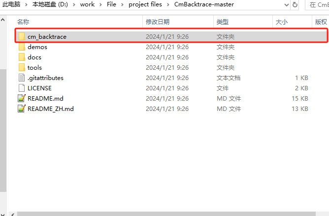

## CmBacktrace简介

- 支持断言（assert）和故障（Hard Fault）
- 故障原因自动诊断
- 输出错误现场的 函数调用栈
- 适配 Cortex-M0/M3/M4/M7 MCU；
- 支持 IAR、KEIL、GCC 编译器；

## 移植步骤

**1. 下载源码**

**官方源码地址** : https://github.com/armink/CmBacktrace
**示例项目地址** : https://github.com/XUAN9527/cmbacktrace-demo

**2. copy源码文件**



- 添加头文件`cm_backtrace.h` `cmb_cfg.h` `cmb_def.h`
- 添加源文件`cm_backtrace.c`
- 添加demos文件 `demos/non_os/stm32f10x/app/src/fault_test.c`
- 修改添加`fault_handler/gcc/cmb_fault.S`为`fault_handler/gcc/cmb_fault.s`

**2.1 添加修改makefile：**

``` c
ASM_SOURCES =  \
CMSIS/device/startup/startup_n32l40x_gcc.s \
components/cm_backtrace/fault_handler/gcc/cmb_fault.s #添加这一行
```

**2.2 添加printf重定向：**

``` c
int _write(int fd, char* pBuffer, int size)
{
    return drv_serial_dma_write(ESERIAL_1, pBuffer, size);
}
``` 

**2.3 修改文件：**

- `cmb_cfg.h`文件
``` c
#ifndef _CMB_CFG_H_
#define _CMB_CFG_H_

#include "log.h"

/* print line, must config by user */
#define cmb_println(...)  printf(__VA_ARGS__);printf("\r\n") /* e.g., printf(__VA_ARGS__);printf("\r\n")  or  SEGGER_RTT_printf(0, __VA_ARGS__);SEGGER_RTT_WriteString(0, "\r\n")  */
/* enable bare metal(no OS) platform */
#define CMB_USING_BARE_METAL_PLATFORM
/* enable OS platform */
/* #define CMB_USING_OS_PLATFORM */
/* OS platform type, must config when CMB_USING_OS_PLATFORM is enable */
/* #define CMB_OS_PLATFORM_TYPE           CMB_OS_PLATFORM_RTT or CMB_OS_PLATFORM_UCOSII or CMB_OS_PLATFORM_UCOSIII or CMB_OS_PLATFORM_FREERTOS or CMB_OS_PLATFORM_RTX5 */
/* cpu platform type, must config by user */
#define CMB_CPU_PLATFORM_TYPE   CMB_CPU_ARM_CORTEX_M4       /* CMB_CPU_ARM_CORTEX_M0 or CMB_CPU_ARM_CORTEX_M3 or CMB_CPU_ARM_CORTEX_M4 or CMB_CPU_ARM_CORTEX_M7 */
/* enable dump stack information */
#define CMB_USING_DUMP_STACK_INFO
/* language of print information */
#define CMB_PRINT_LANGUAGE    CMB_PRINT_LANGUAGE_ENGLISH        /* CMB_PRINT_LANGUAGE_ENGLISH(default) or CMB_PRINT_LANGUAGE_CHINESE */
#endif /* _CMB_CFG_H_ */
``` 

- 修改n32l40x_flash.ld链接文件
	- text段开始之前添加 `_stext = .;` 下面为例程：

``` c
/* Define output sections */
SECTIONS
{
  /* The startup code goes first into FLASH */
  .isr_vector :
  {
    . = ALIGN(4);
    KEEP(*(.isr_vector)) /* Startup code */
    . = ALIGN(4);
  } >FLASH

  _stext = .;				# text段开始之前添加

  /* The program code and other data goes into FLASH */
  .text :
  {
    . = ALIGN(4);
    *(.text)           /* .text sections (code) */
    *(.text*)          /* .text* sections (code) */
    *(.glue_7)         /* glue arm to thumb code */
    *(.glue_7t)        /* glue thumb to arm code */
    *(.eh_frame)

    KEEP (*(.init))
    KEEP (*(.fini))
```

- text段开始之前添加 `_sstack = .;` 下面为例程：

``` c
  .bss :
  {
    /* This is used by the startup in order to initialize the .bss secion */
    _sbss = .;         /* define a global symbol at bss start */
    __bss_start__ = _sbss;
    *(.bss)
    *(.bss*)
    *(COMMON)

    . = ALIGN(4);
    _ebss = .;         /* define a global symbol at bss end */
    __bss_end__ = _ebss;
  } >RAM

  _sstack = .;				# stack段开始之前添加

  /* User_heap_stack section, used to check that there is enough RAM left */
  ._user_heap_stack :
  {
    . = ALIGN(4);
    PROVIDE ( end = . );
    PROVIDE ( _end = . );
    . = . + _Min_Heap_Size;
    . = . + _Min_Stack_Size;
    _estack = .;        /* end of RAM */
    . = ALIGN(4);
  } >RAM
```

**2.4 main函数例程：**

``` c
#include "cm_backtrace.h"
#define HARDWARE_VERSION               "V1.0.0"
#define SOFTWARE_VERSION               "V0.1.0"

extern void fault_test_by_unalign(void);
extern void fault_test_by_div0(void);

int main(void)
{
    main_system_init();
	cm_backtrace_init("CmBacktrace", HARDWARE_VERSION, SOFTWARE_VERSION);
	
	fault_test_by_unalign();
    fault_test_by_div0();

    while(1)
    {
    }
}
```

**编译出错后代码：**
``` c 
Firmware name: CmBacktrace, hardware version: V1.0.0, software version: V0.1.0
Fault on interrupt or bare metal(no OS) environment
===== Thread stack information =====
  addr: 20004ec8    data: 5a6d79ca
  addr: 20004ecc    data: f758b4b7
  addr: 20004ed0    data: 94cfc3fd
  addr: 20004ed4    data: a8ccaa51
  addr: 20004ed8    data: 61049ca6
  addr: 20004edc    data: e4e1b169
  addr: 20004ee0    data: b48e100d
  addr: 20004ee4    data: c44eb7ea
  addr: 20004ee8    data: 23d4e51e
  addr: 20004eec    data: 8527b7c0
  addr: 20004ef0    data: fd9d41f7
  addr: 20004ef4    data: f539e421
  addr: 20004ef8    data: 4ad52963
  addr: 20004efc    data: 4587b423
  addr: 20004f00    data: e000ed00
  addr: 20004f04    data: 00000000
  addr: 20004f08    data: 00000000
  addr: 20004f0c    data: 00000000
  addr: 20004f10    data: 200022cc
  addr: 20004f14    data: 00000000
  addr: 20004f18    data: 00000000
  addr: 20004f1c    data: 00000000
  addr: 20004f20    data: 00000000
  addr: 20004f24    data: 08009093
====================================
=================== Registers information ====================
  R0 : 20002ee9  R1 : 20002e4c  R2 : e000ed14  R3 : 2000253c
  R12: 0000000a  LR : 0800a3b3  PC : 080154c2  PSR: 61000000
==============================================================
Usage fault is caused by attempts to execute an undefined instruction
Show more call stack info by run: addr2line -e CmBacktrace.elf -a -f 080154c2 0800a3b3 08009092
```

**转换为定位代码工具：**

- `linux`环境下输入：

```c
    addr2line -e app.elf -a -f 080154c2 0800a3b2 08009092
```

解释：`app.elf` 为你的工程编译文件。

**数据分析结果：**

``` c
xuan@DESKTOP-A52B6V9:~/work/n5-mini-s-plus/code/app/build$ addr2line -e app.elf -a -f 080154c2 0800a3b2 08009092
0x080154c2
fault_test_by_unalign
/home/xuan/work/n5-mini-s-plus/code/app/components/cm_backtrace/fault_test.c:18
0x0800a3b2
main
/home/xuan/work/n5-mini-s-plus/code/app/application/main.c:30
0x08009092
LoopFillZerobss
/home/xuan/work/n5-mini-s-plus/code/app/CMSIS/device/startup/startup_n32l40x_gcc.s:113
```
