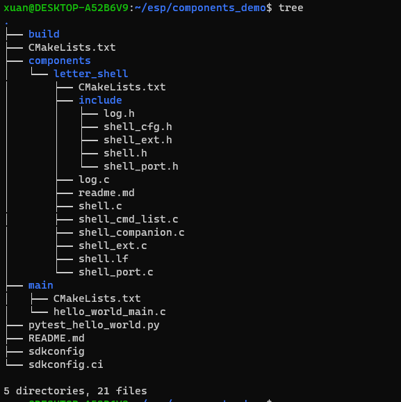
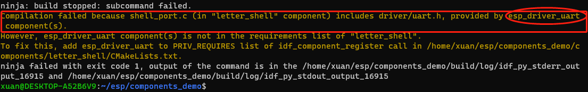

## ESP32 ESP-IDF自定义组件

### 简介

#### 官方文档
[英文官方文档链接](https://link.zhihu.com/?target=https%3A//docs.espressif.com/projects/esp-idf/en/latest/esp32/api-guides/build-system.html%23component-cmakelists-files)
[中文官方文档链接](https://link.zhihu.com/?target=https%3A//docs.espressif.com/projects/esp-idf/zh_CN/latest/esp32/api-guides/build-system.html%23id21)

#### 示例说明
此示例在《ESP32 smart_config和airkiss配网》
https://zhuanlan.zhihu.com/p/440454542
https://link.zhihu.com/?target=https%3A//blog.csdn.net/chentuo2000/article/details/121687760
基础上，增加连接成功后点亮板载LED功能。
实现所需功能后将各功能代码分离，再将分离后的代码构造成组件，使得项目有清晰的结构，方便功能代码移植.

### 开发环境
《Win10启用Linux子系统安装Ubuntu》
https://link.zhihu.com/?target=https%3A//blog.csdn.net/chentuo2000/article/details/112131624

《用乐鑫国内Gitee镜像搭建ESP32开发环境》
https://link.zhihu.com/?target=https%3A//blog.csdn.net/chentuo2000/article/details/113424934

### 构建项目

#### 拷贝 && 初始化例程
将例子项目`hello_world`复制到ESP-IDF开发工具之外,更名为components_demo:

	cd ~/esp
	cp -r ~/esp/esp-adf/esp-idf/examples/get-started/hello_world ./components_demo

清空build目录:

	cd ~/esp/components_demo
	rm -r build/*

注意，每当添加了新组件就要删除build目录下的全部内容，或者执行下面这条命令：

	idf.py fullclean

清除以前的构建。

#### 添加组件letter_shell

	idf.py -C components create-component letter_shell

该命令会创建一个新组件,新组件将包含构建组件所需的一组空文件。我们的工作就是在这一组空文件中写上我们的代码。
如果熟悉了组件结构，也可以直接在项目中手工创建。

#### 项目树
构建好的项目结构如下:



注意：组件目录components名字不能改，其下的组件名可以随意取。build目录是编译时生成的，编译的结果都放在其中。dependencies.lock是随原来的项目复制过来的不要改。sdkconfig文件可以用idf.py menuconfig命令修改。

### 代码和说明
各文件的位置关系很重要，请对照前面的项目树看代码文件。

#### 项目的根CMakeLists.txt文件

	# The following lines of boilerplate have to be in your project's
	# CMakeLists in this exact order for cmake to work correctly
	cmake_minimum_required(VERSION 3.16)

	include($ENV{IDF_PATH}/tools/cmake/project.cmake)
	project(components_demo)

只需要修改`project`中的项目名称。

#### main目录
CMakeLists.txt

	idf_component_register(SRCS "main.c"
                    INCLUDE_DIRS ".")

main.c
```c
#include <stdio.h>
#include <string.h>
#include "freertos/FreeRTOS.h"
#include "freertos/task.h"
#include "freertos/queue.h"
#include "esp_log.h"
#include "shell_port.h"
#include "log.h"
#include "nvs_flash.h"

static const char *TAG = "sample test";

void app_main(void)
{
	esp_err_t ret;

    // Initialize NVS.
    ret = nvs_flash_init();
    if (ret == ESP_ERR_NVS_NO_FREE_PAGES || ret == ESP_ERR_NVS_NEW_VERSION_FOUND) {
        ESP_ERROR_CHECK(nvs_flash_erase());
        ret = nvs_flash_init();
    }
    ESP_ERROR_CHECK( ret );

	esp_log_level_set(TAG, ESP_LOG_INFO);
	ESP_LOGI(TAG,"this is a test program");
    
	userShellInit();

	logInfo("log info!");
	logDebug("log debug!");
	logWarning("log warning!");
	logError("log error!");
	while(1)
	{
		logDebug("log loop!");
		vTaskDelay(pdMS_TO_TICKS(2000));
	}
}
```
头文件nvs_flash.h是对系统组件的引用，shell_port.h是对自定义组件的引用。

#### letter_shell组件

`CMakeLists.txt`:

	idf_component_register(
		SRCS "shell.c"
			"shell_ext.c"
			"log.c"
			"shell_port.c"
		INCLUDE_DIRS "include"
		LDFRAGMENTS "shell.lf"
		# PRIV_REQUIRES led
		REQUIRES esp_driver_uart
	)

##### 说明：

1、PRIV_REQUIRES
该参数指定对其它自定义组件的依赖，即私有依赖项。

`PRIV_REQUIRES led`表示指出在`smart_config`组件中要用到自定义的`led`组件。组件名字可以加引号，也可以不加。多个组件用空格分开。

2、 REQUIRES
该参数指定对系统组件的依赖，即公共依赖项。

`REQUIRES esp_driver_uart` 表示在`letter_shell`组件中要用到系统组件`esp_driver_uart`。

3、系统组件的确定

对于要依赖的系统组件不像私有依赖项那样一目了然，有时我们并不清楚所要的系统组件名称。比如我们不知道需要组件wpa_supplicant，这时我们可以先编译一次，看看错误信息：



在`CMakeLists.txt`中添加依赖组件`REQUIRES esp_driver_uart`，编译通过。

#### 关于CMakeLists.txt文件
根和每个目录都有一个`CMakeLists.txt`文件，开始遇到的问题是不知道目录结构和怎样写`CMakeLists.txt`文件，要注意每一层目录中`CMakeLists.txt`文件的写法，本文的例子给出了一个简单的示范。对于复杂的项目还需要更多编写`CMakeLists.txt`文件的知识，请看简介中给出的官方文档。

## ESP32移植Letter_shell问题

### 添加shell组件及其log，编译出错

#### 可能原因:
1) 宏使用不正确: 如果 SHELL_FREE 旨在实际释放与 `companions` 对象关联的内存或资源，则当前定义不正确。它应该调用内存管理函数或执行其他必要的清理任务。

1) 编译器警告被视为错误: `-Werror=unused-value` 标志已启用，它将警告视为错误。即使宏使用本身可能不是关键问题，这也可能导致编译失败。

#### 解决方案:

##### 修复 SHELL_FREE 定义:

1) 如果 `companions` 需要内存分配，请更新 `shell_cfg.h` 中的 SHELL_FREE 宏以调用适当的内存管理函数，例如 `free()`。
2) 如果 `companions` 不需要内存管理，请从 `shell_companion.c` 中的第 57 行删除 `SHELL_FREE` 调用；或者将`shell_cfg.h` 中的第 36 行 `SHELL_USING_COMPANION` 的宏定义改为 0。

##### 禁用 -Werror=unused-value (如果适用):

如果您希望将未使用的值警告视为警告而不是错误，您可以暂时在编译期间禁用 `-Werror=unused-value` 标志。但是，通常建议修复底层问题以避免潜在的内存泄漏或资源管理问题。

##### 其他提示:

1) 提供有关您的项目更多信息，例如具体的 ESP-IDF 版本、涉及的组件以及 `SHELL_FREE` 宏的用途。这将有助于了解根本原因并提供更定制的指导。
2) 分享 `shell_cfg.h` 头文件和 `shell_companion.c` 文件的相关部分，以便分析代码结构和上下文。
考虑使用调试器逐步执行代码并检查 `companions` 在 `SHELL_FREE` 调用之前和之后的 值，以了解其使用情况和潜在的内存管理问题。
3) 通过遵循这些步骤并提供更多信息，我可以帮助您有效地解决编译错误并确保您的 ESP-IDF 项目成功构建。

#### 配置shell优先级
将shell的freertos优先级设置为 `tskIDLE_PRIORITY`，为0级，跟空闲函数优先级一样，所有其他优先级任务执行完后才会执行 `tskIDLE_PRIORITY`优先级任务。

#### 源代码例程

[ESP32移植letter_shell组件例程](git@github.com:XUAN9527/components_demo.git)


