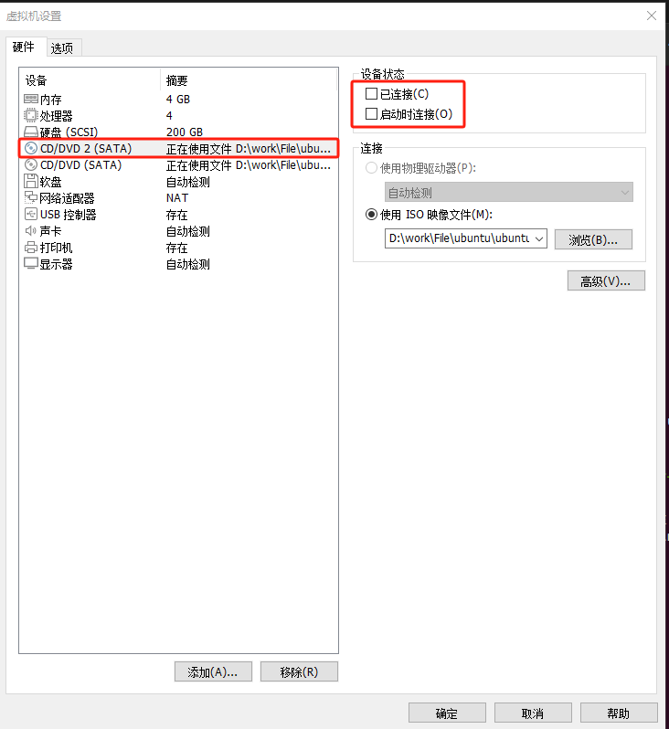
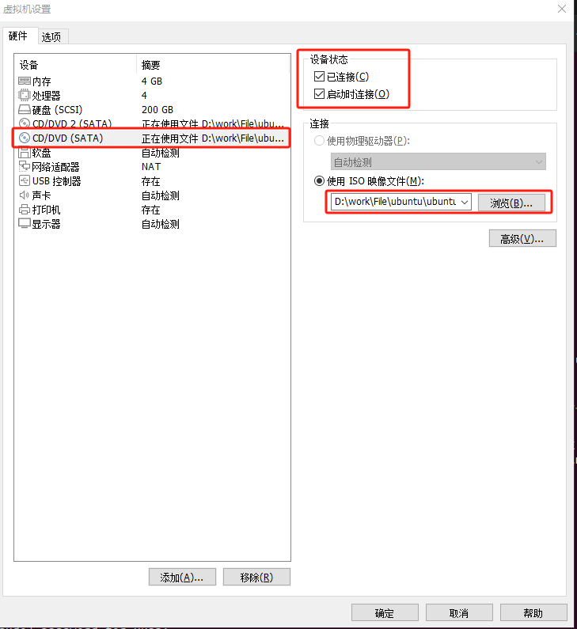
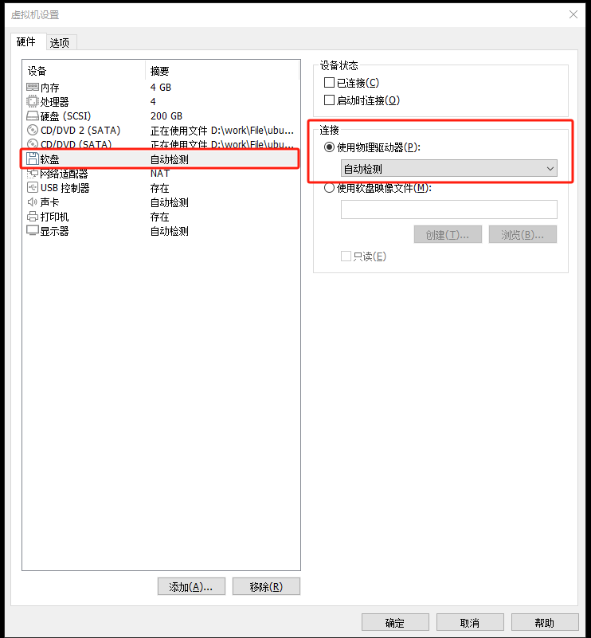
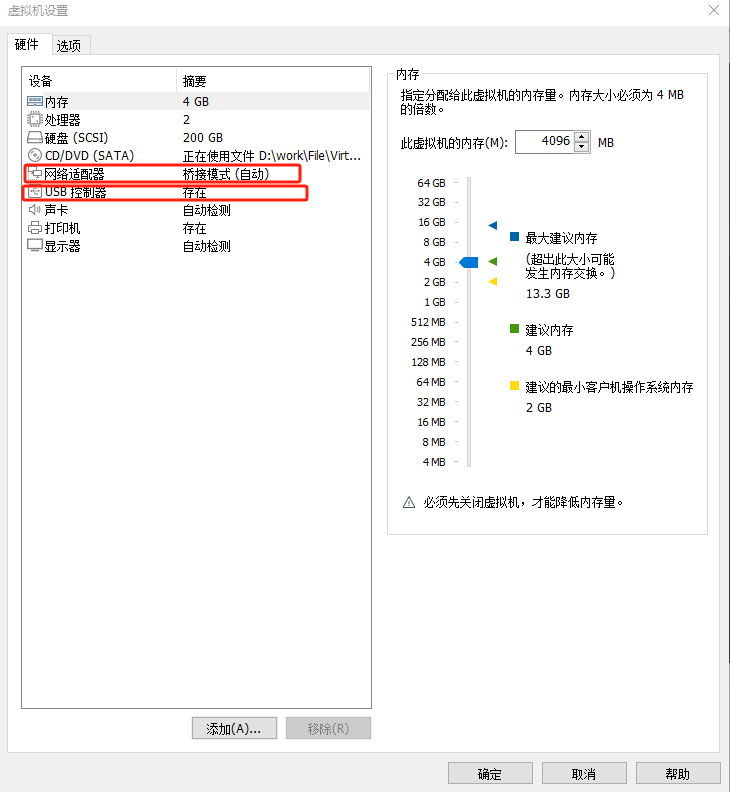
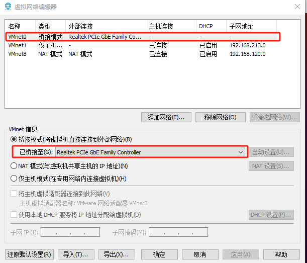
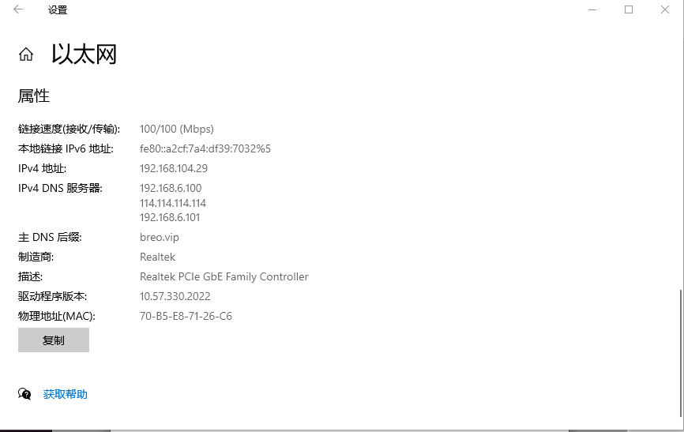
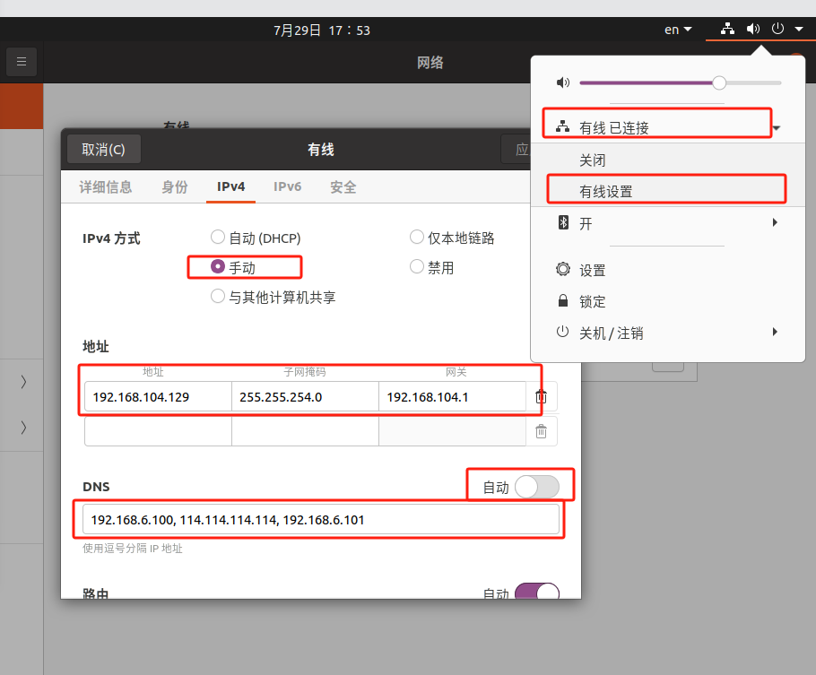
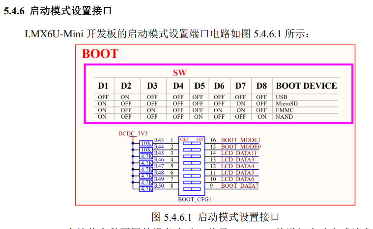

## 开发环境搭建

### 虚拟机安装

1. 下载安装VMware Workstation Pro工具。
2. 下载安装ubuntu 20.04 LTS系统镜像。
3. 快速创建虚拟机。
4. 配置虚拟机环境。
- 虚拟机-设置(见以下图片)：




- 网络适配器可按自己需要设置。


5. 启动虚拟机，进入`ubuntu`系统。
- 进入系统后会自动弹出`DVD`, 里面有`VMware Tools`的压缩包。
- 复制压缩包到`Donwnloads`目录下，解压。
- 执行`sudo ./vmware-install.pl`安装。 
- 解决Windows和Ubuntu之间复制粘贴问题。

	- 输入安装命令：sudo apt install open-vm-tools
	- 输入命令：sudo apt install open-vm-tools-desktop

**注意**：输入第一条命令后，等待安装，遇到选择`Y/N`，选择`Y`；第一条安装完成后，输入第二条命令，同样遇到选择`Y/N`，选择`Y`。
安装完毕后，切记：一定要**重新启动Linux系统**才可以双向复制粘贴。

### 虚拟机安装配置遇到的问题

[桥接模式资料(仅供参考)](https://segmentfault.com/a/1190000039918994)

- 尝试解决无法使用桥接使用与PC机相同IP上网
	- 虚拟网络编辑器-还原默认设置（该过程会卸载虚拟网卡，重新安装适配器）
	- 桥接模式启动
	- 笔试还不能关闭网络服务，`ubuntu`内部配置`IPv4`（先打开`PC主机`以太网，按下图所示手动填写`地址`和`DNS`）,重新启动网络服务。





- 虚拟机右下角的USB是灰的，不能链接/断开。

[参考资料](https://blog.csdn.net/weixin_44259058/article/details/127639566)
<br>

## Uboot移植

[参考资料](https://www.eet-china.com/mp/a68264.html)

### I.MX6ULL启动模式



### Uboot编译烧录

- 将`uboot`压缩文件`uboot-imx-rel_imx_4.1.15_2.1.1_ga_alientek_v2.4.tar.bz2`放到`/home/xuan/linux/`目录下。

- 将`uboot`文件`tar -xjvf uboot-imx-rel_imx_4.1.15_2.1.1_ga_alientek_v2.4.tar.bz2` 解压到该目录下。

- `cd /home/xuan/linux/uboot-imx-rel_imx_4.1.15_2.1.1_ga_alientek_v2.4`

- 编写以下脚本：(`mx6ull_14x14_evk_emmc.sh`)
``` shell
#!/bin/bash
make ARCH=arm CROSS_COMPILE=arm-linux-gnueabihf- distclean
make ARCH=arm CROSS_COMPILE=arm-linux-gnueabihf- mx6ull_alientek_emmc_defconfig
make ARCH=arm CROSS_COMPILE=arm-linux-gnueabihf- V=1 -j12
```
- 执行脚本：`./mx6ull_14x14_evk_emmc.sh`

#### Uboot烧录到SD卡

- 插上`SD卡`，启动`uboot`, `SD`卡和`EMMC`驱动检查:
``` shell
mmc dev 0
mmc info

mmc dev 1
mmc info
```
- 烧写验证与驱动测试
	- 挂载`SD卡`，不做描述，挂载上之后`ls /dev/sd*`显示。
	- 执行以下`shell`指令。
``` shell
cd ~/linux/uboot-alientek-v2.4		//进入uboot文件夹	
chmod 777 imxdownload 				//给予 imxdownload 可执行权限
./imxdownload u-boot.bin /dev/sdb 	//烧写到 SD 卡中，不能烧写到/dev/sda 或 sda1 里面
```

<br>

- `U-Boot` 图形化配置

``` shell
sudo apt-get install build-essential
sudo apt-get install libncurses5-dev

make mx6ull_alientek_emmc_defconfig
make menuconfig
```

- 配置网口的环境变量，开发板上的`ENET2`,上电进入`uboot`,打开的`USB_TTL`对应的串口控制台。
``` shell
env default -a;saveenv				//default好像有问题
setenv ipaddr 192.168.104.130		//开发板 ip 地址
setenv ethaddr b8:ae:1d:01:00:00	//开发板的MAC地址，一定要设置, 如有多块开发板，MAC需不一致
setenv gatewayip 192.168.104.1		//网关地址
setenv netmask 255.255.240.0		//子网掩码
setenv serverip 192.168.104.129		//服务器 IP 地址，也就是 Ubuntu 主机 IP 地址，用于调试代码。
saveenv
```

<br>

## Linux内核移植

### 移植步骤

**1. Ubuntu下搭建网络传输环境**

**1.1 搭建网络tftp服务**

- 执行以下指令，安装`xinetd`: 
``` shell
sudo apt-get install xinetd
```

- 查询`/etc/`下是否存在 `xinetd.conf` 文件，没有的话则自己新建一个。
``` shell
ls /etc/xinetd.conf
sudo vi /etc/xinetd.conf
```

- 创建出来的文件是空白的， 修改 `xinetd.conf` 文件内容如下：
``` shell
# Simple configuration file for xinetd
#
# Some defaults, and include /etc/xinetd.d/
defaults
{
# Please note that you need a log_type line to be able to use log_on_success
# and log_on_failure. The default is the following :
# log_type = SYSLOG daemon info
}
includedir /etc/xinetd.d
```

- 新建 `TFTP` 目录，这里建立在/home/xuan/linux 目录下，目录名为 tftp。将 tftp 目录赋予可读可写可执行权限。

``` shell
mkdir -p /home/xuan/linux/tftp
sudo chmod 777 /home/xuan/linux/tftp/
cd /home/xuan/linux/
ls
```

- 执行以下程序安装 `tftp-hpa` 和 `tftpd-hpa` 服务程序
``` shell
sudo apt-get install tftp-hpa tftpd-hpa
sudo vi /etc/default/tftpd-hpa
```

- 执行以下指令创建`/etc/xinetd.d/tftp`配置文件。（如果没有 `xinetd.d` 这个目录，可以先自己手动创建）,注意 `server_args = -s` 后面要添加自己的 `tftp` 工作路径。
``` shell
server tftp
{
socket_type = dgram
wait = yes
disable = no
user = root
protocol = udp
server = /usr/sbin/in.tftpd
server_args = -s /home/xuan/linux/tftp -c
#log_on_success += PID HOST DURATION
#log_on_failure += HOST
per_source = 11
cps =100 2
flags =IPv4
}
```

- 修改/添加 `tftp` 文件后， 执行以下指令重启 `tftpd-hpa`, 重启 `xinetd` 服务。
``` shell
sudo service tftpd-hpa restart
sudo service xinetd restart
```

- 确保网络环境正常，`Ubuntu`、`Windows`和`开发板`能相互 `ping` 通。
	- 开发板 IP： 192.168.104.130
	- 虚拟机 IP： 192.168.104.129
	- 电脑网口的 IP： 192.168.104.29

<br>

**1.2 搭建网络nfs服务**

- 在 `Ubuntu` 终端执行以下指令安装 `NFS`
``` shell
sudo apt-get install nfs-kernel-server
```

- 新建 `NFS` 共享目录，并给予 `NFS` 目录可读可写可执行权限。
``` shell
sudo mkdir /home/xuan/linux/nfs
sudo chmod 777 /home/xuan/linux/nfs/
```

- 执行以下指令打开 `etc/exports` 文件
``` shell
sudo vi /etc/exports
```

- 进入 `etc/exports` 文件，在最后添加如下内容
``` shell
/home/alientek/linux/nfs *(rw,sync,no_root_squash)
```

`/home/alientek/linux/nfs` 表示 `NFS` 共享的目录
`*`表示允许所有的网络段访问
`rw` 表示访问者具有可读写权限
`sync` 表示将缓存写入设备中，可以说是同步缓存的意思
`no_root_squash` 表示访问者具有 `root` 权限。

- 执行以下指令重启 `NFS` 服务器, 查看 `NFS` 共享目录。
``` shell
sudo /etc/init.d/nfs-kernel-server restart
showmount -e
```

- 设置 `NFS` 服务开机自启
``` shell
sudo systemctl enable nfs-kernel-server
sudo reboot
```

- 测试 `NFS` 服务，执行以下指令设置开发板 `IP`，创建一个 `get` 目录，将虚拟机（`192.168.104.129`） `NFS` 共享目
录挂载到到开发板的 `get` 目录中。
``` shell
mkdir get
mount -t nfs -o nolock,nfsvers=3 192.168.104.129:/home/xuan/linux/nfs get/
```

- 查看挂载的 `NFS` 目录：`df`, 显示如下：
``` shell
192.168.104.129:/home/xuan/linux/nfs 204795392 14416896 179902464   8% /home/root/get
```
- 卸载 `NFS` 目录：`umount get`

<br>

**2. 拷贝内核文件**

- 将内核压缩文件`linux-imx-rel_imx_4.1.15_2.1.1_ga_alientek_v2.4.tar.bz2`放到`/home/xuan/linux/linux-imx-rel_imx_4.1.15_2.1.1_ga_alientek_v2.4`目录下。

- 将内核文件`tar -xjvf linux-imx-rel_imx_4.1.15_2.1.1_ga_alientek_v2.4.tar.bz2` 解压到该目录下。

**3. 编译内核文件**

按以下步骤进行编译：
``` shell
make clean 					//第一次编译 Linux 内核之前先清理一下
make imx_v7_mfg_defconfig 	//配置 Linux 内核
make -j16					//编译 Linux 内核
```
发现编译报错：
``` shell
  LZO     arch/arm/boot/compressed/piggy.lzo
/bin/sh: 1: lzop: not found
make[2]: *** [arch/arm/boot/compressed/Makefile:180：arch/arm/boot/compressed/piggy.lzo] 错误 1
make[1]: *** [arch/arm/boot/Makefile:52：arch/arm/boot/compressed/vmlinux] 错误 2
make: *** [arch/arm/Makefile:316：zImage] 错误 2
make: *** 正在等待未完成的任务....
```
解决方法：
1. 安装lzop：sudo apt install lzop
2. 添加lzop到环境变量：export PATH=$PATH:/usr/bin(直接安装的不需要添加环境变量)
3. 重新编译：make -j16

<br>

- 若执行 `./mx6ull_alientek_emmc.sh`

发现编译报错：
``` shell
<command-line>: fatal error: curses.h: 没有那个文件或目录
```
解决方法：
- 执行 `make ARCH=arm CROSS_COMPILE=arm-linux-gnueabihf- menuconfig` 后报错 `fatal error:curses.h:`没有那个文件或目录，这个是少了某个库，执行如下指令安装库：
```
sudo apt-get install libncurses*
```

<br>

**4. 整理编译后的镜像文件**

`Linux` 内核编译完成以后会在 `arch/arm/boot` 目录下生成 `zImage` 镜像文件，如果使用设备树
的话还会在 `arch/arm/boot/dtb` 目录下开发板对应的.dtb(设备树)文件，比如 `imx6ull-alientek-emmc.dtb`
就是 `NXP` 官方的 `I.MX6ULL EVK开发板`对应的设备树文件。至此我们得到两个文件：
- `Linux` 内核镜像文件： `zImage。`
- `NXP`官方`I.MX6ULL EVK开发板`对应的设备树文件： imx6ull-alientek-emmc.dtb。

<br>

**5. 内核启动测试**

- 修改`uboot` 中的环境变量 `bootargs`
``` shell
console=ttymxc0,115200 root=/dev/mmcblk1p2 rootwait rw
```

- 将上一小节编译出来的 `zImage` 和 `imx6ull-alientek-emmc.dtb` 复制到 `Ubuntu` 中的 `tftp` 目录下，
因为我们要在 `uboot` 中使用 `tftp` 命令将其下载到开发板中，拷贝命令如下：
``` shell
cp arch/arm/boot/zImage /home/xuan/linux/tftpboot/ -f
cp arch/arm/boot/dtb/imx6ull-alientek-emmc.dtb /home/xuan/linux/tftpboot/ -f
```

- 拷贝完成以后就可以测试了，启动开发板，进入 `uboot` 命令行模式，然后输入如下命令将
`zImage` 和 `imx6ull-alientek-emmc.dtb` 下载到开发板中：

**从tftp启动：**
``` shell
tftp 80800000 zImage
tftp 83000000 imx6ull-alientek-emmc.dtb
bootz 80800000 - 83000000
```

**从EMMC启动：**
``` shell
fatload mmc 1:1 80800000 zImage
fatload mmc 1:1 83000000 imx6ull-alientek-emmc.dtb
bootz 80800000 - 83000000
```
或者在uboot中保存环境变量：
``` shell
setenv bootcmd 'mmc dev 1;fatload mmc 1:1 80800000 zImage;fatload mmc 1:1 83000000 imx6ull-alientek-emmc.dtb;bootz 80800000 - 83000000'
setenv bootargs 'console=ttymxc0,115200 root=/dev/mmcblk1p2 rootwait rw'
saveenv
```

<br>

### 从网络启动Linux系统

[移植参考资料](https://blog.angustar.com/archives/system-migration-and-rootfs-construction-based-on-i-mx6ull-2.html)

#### 使用`tftpboot`启动传输。

- 拨码到从`SD`卡启动，开发板上电/`RESET`，进入`uboot`。
- 在`uboot`配置`bootargs`和`bootcmd`参数并保存。

``` shell
//`root=/dev/mmcblk1p2 rootwait rw` 为使用 eMMC 中已有的根文件系统
setenv bootargs 'console=ttymxc0,115200 root=/dev/mmcblk1p2 rootwait rw'	
setenv bootcmd 'tftp 80800000 zImage; tftp 83000000 imx6ull-alientek-emmc.dtb; bootz 80800000 - 83000000'
saveenv
```
- 输入`boot`启动

#### 使用`nfs`挂载`rootfs`。

- 拨码到从`SD`卡启动，开发板上电/`RESET`，进入`uboot`。
- 在`uboot`配置`bootargs`参数并保存。
``` shell
setenv bootargs 'console=ttymxc0,115200 root=/dev/nfs nfsroot=192.168.104.129:/home/xuan/linux/nfs/rootfs,proto=tcp rw ip=192.168.104.130:192.168.104.129:192.168.104.1:255.255.240.0::eth0:off' 		//设置 bootargs
saveenv 				//保存环境变量
```
- 输入`boot`启动

<br>

**Error solving**

[参考资料]：https://blog.csdn.net/weixin_44256228/article/details/113830253)

- 显示挂载失败，一大堆错误，显示没挂载上
- `IMX6ULL`通过NFS挂载根文件系统失败的方法
	- 修改`/etc/default/nfs-kernel-server`
``` shell
sudo vi /etc/default/nfs-kernel-server
```
- `nfs-kernel-server`文件修改内容如下：
``` shell
# Number of servers to start up
#RPCNFSDCOUNT=8
RPCNFSDCOUNT="-V 2 8"

# Runtime priority of server (see nice(1))
RPCNFSDPRIORITY=0

# Options for rpc.mountd.
# If you have a port-based firewall, you might want to set up
# a fixed port here using the --port option. For more information, 
# see rpc.mountd(8) or http://wiki.debian.org/SecuringNFS
# To disable NFSv4 on the server, specify '--no-nfs-version 4' here
#RPCMOUNTDOPTS="--manage-gids"
RPCMOUNTDOPTS="-V 2 --manage-gids"

# Do you want to start the svcgssd daemon? It is only required for Kerberos
# exports. Valid alternatives are "yes" and "no"; the default is "no".
NEED_SVCGSSD=""

# Options for rpc.svcgssd.
RPCSVCGSSDOPTS="--nfs-version 2,3,4 --debug --syslog"
```
- 重启NFS服务器
``` shell
sudo service nfs-kernel-server restart
```
- 重新开机挂载，问题解决。

<br>

## Linux驱动开发

### 老字符驱动开发（手动创建节点）

- `led`驱动的`Makefile`文件如下：
``` maekfile
KERNELDIR := /home/xuan/linux/linux-ga
CURRENT_PATH := $(shell pwd)
obj-m := led.o
build: kernel_modules
kernel_modules:
$(MAKE) -C $(KERNELDIR) M=$(CURRENT_PATH) modules
clean:
$(MAKE) -C $(KERNELDIR) M=$(CURRENT_PATH) clean
```

- `make`编译, 生成`led.ko`文件, 这个是内核模块（Kernel Module）文件，很重要。

- 编译`app`文件，输入如下命令：
arm-linux-gnueabihf-gcc ledApp.c -o ledApp

- 复制到`rootfs`中，若没有`rootfs/lib/modules/4.1.15/`,先建立文件夹，输入如下命令：
```
mkdir -p /home/xuan/linux/nfs/rootfs/lib/modules/4.1.15/
sudo cp led.ko led /home/xuan/linux/nfs/rootfs/lib/modules/4.1.15/ -f
```

- `nfs`挂载`rootfs`，进入开发板
``` shell
cd /lib/modules/4.1.15
```
``` shell
depmod 					//第一次加载驱动的时候需要运行此命令
insmod led.ko
或者
modprobe led.ko 		//加载 led.ko 驱动文件
```
``` shell
cat /proc/devices		//查看当前系统中有没有 led 这个设备
mknod /dev/led c 200 0		//创建设备节点文件
./ledApp /dev/led 1		//亮灯
./ledApp /dev/led 0		//灭灯
```
``` shell
rmmod led.ko
或者
modprobe -r led.ko 		//卸载 led.ko 驱动文件
```

<br>

### 老字符驱动开发（自动创建节点）

- 编写 `Makefile` 文件
``` shell
KERNELDIR := /home/xuan/linux/linux-ga
CURRENT_PATH := $(shell pwd)

obj-m := newchrled.o

build: kernel_modules

kernel_modules:
	$(MAKE) -C $(KERNELDIR) M=$(CURRENT_PATH) modules

clean:
	$(MAKE) -C $(KERNELDIR) M=$(CURRENT_PATH) clean
```

- 编译出驱动模块文件,编译成功以后就会生成一个名为`newchrled.ko`的驱动模块文件
``` shell
cd ~/linux/drivers/03_newchrled
make -j32
arm-linux-gnueabihf-gcc ledApp.c -o ledApp
cp ledApp newchrled.ko ~/linux/nfs/rootfs/lib/modules/4.1.15
```

- 重新上电运行开发板
``` shell
cd /lib/modules/4.1.15
depmod 						//第一次加载驱动的时候需要运行此命令
modprobe newchrled.ko 		//加载驱动
ls /dev/newchrled -l		//查看/dev/newchrdev 这个设备节点文件是否存在
./ledApp /dev/newchrled 1 	//打开 LED 灯
./ledApp /dev/newchrled 0 	//关闭 LED 灯
rmmod newchrled.ko
```

<br>

### Linux 设备树

以LED点灯驱动为例主要步骤：

- 修改设备树(.dts文件),跟根节点下添加设备子节点，子节点添加属性，举例：
``` dts
alphaled {
	#address-cells = <1>;
	#size-cells = <1>;
	compatible = "atkalpha-led";
	status = "okay";
	reg = < 0X020C406C 0X04 /* CCM_CCGR1_BASE */
	0X020E0068 0X04 /* SW_MUX_GPIO1_IO03_BASE */
	0X020E02F4 0X04 /* SW_PAD_GPIO1_IO03_BASE */
	0X0209C000 0X04 /* GPIO1_DR_BASE */
	0X0209C004 0X04 >; /* GPIO1_GDIR_BASE */
};
```
- 在`linux`目录下重新编译设备树：`make dtbs`
- 编译完成以后得到`imx6ull-alientek-emmc.dtb`，使用新的 `imx6ull-alientek-emmc.dtb`启动`Linux`内核
- `Linux`启动成功以后进入到`/proc/device-tree/`目录中查看是否有`alphaled`这个节点,若没有则修改失败
- 编写`dtsled.c`文件和文件`ledApp.c`,修改`Makefile`中的`KERNELDIR`参数为`/home/xuan/linux/linux-ga`
``` shell
make -j32
arm-linux-gnueabihf-gcc ledApp.c -o ledApp
```
- 编译出来的`dtsled.ko`和`ledApp`这两个文件拷贝到`rootfs/lib/modules/4.1.15`目录中，**重启开发板**，进入到目录`lib/modules/4.1.15`中，输入如下命令加载`dtsled.ko`驱动模块：
``` shell
depmod 				//第一次加载驱动的时候需要运行此命令
modprobe dtsled.ko 		//加载驱动
./ledApp /dev/dtsled 1 		//打开 LED 灯
./ledApp /dev/dtsled 0 		//关闭 LED 灯
rmmod dtsled.ko
```

<br>

### pinctrl 和 gpio 子系统实验

#### pinctrl 子系统介绍

`pinctrl` 子系统主要工作内容如下：
- 获取设备树中 `pin` 信息。
- 根据获取到的 `pin` 信息来设置 `pin` 的复用功能
- 根据获取到的 `pin` 信息来设置 `pin` 的电气特性，比如上/下拉、速度、驱动能力等。

对于我们使用者来讲，只需要在设备树里面设置好某个 `pin` 的相关属性即可，其他的初始化工作均由 `pinctrl` 子系统来完成， `pinctrl` 子系统源码目录为 `drivers/pinctrl`。

<br>

#### 设备树中添加 pinctrl 节点模板

- 创建对应的节点，打开 `imx6ull-alientek-emmc.dts`，在 `iomuxc` 节点中的 `imx6ul-evk` 子节点下添加 “`pinctrl_test`” 节点
- 添加 “`fsl,pins`” 属性，名字一定要为“`fsl,pins`”，因为对于 `I.MX` 系列 `SOC` 而言， `pinctrl` 驱动程序是通过读取“`fsl,pins`”属性值来获取 `PIN` 的配置信息

``` dts
pinctrl_test: testgrp {
	/* 具体的 PIN 信息 */
		fsl,pins = <
			MX6UL_PAD_GPIO1_IO00__GPIO1_IO00 config 	/*config 是具体设置值*/
		>;
	};
};
```
- 至此，我们已经在 `imx6ull-alientek-emmc.dts` 文件中添加好了 `test` 设备所使用的 `PIN` 配置信息。

<br>

#### gpio子系统

<br>

#### gpio实验

- 添加 `pinctrl` 节点, ，打开 `imx6ull-alientekemmc.dts`，在 `iomuxc` 节点的 `imx6ul-evk` 子节点下创建一个名为“`pinctrl_led`”的子节点
``` dts
pinctrl_led: ledgrp {
	fsl,pins = <
		MX6UL_PAD_GPIO1_IO03__GPIO1_IO03 0x10B0 /* LED0 */
	>;
};
```

- 添加 `LED` 设备节点, 在根节点“`/`”下创建 `LED` 灯节点，节点名为“`gpioled`”
``` dts
gpioled {
	#address-cells = <1>;
	#size-cells = <1>;
	compatible = "atkalpha-gpioled";
	pinctrl-names = "default";
	pinctrl-0 = <&pinctrl_led>;
	led-gpio = <&gpio1 3 GPIO_ACTIVE_LOW>;
	status = "okay";
};
```

- 检查 `PIN` 是否被其他外设使用
	- 检查 `pinctrl` 设置。
	- 如果这个 `PIN` 配置为 `GPIO` 的话，检查这个 `GPIO` 有没有被别的外设使用。
- 在本章实验中 `LED` 灯使用的 `PIN` 为 `GPIO1_IO03`，在 `imx6ull-alientek-emmc.dts` 中，先检查 `GPIO_IO03` 这个 `PIN` 有没有被其他的 `pinctrl` 节点使用。
- 如别的模块有使用到`GPIO_IO03`，需要注释掉。

<br>

### Linux 蜂鸣器实验

- 打开`imx6ull-alientekemmc.dts`，在 `iomuxc` 节点的 `imx6ul-evk` 子节点下创建一个名为“`pinctrl_beep`”的子节点
``` dts
pinctrl_beep: beepgrp {
	fsl,pins = <
		MX6ULL_PAD_SNVS_TAMPER1__GPIO5_IO01 0x10B0 /* beep */
	>;
};
```

- 在根节点“`/`”下创建 `BEEP` 节点，节点名为“`beep`”
``` dts
beep {
	#address-cells = <1>;
	#size-cells = <1>;
	compatible = "atkalpha-beep";
	pinctrl-names = "default";
	pinctrl-0 = <&pinctrl_beep>;
	beep-gpio = <&gpio5 1 GPIO_ACTIVE_HIGH>;
	status = "okay";
};
```

- 检查 `PIN` 是否被其他外设使用
- 蜂鸣器驱动程序编写
- 编写测试 `APP`
- 编译驱动程序: `make -j32`
- 编译测试 `APP`: `arm-linux-gnueabihf-gcc beepApp.c -o beepApp`
- 开发板运行测试
``` shell
depmod 			//第一次加载驱动的时候需要运行此命令
modprobe beep.ko 	//加载驱动
./beepApp /dev/beep 1 	//打开蜂鸣器
./beepApp /dev/beep 0 	//关闭蜂鸣器
rmmod beep.ko
```

<br>

