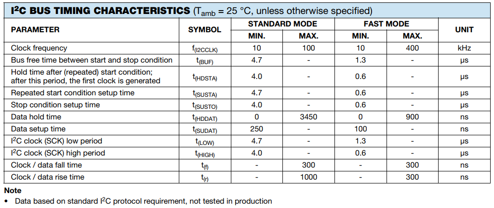
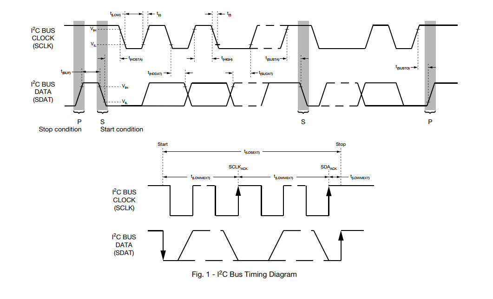
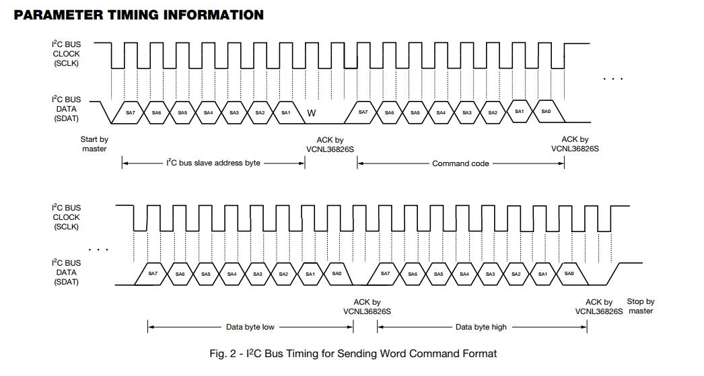
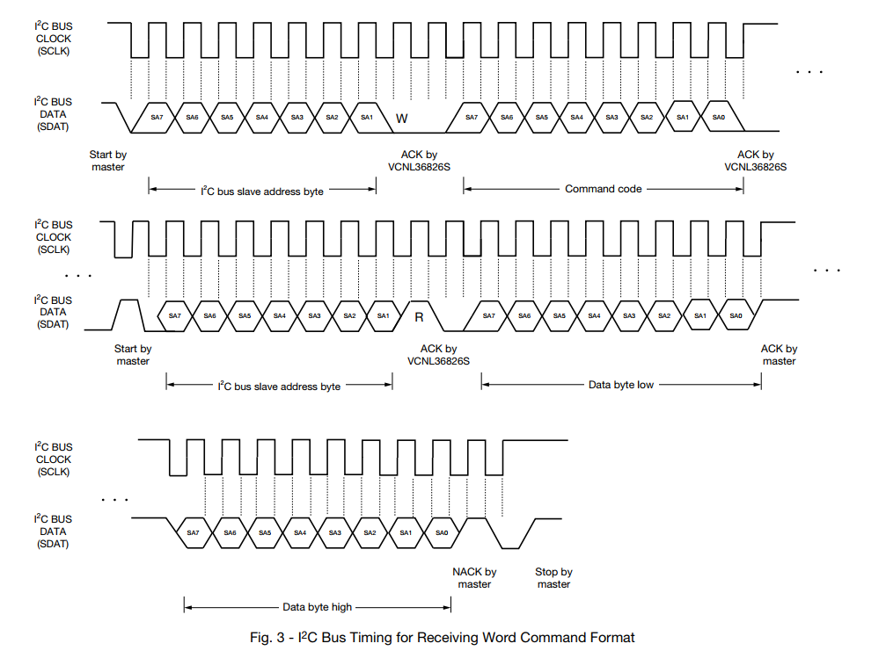
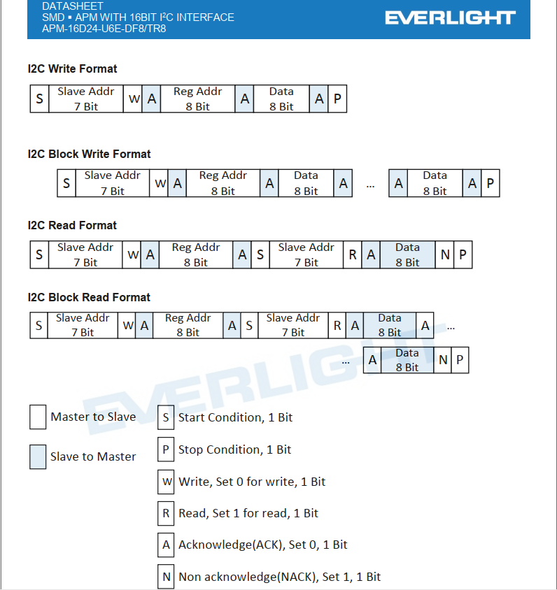

## I2C基本原理介绍

### 时序介绍
参考Vishay的i2c时序图：




### 代码实现详解
I2C协议实现有硬件I2C和软件I2C之分，这里只讲解软件I2C实现的版本。一下列出主要结构体和初始化函数。

#### I2C协议初始化
I2C协议的scl和sda配置为开漏输出,需要外部上拉（一般为10K电阻）
``` bash
#define i2c_pin_mode(pin,mode)		drv_pin_mode(pin,mode)
#define i2c_pin_write(pin,level) 	drv_pin_write(pin,level)
#define i2c_pin_read(pin) 		drv_pin_read(pin)

#define DRV_I2C_WR                      0x00
#define DRV_I2C_RD                      (1u << 0)
#define DRV_I2C_ADDR_10BIT              (1u << 2)  /* this is a ten bit chip address */
#define DRV_I2C_NO_START                (1u << 4)
#define DRV_I2C_IGNORE_NACK             (1u << 5)
#define DRV_I2C_NO_READ_ACK             (1u << 6)  /* when I2C reading, we do not ACK */
#define DRV_I2C_NO_STOP                 (1u << 7)

typedef enum{
	EI2C_DEV_1 = 1,
	EI2C_DEV_2,
	EI2C_DEV_3
}EI2C_DEVICE;

struct drv_soft_i2c_config
{
	uint8_t scl;
	uint8_t sda;
	uint8_t i2c_num;
};

struct drv_i2c_msg
{
    uint16_t addr;
    uint16_t flags;
    uint16_t len;
	uint8_t reg_addr;
    uint8_t  *buf;
};

struct drv_i2c_bit_ops
{
    void *data;            /* private data for lowlevel routines */
    void (*set_sda)(void *data, int state);
    void (*set_scl)(void *data, int state);
    int (*get_sda)(void *data);
    int (*get_scl)(void *data);

    void (*udelay)(uint32_t us);

    uint32_t delay_us;  /* scl and sda line delay */
    uint32_t timeout;   /* in tick */
};

struct drv_i2c_bus_device
{
	struct drv_i2c_msg msg;
	struct drv_i2c_bit_ops ops;
};

static void drv_i2c_gpio_init(struct drv_soft_i2c_config *i2c)
{
    struct drv_soft_i2c_config* cfg = i2c;

    i2c_pin_mode(cfg->scl, I2C_PIN_MODE_OUTPUT_OD);	//PIN_MODE_OUTPUT
    i2c_pin_mode(cfg->sda, I2C_PIN_MODE_OUTPUT_OD);

    i2c_pin_write(cfg->scl, I2C_PIN_HIGH);
    i2c_pin_write(cfg->sda, I2C_PIN_HIGH);
}

int drv_hw_i2c_init(EI2C_DEVICE dev_e)
{
	int size = sizeof(i2c_pin_config)/sizeof(struct drv_soft_i2c_config);
	struct drv_i2c_bus_device *dev = get_i2c_device(dev_e);
	uint8_t dev_num = (uint8_t)dev_e;
	struct drv_soft_i2c_config *pin_cfg = NULL;
	struct drv_i2c_bit_ops *ops = &dev->ops;
	
	for(int i=0;i<size;i++)
	{
		if(i2c_pin_config[i].i2c_num == dev_num)
		{
			pin_cfg = (struct drv_soft_i2c_config *)&i2c_pin_config[i];
			break;
		}
	}
	if(pin_cfg == NULL)
		return -1;
    ops->data  = (void*)pin_cfg;
    ops->set_sda  = n32_set_sda;
    ops->set_scl  = n32_set_scl;
    ops->get_sda  = n32_get_sda;
    ops->get_scl  = n32_get_scl;
    ops->udelay   = n32_udelay;
    ops->delay_us = 1;
    ops->timeout  = 5;
    
    drv_i2c_gpio_init(pin_cfg);
    drv_i2c_bus_unlock(pin_cfg);
    return 0;
}
```

#### 接口函数
``` bash
int drv_i2c_bit_xfer(struct drv_i2c_bit_ops *bus,
                 struct drv_i2c_msg msgs[],
                 uint32_t num);
struct drv_i2c_bus_device *get_i2c_device(EI2C_DEVICE dev_e);
static uint64_t i2c_tick_get(void);
int drv_hw_i2c_init(EI2C_DEVICE dev_e);
int drv_i2c_send_data(EI2C_DEVICE dev_e,uint16_t addr,uint8_t reg_addr,uint8_t *buf,uint16_t len);
int drv_i2c_recv_data(EI2C_DEVICE dev_e,uint16_t addr,uint8_t reg_addr,uint8_t *buf,uint16_t len);
```

## 实战开发问题分析
实际开发过程中，同样的I2C驱动程序，在不同厂家芯片的使用上出现一些问题，导致部分厂家通信异常，导致数据接收不正确，以下进行分析对比，作证并解决问题。

### Vishay 和 亿光 接近传感器模块对比
Vishay 使用VCNL3682S型号芯片，亿光 使用APM-16D24-U6E型号芯片，I2C协议对比。

##### Vishay ：



##### 亿光：


###### 对比波形
对比协议来看基本上是一致的，用JI2C工具测的i2c波形也基本上一致，但是我自己写的软件i2c驱动，Vishay可以正常使用，亿光读取的数据就有问题，用逻辑分析仪抓一波波形分析一下。

发现每次读完都会多恢复一个ack，而协议上读完最后一个字节需要恢复nack。

###### 修改了以下代码
``` bash
static int i2c_send_ack_or_nack(struct drv_i2c_bit_ops *bus, int ack)
{
    struct drv_i2c_bit_ops *ops = bus;

    if (ack)				//if(ack >= 0) 改成 if(ack)
        SET_SDA(ops, 0);
    i2c_delay(ops);
    if (SCL_H(ops) < 0)
    {
//        logVerbose("ACK or NACK timeout.");
        return -2;
    }
    SCL_L(ops);

    return 0;
}
```
static int i2c_send_ack_or_nack(struct drv_i2c_bit_ops *bus, int ack){}
函数主要处理响应回复。

	if(ack >= 0)表示每次都会回复ack/nack
	if(ack)表示除最后一次数据不回复，其他每次都会回复ack/nack