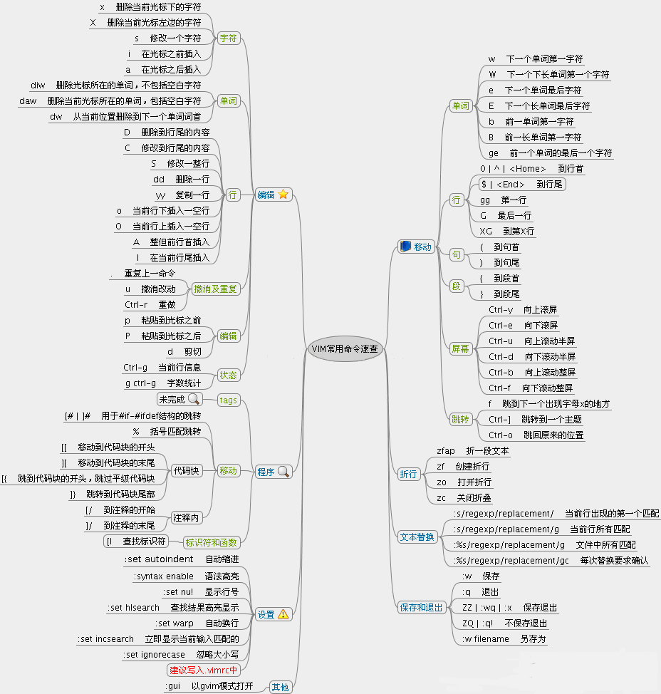

## tree指令小贴士

**1. 基本用法：** 显示当前目录下的文件和目录结构。

	tree

**2. 限制目录深度：** 使用 `-L` 选项后跟数字来限制目录显示的深度。

	tree -L 2

这将显示当前目录及其下最多两级子目录。

**3. 显示隐藏文件：** 默认情况下，隐藏文件（以点 . 开头的文件或目录）不会被显示。要显示这些隐藏文件，可以使用 `-a` 选项。

	tree -a

**4. 递归显示所有文件：** 使用 `-R` 选项递归显示所有文件。

	tree -R

**5. 指定目录：** 显示指定目录的树状结构。

	tree /path/to/directory

**6. 使用文件系统类型：** 显示目录结构时，包括文件系统类型。

	tree -F

`-F` 选项会在每个目录名后添加一个斜杠 `/`。

**7. 排序：** 默认情况下，`tree` 会按字母顺序排序。使用 `-f` 选项可以按照文件修改时间排序。

	tree -f

**8. 显示文件大小：** 使用 `-h` 选项以更易读的格式显示文件大小。

	tree -h

**9. 显示目录和文件的权限：** 使用 `-u` 选项显示文件所有者，`-g` 选项显示文件组。

	tree -ug

**10. 使用颜色：** `tree` 命令使用颜色来区分不同类型的文件和目录。使用 `--no-colour` 可以关闭颜色显示。

	tree --no-colour

**11. 输出到文件：**
将树状结构输出到一个文件中。

	tree > tree.txt

**12. 执行命令：**
对每个文件或目录执行命令，例如，获取每个文件的详细信息。

	tree -exec ls -l {} \;

**13. 帮助和手册：**
查看 tree 命令的帮助信息。

	tree --help
	man tree

**14. 安装 tree 命令（如果尚未安装）通常可以通过你的Linux发行版的包管理器来完成。**
例如，在Ubuntu上，你可以使用以下命令安装：

	sudo apt-get update
	sudo apt-get install tree

使用 `tree` 可以帮助你更直观地查看目录结构，特别是在处理复杂的文件系统时。


## git小贴士





## Python问题

- `python` 指向 `python3`
- `Ubuntu` 系统中默认的 `python` 可能指向 `Python 2`，但 `Python 2` 已经停止使用。可以使用以下命令将 `python` 指向 `Python 3`：

```bash
sudo apt-get install python-is-python3
```


## OpenHarmony学习笔记

### 环境搭建

1. 安装所需的组件和配置`git`身份信息
```bash
sudo apt-get update
sudo apt-get install git-lfs curl python3-pip ccache

git config --global user.name "YourName"
git config --global user.email "YourEmail@example.com"
```

2. 获取代码步骤

- 安装`repo`工具
```bash
mkdir -p ~/bin
curl https://gitee.com/oschina/repo/raw/fork_flow/repo-py3 > ~/bin/repo
chmod a+x ~/bin/repo
export PATH=~/bin:$PATH  # 永久生效需写入~/.bashrc
```

- 初始化仓库
```bash
(推荐SSH协议)
repo init -u git@gitee.com:openharmony/manifest.git -b OpenHarmony-5.0.2-Release --no-repo-verify
或者：
(HTTPS协议)
repo init -u https://gitee.com/openharmony/manifest.git -b OpenHarmony-5.0.2-Release --no-repo-verify
```

- 同步全量代码
```bash
repo sync -c -j8  # -c仅同步当前分支，-j8启用8线程加速
repo forall -c 'git lfs pull'  # 拉取大文件（如图片/预编译库）
```

3. 常见问题处理
- 权限错误,若出现`Permission denied`，检查`SSH`公钥是否已正确绑定`Gitee`账户，并修复目录权限：
```bash
sudo chown -R $USER:$USER .repo/
ex: sudo chown -R ubuntu:ubuntu /home/ubuntu/openharmony/.repo
```
- 如果问题仍存在,可能是父目录权限问题，检查并修复整个`openharmony`目录的权限：
```bash
sudo chown -R ubuntu:ubuntu /home/ubuntu/openharmony
sudo chmod -R 755 /home/ubuntu/openharmony
```

- 网络中断导致同步失败
```bash
repo sync -c -j4 --fail-fast  # 失败时自动重试
```

- 依赖缺失
```bash
./build/prebuilts_download.sh  # 自动下载依赖:cite[3]:cite[6]
```

4. 验证代码完整性
- 目录结构检查
```bash
ls -la .repo/manifests/  # 应包含default.xml及版本分支文件
```

- 版本标签匹配
```bash
cd .repo/manifests.git
git tag | grep OpenHarmony-5.0.2  # 确认分支存在:cite[7]
```