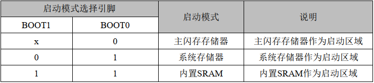

## 内核复位（kernel reset）

### 常见通用问题

- **内核复位代码，如ADC：**

``` c
void kernel_reset(void)
{
    __DSB();
    __disable_irq();							//close irq
	drv_adc_deinit(EADC_DEV1,EDMA_CH6);			//disable adc data
    SCB->AIRCR = ((0x5FA << SCB_AIRCR_VECTKEY_Pos)      |
                  (SCB->AIRCR & SCB_AIRCR_PRIGROUP_Msk) |
                   SCB_AIRCR_VECTRESET_Msk);
    __DSB();
    while(1);
}
```

- 板级初始化前先要重置状态：
``` c
DMA_DeInit(dma_chx);		//DMA开启循环接收后会持续接收字节
ADC_DeInit(adc_handler);
```

- `ADC`驱动初始化/反初始化:
``` c
int drv_adc_init(EADC_DEVICE adc_dev,EDMA_CHANNEL dma_ch)
{
	drv_adc_configuration(adc_dev);
	drv_dma_configuration(adc_dev,dma_ch);
	drv_adc_enable(adc_dev,DISABLE);
	return 0;
}

int drv_adc_deinit(EADC_DEVICE adc_dev,EDMA_CHANNEL dma_ch)
{
	ADC_Module *adc_handler = drv_get_adc_device(adc_dev)->ADC_Handler;
	DMA_ChannelType * dma_chx = drv_get_dma_channel(dma_ch);
	
	drv_adc_enable(adc_dev,DISABLE);
	DMA_EnableChannel(dma_chx,DISABLE);
	return 0;
}
```	
<br>

### n32g452rc内核复位问题

#### bootloader跳转到app

- 栈大小改变后跳转成功：将`ram`空间数据`uint16_t`改为`uint32_t`。
- 堆大小改变后跳转成功：将队列申请长度`20`改为`30`。
- 代码大小变化后跳转失败：
	- 代码段变长，能跑进`system_init`,跑飞待查。
	- 代码段变短，不能跑进`system_init`,跑飞待查。

**总结：**

- `n32g45x`系列栈大小和堆大小影响不大，只要代码段大小不变，跳转成功；若代码段长度变化，跳转失败。（芯片原因？）
- `n32l40x`系列不存在此类问题。

<br>

## MCU复位后状态

- 复位期间和刚复位后，复用功能未开启,`I/O`端口被配置成模拟功能模式(`PCFGy[1:0] = 00b`, `PMODEy[1:0] = 00b`)。

- 但有以下几个例外的信号：`BOOT0`、 `NRST`、 `OSC_IN`、 `OSC_OUT` 默认无 `GPIO` 功能：
	- `BOOT0` 引脚默认输入下拉
	- `NRST` 上拉输入输出
- 复位后，调试系统相关的引脚默认状态为启动 `SWD-JTAG`， `JTAG` 引脚被置于输入上拉或下拉模式：
	- `PA15`：`JTDI` 置于输入上拉模式 
	- `PA14`：`JTCK` 置于输入下拉模式 
	- `PA13`：`JTMS` 置于输入上拉模式
	- `PB4`：`NJTRST` 置于输入上拉模式
	- `PB3`：`JTD0` 置于推挽输出无上下拉
- `PD0` 和 `PD1`
	- `PD0` 和 `PD1` 在 `80` 及以上引脚封装默认为模拟模式
	- `PD0` 和 `PD1` 在 `80` 以下引脚封装复用到 OSC_IN/OUT
- `PC13`、 `PC14`、 `PC15`：
	- `PC13～15` 为备电域下的三个` IO`， 备份域初次上电默认为模拟模式；

<br>

- `PB2`/`BOOT1`：
	- `PB2`/`BOOT1` 默认处于下拉输入状态；

<br>

- `BOOT0` 默认输入下拉，参照下表， 若 `BOOT` 的引脚未连接，则默认选择 `Flash` 主存储区。



<br>

**问题**：`n32g452`系列芯片， `串口2`无法发送数据问题
- 打印测试进入了`usart2`的串口发送函数，示波器测量，有尖峰异常波形。

**解决**：`串口2`引脚为`PB4`,默认为`JTAG`引脚，复用时应关闭`JTAG`功能。

``` c
// 使用jlink引脚复用成GPIO时需要关闭jlink引脚功能，否则无法正常输出。
GPIO_ConfigPinRemap(GPIO_RMP_SW_JTAG_SW_ENABLE, ENABLE);
```

- 时钟引脚使用问题(`n32l406`为例)，可能不需要复用，以实际为准。
``` c
	/*开启复用的外设时钟使能*/
	if(pin == 5)
	{
		RCC_EnableAPB2PeriphClk(RCC_APB2_PERIPH_AFIO,ENABLE);
		GPIO_ConfigPinRemap(GPIOD_PORT_SOURCE,GPIO_PIN_SOURCE14,GPIO_NO_AF);	/*映射的使能*/
	}
	
	if(pin == 6)
	{
		RCC_EnableAPB2PeriphClk(RCC_APB2_PERIPH_AFIO,ENABLE);
		GPIO_ConfigPinRemap(GPIOD_PORT_SOURCE,GPIO_PIN_SOURCE15,GPIO_NO_AF);	/*映射的使能*/
	}
```
<br>

## printf重定向

- MDK版本，勾选Use MicroLIB选项：

```c
 static int is_lr_sent = 0;
 int fputc(int ch, FILE* f)
 {
    if (ch == '\r')
    {
        is_lr_sent = 1;
    }
    else if (ch == '\n')
    {
        if (!is_lr_sent)
    	{
            USART_SendData(USART1, '\r');
            while (USART_GetFlagStatus(USART1, USART_FLAG_TXDE) == RESET);
    	}
    	is_lr_sent = 0;
    }
    else
    {
    	is_lr_sent = 0;
    }
    USART_SendData(USART1, ch);
    while (USART_GetFlagStatus(USART1, USART_FLAG_TXDE) == RESET);
    return ch;
 }
```

- GCC版本

```c
int _write(int fd, char* pBuffer, int size)
{
    for (int i = 0; i < size; i++)
    {
        USART_SendData(USART1, pBuffer[i]);
        while (USART_GetFlagStatus(USART1, USART_FLAG_TXDE) == RESET);
    }
    return size;
}
```
<br>

## RT-THREAD调试问题

### LETTER SHELL问题

``` c
// SHELL_USING_LOCK设为 1，则需要初始化互斥锁，否则shell会死机。
// LOG_USING_LOCK设为 0，否则log会死机，问题不详。
#define SHELL_USING_LOCK    1       
#define LOG_USING_LOCK      0

#if SHELL_USING_LOCK
static struct rt_mutex shellMutex;
int userShellLock(Shell *sh)
{
    rt_mutex_take(&shellMutex,RT_WAITING_FOREVER);		// rt_tick_from_millisecond(100),RT_WAITING_FOREVER
    return 0;
}

/**
 * @brief 用户shell解锁
 * @param shell shell
 * @return int 0
 */
int userShellUnlock(Shell *sh)
{
    rt_mutex_release(&shellMutex);
    return 0;
}
#endif

#if LOG_USING_LOCK
static struct rt_mutex logMutex;
int userLogLock(Log *log)
{
    rt_mutex_take(&logMutex, RT_WAITING_FOREVER);		//rt_tick_from_millisecond(10)
    return 0;
}

int userLogUnlock(Log *log)
{
    rt_mutex_release(&logMutex);
    return 0;
}
#endif

void User_Shell_Init(void)
{
    struct serial_configure config = EC_SERIAL_CONFIG_DEFAULT;
    config.baud_rate = BAUD_RATE_921600;
    drv_usart_init(ESERIAL_1, ESERIAL_MODE_DMA_RX | ESERIAL_MODE_DMA_TX, &config);
#if SHELL_USING_LOCK
	rt_mutex_init(&shellMutex,"shellMutex",RT_IPC_FLAG_FIFO);
	shell.unlock = userShellUnlock;
	shell.lock = userShellLock;
#endif
#if LOG_USING_LOCK
	rt_mutex_init(&logMutex,"logMutex",RT_IPC_FLAG_FIFO);
	uartLog.unlock = userLogUnlock;
	uartLog.lock = userLogLock;
#endif
    shell.write = User_Shell_Write;
	shell.read = User_Shell_Read;
    shellInit(&shell, shell_buffer, sizeof(shell_buffer));
	logRegister(&uartLog, &shell);
}
```

### 串口通信异常

- 打开UART7接收为`DMA IDLE`中断，申请一个超时定时器，发送/接受各一个任务，发送/接受两个队列,以下是错误信息：

``` bash
psr: 0x60000000
r00: 0x00000000
r01: 0x20007978
r02: 0x20007978
r03: 0x00000000
r04: 0x00000000
r05: 0x00000000
r06: 0x00000000
r07: 0x20000920
r08: 0x20005908
r09: 0x20000568
r10: 0xdeadbeef
r11: 0xdeadbeef
r12: 0x00000000
 lr: 0x0801156f
 pc: 0x00000000
hard fault on thread: timer

E [00:00:07,324] (rtt-nano/src/kservice.c) rt_assert_handler [1340]: (rt_object_get_type(&mq->parent.parent) == RT_Object_Class_MessageQueue) assertion failed at function:rt_mq_send_wait, line number:2026 

E [00:00:00,659] (rtt-nano/src/kservice.c) rt_assert_handler [1340]: (rt_object_get_type(&timer->parent) == RT_Object_Class_Timer) assertion failed at function:rt_timer_control, line number:474 

E [00:00:39,282] (rtt-nano/src/kservice.c) rt_assert_handler [1340]: (rt_object_get_type((rt_object_t)thread) == RT_Object_Class_Thread) assertion failed at function:rt_thread_resume, line number:760 
```

- 问题定位到指针变量`p_srx_mq[0]`和`&p_srx_mq[0]`的区别，代码如下：

```bash
#define COMM_MAX_NUM     3
static uint8_t *p_srx_mq[COMM_MAX_NUM];
static struct comm_serial_mq srx_mq_data[COMM_MAX_NUM];
static struct rt_timer comm_rx_stimer[COMM_MAX_NUM];

static void comm_serial_recieve_data_deinit(uint8_t num)
{
	srx_mq_data[num].size = 0;
	p_srx_mq[num] = srx_mq_data[num].data;
}

static int usart_key_rx_indicate(ESERIAL_DEV serial_dev, uint16_t size)
{
	if(p_srx_mq[0] - srx_mq_data[0].data + size > sizeof(srx_mq_data[0].data))
	{
		comm_serial_recieve_data_deinit(0);
		return -1;
	}
	rt_timer_start(&comm_rx_stimer[0]);                   // 启动定时器
	drv_fifo_data_get(serial_dev, (uint8_t *)p_srx_mq[0], size);
	logPrintln("test = [%p][%p][%p]",p_srx_mq[0],&p_srx_mq[0],srx_mq_data[0].data);
	p_srx_mq[0] += size;
	srx_mq_data[0].size += size;
	return 0;
}
```

### FlashDB问题（碰巧对上述问题未遇到问题的解决）
- 上述问题`LETTER SHELL`问题中`SHELL_USING_LOCK`设为`1`，`LOG_USING_LOCK`需设为`0`,否则会卡死，经调试后下面会做出解释。
- 在初始化的时候，不管是`KVDB`还是`TSDB`，必须在烧完程序后，`reboot`一下才能初始化扇区成功，原因待查。
- 会出现以下打印后卡住：
``` c
admin:/$ tsdb_test
[D/FAL] (fal_flash_init:47) Flash device |               n32_onchip | addr: 0x08000000 | len: 0x00080000 | blk_size: 0x00000800 |initialized finish.
[I/FAL] ==================== FAL partition table ====================
[I/FAL] | name      | flash_dev  |   offset   |    length  |
[I/FAL] -------------------------------------------------------------
[I/FAL] | bl        | n32_onchip | 0x00000000 | 0x00002800 |
[I/FAL] | app       | n32_onchip | 0x00002800 | 0x00032000 |
[I/FAL] | download  | n32_onchip | 0x00034800 | 0x00032000 |
[I/FAL] | upflag    | n32_onchip | 0x00066800 | 0x00000800 |
[I/FAL] | dcd       | n32_onchip | 0x00067000 | 0x00000800 |
[I/FAL] | mcuinfo   | n32_onchip | 0x00067800 | 0x00000800 |
[I/FAL] | fdb_kvdb1 | n32_onchip | 0x00068000 | 0x00001000 |
[I/FAL] | fdb_tsdb1 | n32_onchip | 0x00069000 | 0x00016800 |
[I/FAL] =============================================================
[I/FAL] RT-Thread Flash Abstraction Layer (V1.0.0) initialize success.
[FlashDB][tsl][log][fdb_tsdb1] Sector (0x00000000) header info is incorrect.

// 跑飞卡死
```

- 烧录完`reboot`后，正常的打印：
``` c
admin:/$ tsdb_test
[D/FAL] (fal_flash_init:47) Flash device |               n32_onchip | addr: 0x08000000 | len: 0x00080000 | blk_size: 0x00000800 |initialized finish.
[I/FAL] ==================== FAL partition table ====================
[I/FAL] | name      | flash_dev  |   offset   |    length  |
[I/FAL] -------------------------------------------------------------
[I/FAL] | bl        | n32_onchip | 0x00000000 | 0x00002800 |
[I/FAL] | app       | n32_onchip | 0x00002800 | 0x00032000 |
[I/FAL] | download  | n32_onchip | 0x00034800 | 0x00032000 |
[I/FAL] | upflag    | n32_onchip | 0x00066800 | 0x00000800 |
[I/FAL] | dcd       | n32_onchip | 0x00067000 | 0x00000800 |
[I/FAL] | mcuinfo   | n32_onchip | 0x00067800 | 0x00000800 |
[I/FAL] | fdb_kvdb1 | n32_onchip | 0x00068000 | 0x00001000 |
[I/FAL] | fdb_tsdb1 | n32_onchip | 0x00069000 | 0x00016800 |
[I/FAL] =============================================================
[I/FAL] RT-Thread Flash Abstraction Layer (V1.0.0) initialize success.
[FlashDB][tsl][log][fdb_tsdb1] Sector (0x00000000) header info is incorrect.
[FlashDB][tsl][log][fdb_tsdb1] All sector format finished.
[FlashDB][tsl][log][fdb_tsdb1] (components/flashdb/fdb_tsdb.c:980) TSDB (log) oldest sectors is 0x00000000, current using sector is 0x00000000.
[FlashDB] FlashDB V2.1.1 is initialize success.
[FlashDB] You can get the latest version on https://github.com/armink/FlashDB .
[FlashDB][sample][tsdb] ==================== tsdb_sample ====================
[FlashDB][sample][tsdb] append the new status.temp (36) and status.humi (85)
[FlashDB][sample][tsdb] append the new status.temp (38) and status.humi (90)
[FlashDB][sample][tsdb] [query_cb] queried a TSL: time: 1, temp: 36, humi: 85
[FlashDB][sample][tsdb] [query_cb] queried a TSL: time: 2, temp: 38, humi: 90
[FlashDB][sample][tsdb] [query_by_time_cb] queried a TSL: time: 1, temp: 36, humi: 85
[FlashDB][sample][tsdb] [query_by_time_cb] queried a TSL: time: 2, temp: 38, humi: 90
[FlashDB][sample][tsdb] query count is: 2
[FlashDB][sample][tsdb] set the TSL (time 1) status from 2 to 3
[FlashDB][sample][tsdb] set the TSL (time 2) status from 2 to 3
[FlashDB][sample][tsdb] ===========================================================
```

- 原因：由于flash解锁是给互斥量加锁，之前写成一致了，写反了，导致进去一次之后卡死。
``` c
static struct rt_mutex flashMutex;
void af_flash_init(void)
{
 	rt_mutex_init(&flashMutex, "flashMutex", RT_IPC_FLAG_FIFO);
}

void af_flash_unlock(void)
{
	rt_mutex_take(&flashMutex, RT_WAITING_FOREVER);	   // 错误用例：rt_mutex_release(&flashMutex);
	FLASH_Unlock();
}

void af_flash_lock(void)
{
	FLASH_Lock();
	rt_mutex_release(&flashMutex);                      // 错误用例：rt_mutex_take(&flashMutex, RT_WAITING_FOREVER);	
}
```

#### 指针取址符&与取值*的区别

**1. 指针取址符(&)**

	指针取址符 & 用于获取一个变量的地址，并将该地址存储在一个指针变量中。

**具体来说:**

- & 运算符位于变量名前面。
- & 运算符的返回值是一个指针，指向该变量的内存地址。

```c
int num = 10;
int *p = &num; // p 指向 num 的地址
```

**2. 取值符(*)**

	取值符 * 用于获取指针变量所指向的变量的值。

**具体来说:**

- 运算符位于指针变量名前面。
- 运算符的返回值是该指针变量所指向变量的值。

```c
int num = 10;
int *p = &num;
int value = *p;		// 访问 num 的值
```

**总结：**

- 指针取址符 & 用于获取变量的地址，并将该地址存储在一个指针变量中。
- 取值符 * 用于获取指针变量所指向的变量的值。

**需要注意的是：**

- 不能对不存在的变量进行取址。
- **`不能对指针变量进行取址`**。
- 取址操作可能会产生空指针，需要进行空指针检查。

#### 为什么不能对指针变量进行取址

**1. 指针变量本身也是一个变量**

指针变量也是一个变量，它存储的是另一个变量的地址。与其他变量一样，**`指针变量也存在于内存中，并拥有自己的地址`**。

**2. 取址操作会产生无限循环**

**`如果对指针变量进行取址，那么就会得到该指针变量的地址`**。但是，该指针变量本身也是一个变量，所以其地址也是存储在另一个变量中的。如此循环往复，就会产生无限循环。

**3. 违背了指针的定义**

指针的定义是指向另一个变量的地址。如果对指针变量进行取址，那么就意味着指针指向了它自己的地址，这违背了指针的定义。

**4. 可能导致程序崩溃**

在大多数情况下，对指针变量进行取址会导致程序崩溃。这是因为程序会试图访问一个不存在的内存地址。

<br>

### 结构体偏移操作

- `offsetof(TYPE, MEMBER)` 函数用法：
``` c
/* Offset of member MEMBER in a struct of type TYPE. */
#define offsetof(TYPE, MEMBER) __builtin_offsetof (TYPE, MEMBER)

typedef struct __attribute__((packed))
{
    uint8_t device;
    uint8_t version;
    uint16_t packet_sum;        // 大端模式
    uint16_t packet_index;      // 大端模式
    uint8_t len;
    uint8_t cmd;
    uint8_t *data;
    uint16_t check_sum;         // 大端模式
}ble_comm_protocol;

int send_len = offsetof(ble_comm_protocol, data);       // send_len 长度为 8 bytes
```
<br>

## TFT屏ST7735S调试问题

### 硬件/软件spi初始化

```c
//头文件定义
#define HARDWARE_SPI_MODE 1	//1：hardware；0：software

#define LCD_SCLK_Clr() GPIO_ResetBits(GPIOA, GPIO_PIN_5)	//SCL=SCLK
#define LCD_SCLK_Set() GPIO_SetBits(GPIOA, GPIO_PIN_5)
#define LCD_MOSI_Clr() GPIO_ResetBits(GPIOA, GPIO_PIN_7)		//SDA=MOSI
#define LCD_MOSI_Set() GPIO_SetBits(GPIOA, GPIO_PIN_7)
#define LCD_RES_Clr()  GPIO_ResetBits(GPIOB, GPIO_PIN_0)		//RES
#define LCD_RES_Set()  GPIO_SetBits(GPIOB, GPIO_PIN_0)
#define LCD_DC_Clr()   GPIO_ResetBits(GPIOB, GPIO_PIN_1)		//DC
#define LCD_DC_Set()   GPIO_SetBits(GPIOB, GPIO_PIN_1)	     
#define LCD_CS_Clr()   GPIO_ResetBits(GPIOA, GPIO_PIN_4)		//CS
#define LCD_CS_Set()   GPIO_SetBits(GPIOA, GPIO_PIN_4)
#define LCD_BLK_Clr()											//BLK
#define LCD_BLK_Set()

void LCD_GPIO_Init(void)
{
	GPIO_InitType GPIO_InitStructure;
	RCC_EnableAPB2PeriphClk(RCC_APB2_PERIPH_GPIOA | RCC_APB2_PERIPH_GPIOB , ENABLE);

#if HARDWARE_SPI_MODE

    SPI_InitType SPI_InitStructure;
    RCC_EnableAPB2PeriphClk(RCC_APB2_PERIPH_SPI1 | RCC_APB2_PERIPH_AFIO, ENABLE);

    GPIO_InitStruct(&GPIO_InitStructure);
    GPIO_InitStructure.Pin        = GPIO_PIN_4 | GPIO_PIN_5 | GPIO_PIN_7;
    GPIO_InitStructure.GPIO_Alternate = GPIO_AF0_SPI1;
    GPIO_InitStructure.GPIO_Mode = GPIO_Mode_AF_PP;
    GPIO_InitPeripheral(GPIOA, &GPIO_InitStructure);

    /* SPIy Config -------------------------------------------------------------*/
    SPI_InitStructure.DataDirection = SPI_DIR_SINGLELINE_TX;
    SPI_InitStructure.SpiMode       = SPI_MODE_MASTER;
    SPI_InitStructure.DataLen       = SPI_DATA_SIZE_8BITS;
    SPI_InitStructure.CLKPOL        = SPI_CLKPOL_HIGH;
    SPI_InitStructure.CLKPHA        = SPI_CLKPHA_FIRST_EDGE;
    SPI_InitStructure.NSS           = SPI_NSS_HARD;
    SPI_InitStructure.BaudRatePres  = SPI_BR_PRESCALER_2;
    SPI_InitStructure.FirstBit      = SPI_FB_MSB;
    SPI_InitStructure.CRCPoly       = 7;
    SPI_Init(SPI1, &SPI_InitStructure);

    SPI_SSOutputEnable(SPI1, ENABLE);
    SPI_EnableCalculateCrc(SPI1, DISABLE);
    /* Enable SPIy */
    SPI_Enable(SPI1, ENABLE);
#else
    GPIO_InitStruct(&GPIO_InitStructure);
    GPIO_InitStructure.Pin = GPIO_PIN_4 | GPIO_PIN_5 | GPIO_PIN_7;
    GPIO_InitStructure.GPIO_Mode = GPIO_Mode_Out_PP;
    GPIO_InitPeripheral(GPIOA, &GPIO_InitStructure);

    GPIO_SetBits(GPIOA, GPIO_PIN_4 | GPIO_PIN_5 | GPIO_PIN_7);
#endif
    GPIO_InitStruct(&GPIO_InitStructure);
    GPIO_InitStructure.GPIO_Mode = GPIO_Mode_Out_PP;
    GPIO_InitStructure.Pin = GPIO_PIN_0 | GPIO_PIN_1;
    GPIO_InitPeripheral(GPIOB, &GPIO_InitStructure);

    GPIO_SetBits(GPIOB, GPIO_PIN_0 | GPIO_PIN_1);
}

void LCD_Writ_Bus(u8 dat) 
{	
	LCD_CS_Clr();

#if HARDWARE_SPI_MODE
	SPI_I2S_TransmitData(SPI1, dat);
	while (SPI_I2S_GetStatus(SPI1, SPI_I2S_TE_FLAG) == RESET); //必须等到SPI数据发完，才能拉高CS片选，发下一次数据，否则数据会出错
#else
	u8 i;
	for(i=0;i<8;i++)
	{			  
		LCD_SCLK_Clr();
		if(dat&0x80)
		{
		   LCD_MOSI_Set();
		}
		else
		{
		   LCD_MOSI_Clr();
		}
		LCD_SCLK_Set();
		dat<<=1;
	}
#endif

   LCD_CS_Set();	
}

void LCD_WR_DATA8(u8 dat)
{
	LCD_Writ_Bus(dat);
}

void LCD_WR_DATA(u16 dat)
{
	LCD_Writ_Bus(dat>>8);
	LCD_Writ_Bus(dat);
}
```

<br>

## Cortex-M系列内核字节对齐汇总

- 4字节对齐的含义就是变量地址对4求余数为0；8字节对齐就是地址对8求余等于0，依次类推，比如：如果让p去访问0x20000001， 0x20000002，0x20000003这都是不对齐访问。

- 对于`M3和M4`而言，可以直接访问非对齐地址（注意芯片要在这个地址有对应的内存空间), 因为`M3和M4`是支持的，而`M0/M0+/M1`是不支持的，不支持的内核芯片，只要非对齐访问就会触发硬件异常。

**综上所述，我们只讨论Cortex-M3/M4内核情况。**

### 全局变量对齐问题

- `uint8_t`定义变量地址要1字节对齐。
- `uint16_t`定义变量地址要2字节对齐。
- `uint32_t`定义变量地址要4字节对齐。
- `uint64_t`定义变量地址要8字节对齐。
- `指针变量`是4字节对齐。

### 结构体成员对齐问题

#### 自然对界

**例子1**（分析结构各成员的默认字节对界条界条件和结构整体的默认字节对界条件）:

```c
struct Test
{ 
  char x1; // 成员x1为char型(其起始地址必须1字节对界)，其偏移地址为0 
  char x2; // 成员x2为char型(其起始地址必须1字节对界，其偏移地址为1 
  float x3; // 成员x3为float型(其起始地址必须4字节对界)，编译器在x2和x3之间填充了两个空字节，其偏移地址为4 
  char x4; // 成员x4为char型(其起始地址必须1字节对界)，其偏移地址为8 
};
```
在Test结构体中，最大的成员为`float` x3，因此结构体的自然对界条件为4字节对齐。则结构体长度就为12字节，内存布局为`1100 1111 1000`。

<br>

#### 指令对齐

**1. 伪指令#pragma pack**

改变缺省的对界条件(指定对界)
- 使用伪指令`#pragma pack (n)`，编译器将按照n个字节对齐。
- 使用伪指令`#pragma pack ()`，取消自定义字节对齐方式。
	- 数据成员对齐规则：结构(`struct`)(或联合(`union`))的数据成员，第一个数据成员放在offset为0的地方，以后每个数据成员的对齐按照`#pragma pack`指定的数值和这个数据成员自身长度中，比较小的那个进行。
	- 结构(或联合)的整体对齐规则：在数据成员完成各自对齐之后，结构(或联合)本身也要进行对齐，对齐将按照`#pragma pack`指定的数值和结构(或联合)最大数据成员长度中，比较小的那个进行。

结合推断：当`#pragma pack`的n值等于或超过所有数据成员长度的时候，这个n值的大小将不产生任何效果。因此，当使用伪指令`#pragma pack (2)`时，Test结构体的大小为8，内存布局为`1111 1110`。

- 需要注意一点，当结构体中包含一个子结构体时，子结构中的成员按照#pragma pack指定的数值和子结构最大数据成员长度中，比较小的那个进行进行对齐。例子如下：

```c
#pragma pack(8)
struct s1
{
  short a;
  long b;
};
 
struct s2
{
  char c;
  s1 d;
  long long e;
};
#pragma pack()
```
`sizeof(s2)`的结果为24。S1的内存布局为`1100 1111`，S2的内存布局为`1000 1100 1111 0000 1111 1111`。

**例子2**(按照2个字节对齐时)：
``` c
#include <stdio.h>
#pragma pack(2)
typedef struct
{
  int aa1; //2个字节对齐 1111
  char bb1;//1个字节对齐 1
  short cc1;//2个字节对齐 011
  char dd1; //1个字节对齐 1
} testlength1;
int length1 = sizeof(testlength1); //2个字节对齐，占用字节11 11 10 11 10,length = 10
 
typedef struct
{
  char bb2;//1个字节对齐 1
  int aa2; //2个字节对齐 01111
  short cc2;//2个字节对齐 11
  char dd2; //1个字节对齐 1
} testlength2;
int length2 = sizeof(testlength2); //2个字节对齐，占用字节10 11 11 11 10,length = 10
 
typedef struct
{
  char bb3; //1个字节对齐 1
  char dd3; //1个字节对齐 1
  int aa3; //2个字节对齐 11 11
  short cc23//2个字节对齐 11
 
} testlength3;
int length3 = sizeof(testlength3); //2个字节对齐，占用字节11 11 11 11,length = 8
 
typedef struct
{
  char bb4; //1个字节对齐 1
  char dd4; //1个字节对齐 1
  short cc4;//2个字节对齐 11
  int aa4; //2个字节对齐 11 11
} testlength4;
int length4 = sizeof(testlength4); //2个字节对齐，占用字节11 11 11 11,length = 8
#pragma pack()
int main(void)
{
  printf("length1 = %d.\n",length1);
  printf("length2 = %d.\n",length2);
  printf("length3 = %d.\n",length3);
  printf("length4 = %d.\n",length4);
  return 0;
}
```

**2. __attribute__((__aligned__(n)))**

`__attribute__`是GCC里的编译参数，用法有很多种，感兴趣可以阅读一下gcc的相关文档。这里说一下`__attribute__`对变量和结构体对齐的影响。这里的影响大概分为两个方面，对齐和本身占用的字节数的大小，即sizeof（变量）的值。

- `int a attribute((aligned(64))) = 10;`

这个修饰的影响主要是对齐，所谓对齐是存储为值的起始地址。变量a的地址&a,本来是4字节对齐，变成了64字节对齐（有的环境对最大对齐数值有限制）。64字节对齐就是`&a`的最后6位为0。
``` c
sizeof(a) = 4; 		//a 占用的字节数还是4个字节
```

- `typedef int myint attribute((aligned(64))) ;`

这样说明myint 声明的变量按照64字节对齐，大小是4字节，这样就会有一个问题，这个变量不能定义数组：
``` c
myint myarray[2]; 	//这样定义编译器会报err
```
报错的原因是数组的存储在内存中是连续的，而myint只有4字节确要64字节对齐，这样对齐和连续就不能同时保证，就会报错。

**例子1**：

``` c
typedef struct st_tag {
	int a;
	char b;
} ST1;
ST1 myst；
```

在没有对齐的情况下：`sizeof(ST1) = sizeof(myst) = 8;`
结构体对齐的原则可以总结为：

- 结构体起始地址(&myst)按最大变量字节数(sizeof(int))对齐；
- 结构体内每个变量按照自身字节数对齐；
- 结构体的大小`(sizeof(myst))`是最大变量字节数的整数倍（8/4=2）；

``` c
typedef struct st_tag {
	int a;
	char b;
}  __attribute__((__aligned__(64))) ST1;
ST1 myst；
sizeof(ST1) = sizeof(myst) = 64; 
```
对比：
``` c
typedef struct st_tag {
	int a;
	char b;
}  ST1 __attribute__((__aligned__(64)));
ST1 myst；
sizeof(ST1) = sizeof(myst) = 8 ;
```

这第二种情况可以理解为`__attribute__((aligned(64)))`作用于变量ST1 ，只影响对齐，不影响结构的大小。

**例子2**：
``` c
typedef struct __attribute__((packed))
{
    uint8_t comm_version;
    uint8_t comm_lenth;
    uint8_t device_fw_verion[];
}ble_resp_device_info_desc;
```
`__attribute__((packed))`是GCC编译器提供的一个属性,`__attribute__((packed))`其中的成员变量不会进行对齐。

<br>

## HSV 模型

```c
#include <math.h>

/*
* 将HSV颜色转换为RGB颜色
* hue,色调:0-360; saturation,纯度:0-1; value,明度:0-1
* r,g,b,RGB颜色，此值范围为0-255，但外界传入时的变量须是int类型
*/
void hsv_to_rgb(float h, float s, float v, int *r, int *g, int *b)
{
   float f, x, y, z;
   int i;
   v *= 255.0;
   if (s == 0.0) {
      *r = *g = *b = (int)v;
   } else {
      while (h < 0)
      h += 360;
      h = fmod(h, 360) / 60.0;
      i = (int)h;
      f = h - i;
      x = v * (1.0 - s);
      y = v * (1.0 - (s * f));
      z = v * (1.0 - (s * (1.0 - f)));
      switch (i) {
         case 0: *r = v; *g = z; *b = x; break;
         case 1: *r = y; *g = v; *b = x; break;
         case 2: *r = x; *g = v; *b = z; break;
         case 3: *r = x; *g = y; *b = v; break;
         case 4: *r = z; *g = x; *b = v; break;
         case 5: *r = v; *g = x; *b = y; break;
      }
   }
}
```

使用Demo如下：
```c
void led_set_poll(void)
{    
    int red,green,blue;
    
    static float hue = 0;
    hue = fmodf(hue + 1.0, 360.0);  // 0-360 色调循环
    hsv_to_rgb(hue, 1.0, 1.0, &red, &green, &blue);
    display_board_rgb_color_set(red, green, blue);
}
```

<br>

## 内存管理

`RT-Thread`和`FreeRTOS`都是流行的嵌入式实时操作系统（`RTOS`），它们提供了内存管理机制来处理任务、队列、信号量等对象的创建和删除。尽管两者在内存管理的某些方面有相似之处，但它们在实现和配置上存在一些关键的区别：

- 内存管理策略：
    - **RT-Thread**：提供了动态内存堆管理和静态内存池管理两种方式。动态内存堆管理允许在运行时动态分配和释放内存，而内存池管理则分配固定大小的内存块，适用于分配大量大小相同的小内存块的场景。
    - **FreeRTOS**：提供了多种内存管理方案，包括简单的静态内存分配（`heap_1`）和更复杂的动态内存分配策略（如`heap_2`、`heap_3`、`heap_4`和`heap_5`）。`FreeRTOS`的动态内存分配策略允许内存的分配和释放，同时也提供了内存碎片管理的方法。

- 内存分配函数：
  - **RT-Thread**：使用自己的内存分配函数，如`rt_malloc`、`rt_free`、`rt_realloc`和`rt_calloc`，这些函数与`C`标准库中的`malloc`和`free`类似，但是专为`RT-Thread`设计。
  - **FreeRTOS**：使用`pvPortMalloc`和`vPortFree`函数进行内存分配和释放。`FreeRTOS`还提供了`xPortGetFreeHeapSize`等函数来获取内存堆的状态。

- 内存堆的实现：
    - **RT-Thread**：内存堆管理根据内存设备的不同，分为小内存块分配管理、大内存块的`slab`分配管理和多内存堆分配情况的管理。
    - **FreeRTOS**：提供了多种内存堆实现，例如`heap_1`不允许释放内存，`heap_2`允许释放但不合并相邻空闲块，`heap_3`包装了标准库的`malloc`和`free`，`heap_4`合并相邻空闲块以减少碎片，`heap_5`则支持跨多个不相邻内存区域的堆。

- 内存碎片管理：

    - **RT-Thread**：通过内存池管理来减少内存碎片，内存池预先分配一块内存，并在其中管理固定大小的内存块。
    - **FreeRTOS**：`heap_4`和`heap_5`实现了内存碎片管理，通过合并相邻的空闲内存块来减少碎片。

- 内存管理的配置：
    - **RT-Thread**：内存管理的配置通常在`rtconfig.h`中进行，可以选择使用不同的内存管理算法。
    - **FreeRTOS**：内存管理的配置也在配置文件中进行，需要选择一个合适的堆管理实现文件，并在`FreeRTOSConfig.h`中进行相应的配置。

- 内存管理的适用性：
    - **RT-Thread**：内存管理机制适用于各种大小的内存块，特别是通过内存池管理来优化小内存块的分配效率。
    - **FreeRTOS**：提供了多种内存管理策略，适用于不同的应用场景和内存需求，从简单的静态分配到复杂的动态分配。

总的来说，`RT-Thread`和`FreeRTOS`都提供了灵活的内存管理机制来满足不同嵌入式应用的需求。选择哪种内存管理策略取决于具体的应用场景、内存需求和开发偏好。

## 国民UART+DMA+TX问题
改之前：
``` c
static void ec32_uart_dma_tx_config(struct ec_serial_device *serial, uint8_t *buffer, uint16_t length)
{
    if(serial->Txbuffer->tail + length > serial->dma.setting_tx_len) 
    {
        while(DMA_GetFlagStatus(serial->dma.tx_gl_flag, serial->dma.tx_dma_type) == RESET){}
        DMA_ClearFlag(serial->dma.tx_gl_flag, serial->dma.tx_dma_type);
    }
	
    DMA_EnableChannel(serial->dma.tx_ch, DISABLE);
    DMA_InitType DMA_InitStructure;
	
    uint16_t dma_get_counts = DMA_GetCurrDataCounter(serial->dma.tx_ch);
    /* if no data waiting send*/
    if(dma_get_counts == 0)
    {
	serial->Txbuffer->lenth = length > serial->dma.setting_tx_len ? serial->dma.setting_tx_len : length;
	memcpy(serial->Txbuffer->data, buffer, serial->Txbuffer->lenth);
        DMA_InitStructure.MemAddr = (uint32_t)serial->Txbuffer->data;
        DMA_InitStructure.BufSize = serial->Txbuffer->lenth;
        serial->Txbuffer->tail = serial->Txbuffer->lenth;
    }else{	
        memcpy(serial->Txbuffer->data + serial->Txbuffer->tail, buffer, length);
        DMA_InitStructure.MemAddr = (uint32_t)(serial->Txbuffer->data + serial->Txbuffer->tail - dma_get_counts);
        DMA_InitStructure.BufSize = length + dma_get_counts;
        serial->Txbuffer->tail = serial->Txbuffer->tail + length;
    }
... ...
}
```

问题解决来自`jindu-chen`，修改后：
``` c
static void ec32_uart_dma_tx_config(struct ec_serial_device *serial, uint8_t *buffer, uint16_t length)
{
    DMA_EnableChannel(serial->dma.tx_ch, DISABLE);
    DMA_InitType DMA_InitStructure;
	
    uint16_t dma_get_counts = DMA_GetCurrDataCounter(serial->dma.tx_ch);
    /* if no data waiting send*/
    if(dma_get_counts == 0)
    {
        serial->Txbuffer->lenth = length > serial->dma.setting_tx_len ? serial->dma.setting_tx_len : length;
        memcpy(serial->Txbuffer->data, buffer, serial->Txbuffer->lenth);
        DMA_InitStructure.MemAddr = (uint32_t)serial->Txbuffer->data;
        DMA_InitStructure.BufSize = serial->Txbuffer->lenth;
        serial->Txbuffer->tail = serial->Txbuffer->lenth;
    }else{	
        if(serial->Txbuffer->tail + length > serial->dma.setting_tx_len)
        {
            DMA_EnableChannel(serial->dma.tx_ch, ENABLE);
            while(DMA_GetFlagStatus(serial->dma.tx_gl_flag, serial->dma.tx_dma_type) == RESET){}

            DMA_EnableChannel(serial->dma.tx_ch, DISABLE);
            memcpy(serial->Txbuffer->data, buffer, serial->Txbuffer->lenth);
            DMA_InitStructure.MemAddr = (uint32_t)serial->Txbuffer->data;
            DMA_InitStructure.BufSize = length;
            serial->Txbuffer->tail = serial->Txbuffer->lenth;
        }else{
            memcpy(serial->Txbuffer->data + serial->Txbuffer->tail, buffer, length);
            DMA_InitStructure.MemAddr = (uint32_t)(serial->Txbuffer->data + serial->Txbuffer->tail - dma_get_counts);
            DMA_InitStructure.BufSize = length + dma_get_counts;
            serial->Txbuffer->tail = serial->Txbuffer->tail + length;
        }
    }
... ...
}
```
修改前`tail`指针接近缓存区最大边界时，剩余空间不足时会进入以下函数, 一直卡在`while`中出不来, 需改到后面去：
``` c
if(serial->Txbuffer->tail + length > serial->dma.setting_tx_len) 
{
    while(DMA_GetFlagStatus(serial->dma.tx_gl_flag, serial->dma.tx_dma_type) == RESET){}
    DMA_ClearFlag(serial->dma.tx_gl_flag, serial->dma.tx_dma_type);
}

DMA_GetCurrDataCounter(serial->dma.tx_ch) 需要实时获取
```
即以下代码：
``` c
static void ec32_uart_dma_tx_config(struct ec_serial_device *serial, uint8_t *buffer, uint16_t length)
{
    DMA_EnableChannel(serial->dma.tx_ch, DISABLE);
    DMA_InitType DMA_InitStructure;
	
    /* if no data waiting send*/
    if(DMA_GetCurrDataCounter(serial->dma.tx_ch) == 0)
    {
		serial->Txbuffer->lenth = length > serial->dma.setting_tx_len ? serial->dma.setting_tx_len : length;
		memcpy(serial->Txbuffer->data, buffer, serial->Txbuffer->lenth);
        DMA_InitStructure.MemAddr = (uint32_t)serial->Txbuffer->data;
        DMA_InitStructure.BufSize = serial->Txbuffer->lenth;
        serial->Txbuffer->tail = serial->Txbuffer->lenth;
    }else{	
        if(serial->Txbuffer->tail + length > serial->dma.setting_tx_len)
        {
            DMA_EnableChannel(serial->dma.tx_ch, ENABLE);
            while(DMA_GetFlagStatus(serial->dma.tx_gl_flag, serial->dma.tx_dma_type) == RESET){}
            
            //需在serial->Txbuffer->lenth赋值之前，否则DMA_InitStructure.BufSize会刷新，会继续发送未知数据。
            DMA_EnableChannel(serial->dma.tx_ch, DISABLE);

            //需在DMA_EnableChannel(serial->dma.tx_ch, DISABLE)之后
            serial->Txbuffer->lenth = length > serial->dma.setting_tx_len ? serial->dma.setting_tx_len : length;

            memcpy(serial->Txbuffer->data, buffer, serial->Txbuffer->lenth);
			DMA_InitStructure.MemAddr = (uint32_t)serial->Txbuffer->data;
			DMA_InitStructure.BufSize = serial->Txbuffer->lenth;
			serial->Txbuffer->tail = serial->Txbuffer->lenth;
        }else{
			memcpy(serial->Txbuffer->data + serial->Txbuffer->tail, buffer, length);
			DMA_InitStructure.MemAddr = (uint32_t)(serial->Txbuffer->data + serial->Txbuffer->tail - DMA_GetCurrDataCounter(serial->dma.tx_ch));
			DMA_InitStructure.BufSize = length + DMA_GetCurrDataCounter(serial->dma.tx_ch);
			serial->Txbuffer->tail = serial->Txbuffer->tail + length;
		}
    }
... ...
}
```

修改后还是会在DMA发送数据满的时候，多出不知名的符号，再次修改：
``` c
static void ec32_uart_dma_tx_config(struct ec_serial_device *serial, uint8_t *buffer, uint16_t length)
{
    DMA_EnableChannel(serial->dma.tx_ch, DISABLE);          //去掉这一项，在需要关闭时再关闭DMA，否则会影响数组满时的数据。
... ...
```

修改后代码：
```
static void ec32_uart_dma_tx_config(struct ec_serial_device *serial, uint8_t *buffer, uint16_t length)
{
    DMA_InitType DMA_InitStructure;
	
    /* if no data waiting send*/
    if(DMA_GetCurrDataCounter(serial->dma.tx_ch) == 0)
    {
        DMA_EnableChannel(serial->dma.tx_ch, DISABLE);
		serial->Txbuffer->lenth = length > serial->dma.setting_tx_len ? serial->dma.setting_tx_len : length;
		memcpy(serial->Txbuffer->data, buffer, serial->Txbuffer->lenth);
        DMA_InitStructure.MemAddr = (uint32_t)serial->Txbuffer->data;
        DMA_InitStructure.BufSize = serial->Txbuffer->lenth;
        serial->Txbuffer->tail = serial->Txbuffer->lenth;
    }else{
        if(serial->Txbuffer->tail + length > serial->dma.setting_tx_len)
        {
            while(DMA_GetFlagStatus(serial->dma.tx_gl_flag, serial->dma.tx_dma_type) == RESET){}
            DMA_EnableChannel(serial->dma.tx_ch, DISABLE);
            
            serial->Txbuffer->lenth = length > serial->dma.setting_tx_len ? serial->dma.setting_tx_len : length;
            memcpy(serial->Txbuffer->data, buffer, serial->Txbuffer->lenth);
			DMA_InitStructure.MemAddr = (uint32_t)serial->Txbuffer->data;
			DMA_InitStructure.BufSize = serial->Txbuffer->lenth;
			serial->Txbuffer->tail = serial->Txbuffer->lenth;
        }else{
            DMA_EnableChannel(serial->dma.tx_ch, DISABLE);
			memcpy(serial->Txbuffer->data + serial->Txbuffer->tail, buffer, length);
			DMA_InitStructure.MemAddr = (uint32_t)(serial->Txbuffer->data + serial->Txbuffer->tail - DMA_GetCurrDataCounter(serial->dma.tx_ch));
			DMA_InitStructure.BufSize = length + DMA_GetCurrDataCounter(serial->dma.tx_ch);
			serial->Txbuffer->tail = serial->Txbuffer->tail + length;
		}
    }
... ...
```

<br>

## RT-THREAD下IAP升级问题
当前代码：
``` c
#define RT_THREAD_PRIORITY_MAX          32 
#define RT_THREAD_COMM_TASK_PRIORITY    10
static void iap(void)
{
	uint8_t proi = RT_THREAD_COMM_TASK_PRIORITY - 1;
	rt_thread_t th = rt_thread_find("tidle");					//fix it（2022.8.30）
	rt_thread_control(th,RT_THREAD_CTRL_CHANGE_PRIORITY,&proi);
	SerialDownload();
	proi = RT_THREAD_PRIORITY_MAX - 1;
	rt_thread_control(th,RT_THREAD_CTRL_CHANGE_PRIORITY,&proi);
}
```
- 思路是进入`IAP`升级后提高当前优先级，避免其他任务打断，传输数据接收异常，导致升级失败。
- 后面测试发现如果升级途中被外部字符输入打断，会一直在`YMODEM`里面出不来，开了看门口也没用（`YMODEM`接收程序里有看门狗）。
- 解决方法：
目前添加`rt_schedule();`暂时解决问题，测试中会偶发，最近测试没有发现，待进一步测试。
``` c
    rt_thread_t th = rt_thread_find("tidle");					//fix it（2022.8.30）
    int original_priority = th->current_priority;
    int new_priority = RT_THREAD_COMM_TASK_PRIORITY - 1;
	rt_err_t ret = rt_thread_control(th,RT_THREAD_CTRL_CHANGE_PRIORITY,&new_priority);
    // rt_schedule();

	SerialDownload();

	ret = rt_thread_control(th,RT_THREAD_CTRL_CHANGE_PRIORITY,&original_priority);
    rt_schedule();
```

## J-LINK添加芯片
`J-LINK`时常会添加没用过的芯片，有以下步骤可以适配J-LINK的UI界面版和指令板，以`GD`的`GD32E235CBT6`举例：

- 添加`GD32E23x.FLM`文件到`JLink\Devices\GigaDevice`
- 在最后面, `</DataBase>`之前追加`JLinkDevices.xml`文件的内容：
``` xml
<Device>
    <ChipInfo Vendor="GigaDevice" Name="GD32E235CB" Core="JLINK_CORE_CORTEX_M23"  WorkRAMAddr="0x20000000" WorkRAMSize="0x00004000" />
    <FlashBankInfo Name="Flash Bank1" BaseAddr="0x08000000" MaxSize="0x00020000" Loader="Devices\GigaDevice\GD32E23x.FLM" LoaderType="FLASH_ALGO_TYPE_OPEN" AlwaysPresent="1"/>
  </Device>
```
- 注意, `Name="GD32E235CB"` 中的`GD32E235CB` 需要跟脚本指令 `JLink -device N32G452RC`保持一致。

## 利用正弦曲线模拟呼吸灯

- 直接上示例：
``` c
// 宏定义
#include <math.h>

#define RLED_WHITE_NUM_MAX 		11
#define RLED_RGB_TYPE 			3
#define RLED_LIGHT_PERCENT 		0.3f								//light percent
#define RLED_VALUE_MAX 			(uint8_t)(255 * RLED_LIGHT_PERCENT)	//max 255
#define CHARGE_BREATH_TICKS		3000.0								//3s

#ifndef M_PI
	#define M_PI 3.14159265358979323846
#endif
const float twoPi = 2.0f * M_PI; // 2 * π

// 具体实现
static void led_rgb_breath_function(uint8_t *rgb, float tick)		//tick->(0~1) 为一个周期
{
	uint8_t temp[RLED_RGB_TYPE] = {0};
	for(int i=0; i<RLED_RGB_TYPE; i++)
	{
		temp[i] = (rgb[i] * (1.0f + cos(M_PI + twoPi * tick)) / 2.0f);
		board_led_rgb_set(i, temp[i]);          //具体输出RGB的PWM函数
	}
}

RLED_RUN_MODE rled_ring_charge_function(event_param_t ep)
{
	RLED_RUN_MODE ret = RLED_NONE;
		
	static float ticks = 0;
	uint8_t rgb_temp[] = RGB_LED_COLOR_WHITE;
	for(int i=0; i<RLED_RGB_TYPE; i++)
		rgb_temp[i] = (uint8_t)(rgb_temp[i] * RLED_LIGHT_PERCENT);

	if(ep.first_in){
		led_white_all_play(0);
		ticks = 0;
	}else{
		ticks = ticks + LED_MAIN_UPGRATE_TIMES * LED_SINGLE_CHR_IN_CNTS / CHARGE_BREATH_TICKS;  // ticks递增
		led_rgb_breath_function(rgb_temp, ticks);
	}
	
	ret = ep.mode;
	if(ep.ret_priv)
		ret = ep.mode;
	return ret;
}
```

<br>

## RTC低功耗唤醒问题

### RTC设置日期时间问题

- 遇到问题
``` c
void drv_low_power_rtc_init(void)
{
	rtc_date_time_default_value();
	rtc_alarm_default_value();
    rtc_system_clk_config();
	if(USER_WRITE_BKP_DAT1_DATA != BKP_ReadBkpData(BKP_DAT1))
    {
		logDebug("RTC not yet configured.... ");
		rtc_clk_source_config(RTC_CLK_SRC_TYPE_LSI, true, true);
		rtc_date_params_set(&RTC_DateDefault);
		rtc_time_params_set(&RTC_TimeDefault);
		BKP_WriteBkpData(BKP_DAT1, USER_WRITE_BKP_DAT1_DATA);
	}else{
		logDebug("RTC is haven configured.... ");
	}
	wakeup_exti_trigger_init();
    wakeup_exti_config_it(true);
}
```

- `rtc_clk_source_config(...)`执行完后，设置日期`rtc_date_params_set(...)`，设置会失败显示`The current date (WeekDay-Date-Month-Year) is < 00-01-01-00 >`：
``` c
D [00:00:00,000] (driver/drv_lp_rtc.c) drv_low_power_rtc_init [380]: RTC not yet configured.... 
D [00:00:00,000] (driver/drv_lp_rtc.c) rtc_clk_source_config [331]: RTC_ClkSrc Is Set LSI!
D [00:00:00,001] (driver/drv_lp_rtc.c) rtc_date_params_set [166]: >> RTC Set Date success. <<
D [00:00:00,001] (driver/drv_lp_rtc.c) rtc_date_param_show [125]: The current date (WeekDay-Date-Month-Year) is < 00-01-01-00 >
D [00:00:00,001] (driver/drv_lp_rtc.c) rtc_time_params_set [186]: >> RTC Set Time success. <<
D [00:00:00,001] (driver/drv_lp_rtc.c) rtc_time_param_show [137]: The current time (Hour-Minute-Second) is < 12:00:01 >
```

- 原因分析，在函数`ErrorStatus RTC_Init(RTC_InitType* RTC_InitStruct){...}`中有以下代码：
``` c
/* Delay for the RTC prescale effect */
for(i=0;i<0x2FF;i++);
```
- 当跑原厂`demo`的时候不会出现设置失败，经排查发现`demo`是的优化等级是`O0`，而本代码是`Os`，优化等级`Os`会将空循环`for(i=0;i<0x2FF;i++);`导致RTC初始化后，等待寄存器同步过程被优化掉不去执行，导致下一步设置`RTC`参数失败。

- 解决方案：
    - 1、将函数`for(i=0;i<0x2FF;i++);`中`i`的变量类型改为`volatile`，将会直接读取寄存器，不会被内存优化。
    - 2、将函数`for(i=0;i<0x2FF;i++);`替换为`for(i=0;i<0x2FF;i++){__asm("nop");}`，将会直接执行指令，不会被内存优化。

### RTC唤醒偶尔失败（rt-thread操作系统）

调试发现`按键唤醒`和`闹钟唤醒`均可, `RTC自动唤醒`有问题。

#### 唤醒例程

- 代码如下：
``` c
#define RTC_WAKEUP_EN  			0
#define IWDG_MAX_TIMEOUT_SECS	25
#define IWDG_MAX_USER_SECS	21

static void board_rtc_alarm_second_set(uint32_t secs)
{
	uint32_t second = IWDG_MAX_USER_SECS;
	if(secs < IWDG_MAX_USER_SECS)
		second = secs;
	rtc_alarm_second_set(second);
}

// 挂起所有线程的函数
void suspend_all_threads(void)
{
    struct rt_thread *thread;
    struct rt_object_information *information;
    struct rt_list_node *node;

    /* 获取线程对象信息 */
    information = rt_object_get_information(RT_Object_Class_Thread);
    RT_ASSERT(information != RT_NULL);

    /* 进入临界区 */
    rt_enter_critical();

	//清空tick值，关闭systick中断
	SysTick->VAL = 0x00;
	SysTick->CTRL = 0x00;	

    /* 遍历线程对象列表 */
    for (node = information->object_list.next; node != &(information->object_list); node = node->next)
    {
        thread = rt_list_entry(node, struct rt_thread, list);
        /* 确保不是挂起当前正在运行的线程 */
        if (thread != rt_thread_self())
        {
            /* 挂起线程 */
            rt_thread_suspend(thread);
        }
    }

    /* 退出临界区 */
    rt_exit_critical();
}

void board_pwr_enter_stop2(void)
{
	suspend_all_threads();
#if RTC_WAKEUP_EN
	rtc_auto_wakeup_init(5);
#endif
	while(1)
	{
		serial_only_print_string("Start low power mode!\r\n\r\n");
#if !RTC_WAKEUP_EN
		board_rtc_alarm_second_set(20);
#endif
		PWR_EnterSTOP2Mode(PWR_STOPENTRY_WFI);
		system_clock_config_stop2();
		system_print_config_stop2();
		serial_only_print_string("Exit low power mode!\r\n");

		bool botton_sw = GPIO_ReadInputDataBit(GPIOA, GPIO_PIN_0);
		bool dc_ch = !GPIO_ReadInputDataBit(GPIOA, GPIO_PIN_5);
		if(botton_sw) 		//  || dc_ch
		{
			serial_only_print_string("botton press!\r\n");
			reboot();
		}
	}
}
```

- `RTC auto wakeup`成功, 需注意唤醒时钟问题:
``` c
void drv_low_power_rtc_init(void)
{
	rtc_date_time_default_value();
	rtc_alarm_default_value();
    rtc_system_clk_config();
    rtc_auto_wakeup_init();
	if(USER_WRITE_BKP_DAT1_DATA != BKP_ReadBkpData(BKP_DAT1))
    {
		logDebug("RTC not yet configured.... ");
		rtc_clk_source_config(RTC_CLK_SRC_TYPE_LSI, true, true);
        RTC_ConfigWakeUpClock(RTC_WKUPCLK_CK_SPRE_16BITS);          // 注意：只能设置一次，否则会有异常，不能自动唤醒导致卡死
		rtc_date_params_set(&RTC_DateDefault);
		rtc_time_params_set(&RTC_TimeDefault);
		BKP_WriteBkpData(BKP_DAT1, USER_WRITE_BKP_DAT1_DATA);
	}else{
		logDebug("RTC is haven configured.... ");
	}
	wakeup_exti_trigger_init();
}

void rtc_auto_wakeup_set(uint8_t seconds)
{
    RTC_SetWakeUpCounter(seconds);
    EXTI20_RTCWKUP_Configuration(true);
    RTC_ConfigInt(RTC_INT_WUT, ENABLE);
    RTC_EnableWakeUp(ENABLE);
    exti20_alarm_config_it(true);
    rtc_wakeup_all_config_it(true);
}
```

### gcc优化等级和标准库问题

- `O0`级优化低功耗会跑飞，`Os`级优化低功耗就是正常的，原因待查，下一步**先查打印函数**, **不是打印函数原因**，已验证。
- `arm-none-eabi-gcc`的`nano`系统：添加`--specs=nano.specs` 打印不了`float`和`64位`整数，但是程序缩小`20K`左右; 但是标准库跑不了低功耗，原因为**串口打印函数问题**, 待分析。

<br>

## 自写printf函数

``` c
static int lp_printf(const char *format, ...) {
    va_list args;
    char buffer[256];  			// 定义一个足够大的缓冲区
    int len, size;

    va_start(args, format);  	// 初始化args
    len = vsnprintf(buffer, sizeof(buffer), format, args);  // 格式化字符串到buffer
    va_end(args);  				// 清理args
	
	uint8_t *p_buff = (uint8_t *)buffer;
	size = len;
	
    // 硬件适配层
	USART_ClrFlag(USART1, USART_FLAG_TXC);
	while(len --)
	{
		USART_SendData(USART1, *p_buff);
        while (USART_GetFlagStatus(USART1, USART_FLAG_TXC) == RESET);
		p_buff ++;
	}
    return size;  // 返回发送的字符数
}
```

- 问题点：使用`arm-none-eabi-gcc`环境在`makefile`中使用`--specs=nano.specs`选项，使用的是`newlib-nano`库，`lp_printf`进入低功耗后初始化打印正常；使用的是标准库`newlib`库，`lp_printf`进入低功耗后初始化打印异常。调试发现在使用`vsnprintf`函数时会跑飞。
- 改进方法：将`vsnprintf`函数替换成`rt_vsnprintf`函数。
- 分析原因：
    - 可能问题点：在进入低功耗模式时，系统会关闭一些外设和资源以节省能量。当退出低功耗模式时，需要正确地恢复这些资源。如果 `newlib` 中的某些功能在资源恢复过程中存在问题，可能会导致程序异常。
    - `newlib-nano` 由于实现简单，可能在资源恢复方面更加稳定，不会受到低功耗模式的影响。
- 解决方法：（感觉无用）
    - 检查资源管理：确保在进入和退出低功耗模式时，所有资源都被正确管理。特别是对于标准库中使用的资源，如内存分配器等，确保它们在低功耗模式下能够正常工作。
    - 使用线程安全的实现：如果在多线程环境中使用标准库，确保所有函数都是线程安全的，以避免在低功耗模式下出现并发问题。

<br>

## rt-thread 互斥量问题

**问题点：**
- 低优先级任务在打印时，高优先级任务也有打印，导致打印函数重入互斥量自锁。

**解决方法：**
- **使用递归互斥量**：在`FreeRTOS`中，可以使用`xSemaphoreCreateRecursiveMutex`来创建递归互斥量，并使用`xSemaphoreTakeRecursive`和`xSemaphoreGiveRecursive`来获取和释放互斥量, `rtthread`系统待验证。
- **优先级继承**：当低优先级任务持有互斥量时，如果高优先级任务试图获取同一个互斥量，可以通过优先级继承机制来避免死锁。这样，低优先级任务的优先级会临时提升，以减少高优先级任务的等待时间。
- **设计合理的资源访问顺序**：确保系统中的所有任务以相同的顺序获取互斥量，这可以避免循环等待，从而减少死锁的可能性。

<br>

**项目中的解决方案及代码**：
- `shell`是空闲任务，线程优先级最低。
- `brains_electric_data_send(&send_data, sizeof(send_data));`函数会传递队列，接收队列任务优先级要比`shell`线程优先级高。
- 在这里进入打印时`不设上锁等待时间`，会直接重入。
- **影响**：有部分打印会被覆盖，不显示。
``` c
#if LOG_USING_LOCK
static struct rt_mutex logMutex;
int userLogLock(Log *log)
{
    //互斥量在低优先级使用的时候，切到高优先级任务会导致死锁，不能用RT_WAITING_FOREVER
    rt_mutex_take(&logMutex, rt_tick_from_millisecond(0));
    return 0;
}

int userLogUnlock(Log *log)
{
    rt_mutex_release(&logMutex);
    return 0;
}
#endif

// 在shell中
void brains_electric_transmit_en(bool en)
{
	uint8_t send_data = 0;
	if(en)
	{
		brains_electric_onoff = true;
		send_data = 'b';
		brains_electric_data_send(&send_data, sizeof(send_data));
		// logVerbose("brains_electric_serial_tx -> [%c]", send_data);
	}else{
		rt_timer_stop(&brains_timer_stimer);
		rt_timer_stop(&brains_wait_stimer);
		send_data = 's';
		brains_electric_data_send(&send_data, sizeof(send_data));
		// logVerbose("brains_electric_serial_tx -> [%c]", send_data);
	}
}
SHELL_EXPORT_CMD(SHELL_CMD_PERMISSION(0)|SHELL_CMD_TYPE(SHELL_TYPE_CMD_FUNC)|SHELL_CMD_DISABLE_RETURN, brains_electric_transmit_en, brains_electric_transmit_en,brains_electric_transmit_en);

```

## arm-none-eabi-gcc打印不了浮点和64位数据问题分析

**问题点**：
- `arm-none-eabi-gcc`环境打印不了浮点和64位数据，测试发现在`makefile`中使用`--specs=nano.specs`选项，使用的是`nano`库而非标准库。

**解决方法**：
- 尝试添加`LDFLAGS += -lc -lrdimon -u _printf_float`，程序会跑飞。
- 将`--specs=nano.specs`去掉，默认使用标准库就可以打印浮点和64位数据了。

## letter shell调试问题

- 使用`letter shell`调试时间戳转换函数时遇到问题，设置时间对不上，代码如下：
``` c
// 将UTC的Unix时间戳转换为RTC时间和日期
static void rtc_utc_timestamp_set(time_t timestamp)
{
    struct tm *tm = gmtime(&timestamp);
    RTC_DateType RTC_Date;
    RTC_TimeType RTC_Time;

    RTC_Date.Year = tm->tm_year - 100;    // 年份从1900开始计算
    RTC_Date.Month = tm->tm_mon + 1;      // 月份从0开始计算
    RTC_Date.Date = tm->tm_mday;
    RTC_Date.WeekDay = (tm->tm_wday == 0) ? 7 : tm->tm_wday;   // 星期几，tm结构体是0-6，0是星期天; stm32的RTC返回的是1-7
    RTC_Time.Hours = tm->tm_hour;
    RTC_Time.Minutes = tm->tm_min;
    RTC_Time.Seconds = tm->tm_sec;
    RTC_Time.H12 = RTC_AM_H12;

    rtc_date_params_set(&RTC_Date);
    rtc_time_params_set(&RTC_Time);
}
SHELL_EXPORT_CMD(SHELL_CMD_PERMISSION(0)|SHELL_CMD_TYPE(SHELL_TYPE_CMD_FUNC)|SHELL_CMD_DISABLE_RETURN, utc_timestamp_set, rtc_utc_timestamp_set, rtc_utc_timestamp_set);

// 将UTC的Unix时间戳转换为本地RTC时间和日期
void rtc_local_timestamp_set(time_t timestamp)
{
    time_t utc_timestamp = timestamp + 8 * 3600;    // 本地时间比UTC时间快8小时，UTC时间要加上8小时
    rtc_utc_timestamp_set(utc_timestamp);
}
SHELL_EXPORT_CMD(SHELL_CMD_PERMISSION(0)|SHELL_CMD_TYPE(SHELL_TYPE_CMD_FUNC)|SHELL_CMD_DISABLE_RETURN, local_timestamp_set, rtc_local_timestamp_set, rtc_local_timestamp_set);
```

<br>

- 查阅`letter shell`相关资料发现，参数只支持`char(字符)`，`char(数字)`，`short(数字)`，`int(数字)`，`char *(字符串)`，`pointer`这几个数据类型，并不支持`time_t`，所以敲`shell`指令入参的时候，会把数据强制转为`int`类型，而在使用`gmtime(&timestamp)`转换的时候，`timestamp`是需要为`time_t`类型的，所以做出如下修改：
``` c
// 将UTC的Unix时间戳转换为RTC时间和日期
static void rtc_utc_timestamp_set(int timestamp)       // 改为int类型
{
    time_t utc_timestamp = (time_t)timestamp;          // 强制转换为time_t类型
    struct tm *tm = gmtime(&utc_timestamp);
    RTC_DateType RTC_Date;
    RTC_TimeType RTC_Time;

    RTC_Date.Year = tm->tm_year - 100;    // 年份从1900开始计算
    RTC_Date.Month = tm->tm_mon + 1;      // 月份从0开始计算
    RTC_Date.Date = tm->tm_mday;
    RTC_Date.WeekDay = (tm->tm_wday == 0) ? 7 : tm->tm_wday;   // 星期几，tm结构体是0-6，0是星期天; stm32的RTC返回的是1-7
    RTC_Time.Hours = tm->tm_hour;
    RTC_Time.Minutes = tm->tm_min;
    RTC_Time.Seconds = tm->tm_sec;
    RTC_Time.H12 = RTC_AM_H12;

    rtc_date_params_set(&RTC_Date);
    rtc_time_params_set(&RTC_Time);
}
SHELL_EXPORT_CMD(SHELL_CMD_PERMISSION(0)|SHELL_CMD_TYPE(SHELL_TYPE_CMD_FUNC)|SHELL_CMD_DISABLE_RETURN, utc_timestamp_set, rtc_utc_timestamp_set, rtc_utc_timestamp_set);


// 将UTC的Unix时间戳转换为本地RTC时间和日期
void rtc_local_timestamp_set(time_t timestamp)      // 无需改为int类型能通过?
{
    time_t utc_timestamp = timestamp + 8 * 3600;    // 本地时间比UTC时间快8小时，UTC时间要加上8小时
    rtc_utc_timestamp_set(utc_timestamp);           // 调用UTC时间戳转换为RTC时间和日期的函数
}
SHELL_EXPORT_CMD(SHELL_CMD_PERMISSION(0)|SHELL_CMD_TYPE(SHELL_TYPE_CMD_FUNC)|SHELL_CMD_DISABLE_RETURN, local_timestamp_set, rtc_local_timestamp_set, rtc_local_timestamp_set);
```

<br>

## 串口相关问题

### 不带数据线USB的D+和D-短接

- 添加`shell.c`文件中的判断，可能会出现恢复后`shell`交互键入数据延后：
``` c
#define SHELL_SHUTDOWN_CNTS		50
static unsigned char shell_shutdown = 0;			//TX RX短接处理
static int shell_shutdown_cnts = 0;					//TX RX短接处理cnts次数

void shellInsertByte(Shell *shell, char data)
{
    /* 判断输入数据是否过长 */
    if (shell->parser.length >= shell->parser.bufferSize - 1)
    {
		shell_shutdown_cnts ++;											//超长次数过多触发shell不接受标志
		if(shell_shutdown_cnts > SHELL_SHUTDOWN_CNTS)
			shell_shutdown = 1;
		
        shellWriteString(shell, shellText[SHELL_TEXT_CMD_TOO_LONG]);
        shellWritePrompt(shell, 1);
        shellWriteString(shell, shell->parser.buffer);
        return;
    }
...
}

/**
 * @brief shell 任务
 * 
 * @param param 参数(shell对象)
 * 
 */
void shellTask(void *param)
{
    Shell *shell = (Shell *)param;
    char data;
#if SHELL_TASK_WHILE == 1
    while(1)
    {
#endif
		if(shell_shutdown)									//shell_shutdown true 退出, 可外部调用shell_shutdown置为false重新启用
			return;
	
        if (shell->read && shell->read(&data, 1) == 1)
        {
            shellHandler(shell, data);
        }
#if SHELL_TASK_WHILE == 1
    }
#endif
}

```

<br>

### 串口回环后shell交互键入数据延后解决

- 使用`letter shell`的解决方法：

- 修改`shell.c`文件中的部分函数，清空缓存区长度：
``` c
// shell.c 文件 
void shellInsertByte(Shell *shell, char data)
{
    /* 判断输入数据是否过长 */
    if (shell->parser.length >= shell->parser.bufferSize - 1)
    {
        shellWriteString(shell, shellText[SHELL_TEXT_CMD_TOO_LONG]);    //可以注释掉，也以免一直打印？
        shellWritePrompt(shell, 1);
        shell->parser.buffer[shell->parser.length] = 0;                 // + 增加清空缓存区长度
        // shellWriteString(shell, shell->parser.buffer);               //不打印显示超长数据
        return;
    }
...
}

void shellExec(Shell *shell)
{
    ...
    if (shell->status.isChecked)
    {
        ...
        if (command != NULL)
        {
            shellRunCommand(shell, command);
        }
        else
        {
            shellWriteString(shell, shellText[SHELL_TEXT_CMD_NOT_FOUND]);
            shell->parser.buffer[shell->parser.length] = 0;                 // + 缓存字符串清零
        }
    }
    else
    {
        shellCheckPassword(shell);
    }
}

static void shellWriteCommandHelp(Shell *shell, char *cmd)
{
    ShellCommand *command = shellSeekCommand(shell,
                                             cmd,
                                             shell->commandList.base,
                                             0);
    if (command)
    {
        shellWriteString(shell, shellText[SHELL_TEXT_HELP_HEADER]);
        shellWriteString(shell, shellGetCommandName(command));
        shellWriteString(shell, "\r\n");
        shellWriteString(shell, shellGetCommandDesc(command));
        shellWriteString(shell, "\r\n");
    }
    else
    {
        shellWriteString(shell, shellText[SHELL_TEXT_CMD_NOT_FOUND]);
        shell->parser.buffer[shell->parser.length] = 0;                 // + 缓存字符串清零
    }
}
```

### letter shell初始化优化

- `letter shell`新增初始化设置打印等级参数

``` c
void User_Shell_Init(uint8_t level)
{
    struct serial_configure config = EC_SERIAL_CONFIG_DEFAULT;
    config.baud_rate = BAUD_RATE_921600;
    drv_usart_init(ESERIAL_1, ESERIAL_MODE_DMA_RX | ESERIAL_MODE_DMA_TX, &config);

    shell.write = User_Shell_Write;
	shell.read = User_Shell_Read;
    shellInit(&shell, shell_buffer, sizeof(shell_buffer));
    
    if(level > LOG_ALL)
    {
        uartLog.level = LOG_ALL;
    }
	logRegister(&uartLog, &shell);
}
```

<br>

### 串口升级后清屏指令问题

- 串口升级后清屏指令打不全导致字符重叠，`letter shell`优化代码如下：
``` c
static const char *shellText[] =
{
    ...
    [SHELL_TEXT_CLEAR_CONSOLE] = 
        "\033[2J\033[1H",
    ...
}

改为：
static const char *shellText[] =
{
    ...
    [SHELL_TEXT_CLEAR_CONSOLE] = 
        "\r\n\033[2J\033[1H",                   // 添加\r\n字符保证终端不会粘连识别
    ...
}
```

<br>

## secure CRT问题

- 在线升级后打印出不完整清屏指令，显示残留`2J`，不会清屏。
- 测试两块板，一块有这个问题，另一块没有问题

## n32l406的ADC跑飞

- 问题：`n32l406`的`ADC`跑飞，代码复用以前可以跑的。
- 解决：低级错误，`ADC`的`IO`口初始化`PORT`和`PIN`写反，`CmBacktrace`排查出问题。