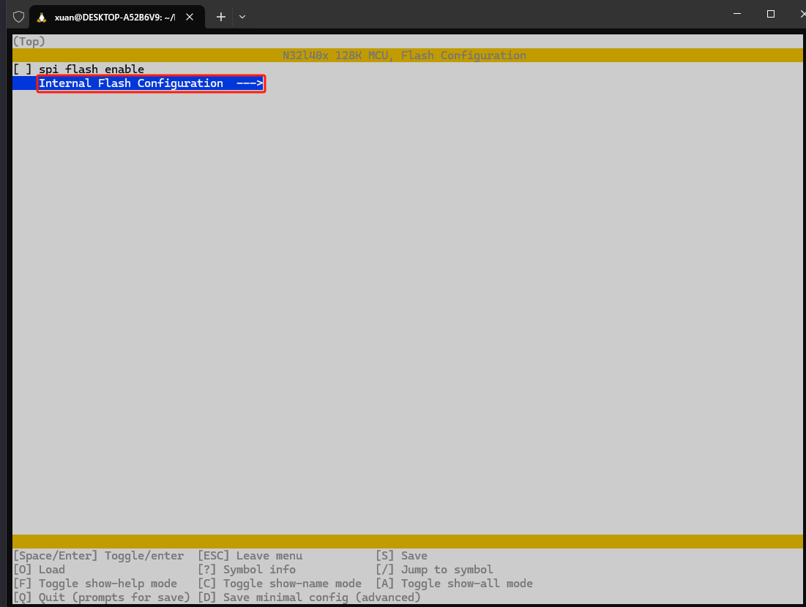
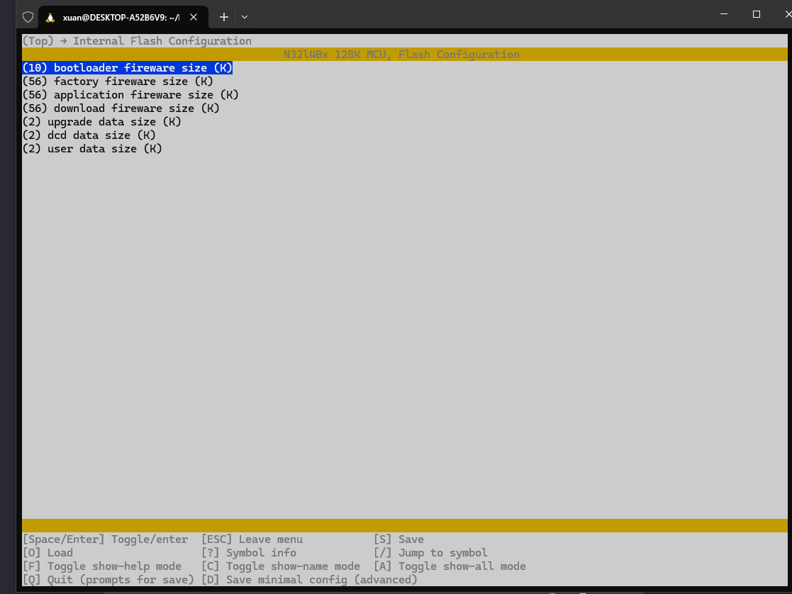

<br>

## makefile问题汇总

### 修改.h文件没有重新编译

- 定义`COMPILE_FLAGS = -MD`或者`-MMD`, 编译器标志，用于生成 `.d` 文件
- `$(BUILD_DIR)`为编译文件目录，跟进自身makefile修改，原来的编译规则：

``` makefile
-include $(wildcard $(BUILD_DIR)/*/*.d)	# 包含所有生成的依赖文件，避免重复编译、提高效率
```
`/*/*.d` 为当前目录下的二级所有文件检索。

- 修改为以下编译规则：
``` makefile
# 找到所有的 .d 文件
DEP_FILES := $(shell find $(BUILD_DIR) -type f -name '*.d')# 包含所有生成的依赖文件，避免重复编译、提高效率

# 包含所有的 .d 文件
-include $(DEP_FILES)
```
或者：
``` c
-include $(wildcard $(BUILD_DIR)/**/*.d)
-include $(wildcard $(BUILD_DIR)/*/*/*.d)
```
`/**/*.d` 它允许你搜索和匹配嵌套在任意深度的目录中的文件。
`/*/*/*.d` 为当前目录下的三级所有文件检索，根据具体情况修改。

<br>

### `$<` 和 `$^` 的区别

在`Makefile`中，`$<` 和 `$^` 是两个自动变量，它们在规则中用来引用规则的依赖文件，但它们的用途和行为有所不同：

- `$<` - 代表规则的第一个依赖文件。
	- 当规则有多个依赖文件时，`$<` 只引用第一个依赖文件。
	- 它通常用于指定要编译的源文件，特别是在编译单个目标文件时。

- `$^` - 代表规则的所有依赖文件。
	- 无论规则有多少个依赖文件，`$^` 都会将它们全部列出。
	- 它常用于链接阶段，当你需要将多个目标文件链接成最终的可执行文件时。

举个例子来说明它们的不同：

``` makefile
# 假设有一个目标文件 main.o 需要两个源文件 main.c 和 utils.c 来生成
main.o: main.c utils.c
    $(CC) $(CFLAGS) -c main.c -o $@

# 在这个例子中，$< 就是 main.c，而 $^ 就是 main.c utils.c
```

再看一个示例：
``` makefile
$(BUILD_DIR)/%.o: %.c
	@mkdir -p $(dir $@)
	$(CC) $(CFLAGS) $(INCLUDE) $< -o $@
```
这个规则的意思是，对于`$(BUILD_DIR)`目录下的每个`.o`文件，都有一个对应的`.c`文件。在`Makefile`中，`$<` 是一个自动变量，它代表当前规则的第一个依赖文件。然而，`$<` 并不会直接依赖所有的 `.c` 文件，而是依赖于当前规则的 **第一个依赖文件**。

总结一下：

- 使用 `$<` 时，只有第一个依赖文件会被考虑。
- 使用 `$^` 时，所有依赖文件都会被考虑。

在实际编写Makefile时，根据你的需要选择合适的变量。

<br>

### makefile伪指令
在 `Makefile` 中，`.PHONY` 是一个特殊的声明，用来指出一些目标并不是实际的文件，而是一些需要执行的命令序列。这样做可以让 `Make` 工具在遇到同名文件时，不会误认为这些目标是要操作的文件，而是要执行的命令。

``` makefile
.PHONY : clean all copy mix download

all: $(TARGET).bin $(TARGET).list $(TARGET).hex
	$(SZ) $(TARGET).elf
	@make copy
	@make mix
	
copy: $(TARGET).bin
	cp $(TARGET).bin app.bin
	cp ../bootloader/bootloader.bin bootloader.bin
#	cp $(TARGET).hex app.hex

mix:
	./tools/papp_up
	./tools/mix_10K
	$(OC) -I binary -O ihex --change-addresses 0x8000000 mix.bin mix.hex
	rm bootloader.bin
	rm app.bin
	rm mix.bin

clean:
	rm -rf $(BUILD_DIR)
	rm papp.bin
	rm mix.hex
```

- `Makefile`默认执行的是 **第一个目标**（不包括以点开头的目标）`all`，而不是 `.PHONY` 后的第一个目标。`.PHONY` 宏的作用是防止`Make`错误地将伪目标与文件系统中的文件混淆。
- `make`会加载依赖`$(TARGET).bin` `$(TARGET).list` `$(TARGET).hex` `$(SZ) $(TARGET).elf`。
- `@`符号使得 `Make` 工具在执行命令时不会打印该命令本身,如`make copy`。
- **拓展**：`$(OC) -I binary -O ihex --change-addresses 0x8000000 mix.bin mix.hex`表示将 `mix.bin` 的二进制文件转换为名为 `mix.hex` 的 `Intel HEX`格式文件，并将所有地址偏移设置为 `0x8000000`

<br>

## n32g452rc的makefile解析

**`makefile`源码：**
``` makefile
# C编译器的宏定义
C_DEFS +=  \
-DN32G45X \
-DUSE_STDPERIPH_DRIVER

# C编译器的头文件搜索路径
INCLUDE +=  \
-ICMSIS/core  \
-ICMSIS/device	\
-Istd_periph_lib/inc


# APP源文件
C_APP_SOURCES +=  \
application/main.c \
application/n32g45x_it.c

# 中间层驱动源文件
C_DRV_SOURCES +=  \
msp/drv_msp.c \
$(wildcard rtt-nano/src/*.c)

# C编译器的底层驱动源文件
C_LIB_SOURCES +=  \
CMSIS/device/system_n32g45x.c \
std_periph_lib/src/misc.c \
std_periph_lib/src/n32g45x_rcc.c

C_SOURCES += $(C_LIB_SOURCES)
C_SOURCES += $(C_APP_SOURCES)
C_SOURCES += $(C_DRV_SOURCES)

ASM_SOURCES +=  \
CMSIS/device/startup/startup_n32g45x_gcc.S \
rtt-nano/libcpu/arm/cortex-m4/context_gcc.S

# 指定交叉编译工具链的 编译器、连接器、库管理器、
CROSS_COMPILE=arm-none-eabi-
CC=$(CROSS_COMPILE)gcc
LD=$(CROSS_COMPILE)ld
AR=$(CROSS_COMPILE)ar
AS=$(CROSS_COMPILE)as
OC=$(CROSS_COMPILE)objcopy
OD=$(CROSS_COMPILE)objdump
SZ=$(CROSS_COMPILE)size

# 指定目标硬件的架构和浮点运算单元   -mfpu=fpv4-sp-d16 -mfloat-abi=hard -mfloat-abi=soft 
MCU = -mcpu=cortex-m4 -mthumb \
	-ffunction-sections \
	-fdata-sections \
	--specs=nano.specs \
	--specs=nosys.specs \
	-Os -ggdb

# 定义编译C源文件的编译选项：禁用共享变量、函数和数据分段、优化级别、调试信息级别、开启所有警告、目标架构、预定义宏
# O0:禁用优化，O1：基本优化，O2, O3, Os
# g0:禁用调试信息, g1, g2, g3, g
CFLAGS += -c -fno-common \
	--specs=rdimon.specs \
	-std=gnu99 -mabi=aapcs \
	-Wall \
	$(MCU) \
	$(C_DEFS)


# 定义链接器脚本、链接选项、目标文件格式转换选项、反汇编 -nostdlib -lnosys
LDSCRIPT=n32g452_flash.ld
LDFLAGS += -Wl,--gc-sections --data-sections -mabi=aapcs $(MCU) -T$(LDSCRIPT) \
	-x assembler-with-cpp -Wa,-mimplicit-it=thumb

# printf打印浮点数
# LDFLAGS += -lc -lrdimon -u _printf_float

OCFLAGS	= -Obinary
ODFLAGS	= -S


#输出目录和目标文件名
BUILD_DIR = build
TARGET  = $(BUILD_DIR)/app

# C源文件、汇编源文件的目标文件路径
C_OBJECTS = $(addprefix $(BUILD_DIR)/, $(C_SOURCES:.c=.o))
ASM_OBJECTS = $(addprefix $(BUILD_DIR)/, $(ASM_SOURCES:.S=.o))
OBJECTS += $(ASM_OBJECTS) $(C_OBJECTS)

.PHONY : clean all

all: $(TARGET).bin $(TARGET).list $(TARGET).hex
	$(SZ) $(TARGET).elf
	@make copy
	@make mix

.PHONY: copy

copy: $(TARGET).bin
	cp $(TARGET).bin app.bin
	cp ../bootloader/bootloader.bin bootloader.bin
#	cp $(TARGET).hex app.hex

mix:
	./tools/papp_up
	./tools/mix_10K
	$(OC) -I binary -O ihex --change-addresses 0x8000000 mix.bin mix.hex
	rm bootloader.bin
	rm app.bin
	rm mix.bin

clean:
	rm -rf $(BUILD_DIR)
	rm papp.bin
	rm mix.hex

SYS := $(shell uname -a)

ifeq ($(findstring Microsoft,$(SYS)),Microsoft)
COPY_CMD:
	cp $(TARGET).hex "/mnt/c/Users/Breo/Desktop/iap-tools/linux_download"
	wsl.exe -d Ubuntu-20.04 cmd.exe /c "C:\\\Users\\\BREO\\\Desktop\\\iap-tools\\\linux_download\\\program452RC.bat"
else
COPY_CMD:
	echo "当前系统不是 WSL，跳过拷贝文件指令"
endif

download:
	@make all
	@$(MAKE) COPY_CMD

# 定义生成目标文件的规则
$(TARGET).list: $(TARGET).elf
	$(OD) $(ODFLAGS) $< > $(TARGET).lst

$(TARGET).bin: $(TARGET).elf
	$(OC) $(OCFLAGS) $(TARGET).elf $(TARGET).bin

$(TARGET).elf: $(OBJECTS)
	$(CC) $(ASM_OBJECTS) $(C_OBJECTS) $(LDFLAGS) -Wl,-Map=$(TARGET).map -o $(TARGET).elf

$(TARGET).hex: $(TARGET).elf
	$(OC) -O ihex $< $@

# 定义编译C源文件、汇编源文件的规则，将源文件编译成目标文件
$(BUILD_DIR)/%.o: %.c
	mkdir -p $(dir $@)
	$(CC) $(INCLUDE) $(CFLAGS) -MMD -c $< -o $@

$(BUILD_DIR)/%.o: %.S
	mkdir -p $(dir $@)
	$(CC) $(INCLUDE) $(CFLAGS) -c $< -o $@


#-include $(wildcard $(BUILD_DIR)/**/*.d)	# 包含所有生成的依赖文件，避免重复编译、提高效率

# 找到所有的 .d 文件
DEP_FILES := $(shell find $(BUILD_DIR) -type f -name '*.d')# 包含所有生成的依赖文件，避免重复编译、提高效率

# 包含所有的 .d 文件
-include $(DEP_FILES)
```
下面是对这段代码的逐句分析：

1. 宏定义 (`C_DEFS`):

	- `-DN32G45X` 和 `-DUSE_STDPERIPH_DRIVER` 是编译器的宏定义，用于在编译时定义特定的预处理变量。

<br>

2. 头文件搜索路径 (`INCLUDE`):

	`-ICMSIS/core`, `-ICMSIS/device`, `-Istd_periph_lib/inc` 指定了编译器搜索头文件的路径。

<br>

3. 应用层源文件 (`C_APP_SOURCES`):

	- 列出了应用层的 `C` 源文件。

<br>

4. 中间层驱动源文件 (`C_DRV_SOURCES`):
	
	- 使用 $(wildcard rtt-nano/src/*.c) 来匹配 rtt-nano/src 目录下的所有 .c 文件。

<br>

5. 底层驱动源文件 (`C_LIB_SOURCES`):

	- 列出了底层驱动的 C 源文件。

<br>

6. 源文件汇总 (`C_SOURCES`):

	- 将应用层、中间层和底层驱动的源文件汇总到 `C_SOURCES。`

<br>

7. 汇编源文件 (`ASM_SOURCES`):

	- 列出了汇编语言的源文件。

<br>

8. 交叉编译工具链 (`CROSS_COMPILE`, `CC`, `LD`, `AR`, `AS`, `OC`, `OD`, `SZ`):

	- 定义了交叉编译工具链的前缀和各个工具（编译器、链接器、库管理器等）的命令。

<br>

9. 目标硬件的架构和浮点运算单元 (`MCU`):

	- `-mcpu=cortex-m4`:
    	- 编译器目标处理器是 `Cortex-M4` CPU
		- `-mcpu=` 后面跟的是具体的目标 CPU 型号
	- `-mthumb`:
		- 编译器生成 `Thumb` 指令集的代码。`Thumb` 指令集是 `ARM` 架构的一种`16位指令集`,用于嵌入式系统以减少内存占用和提高代码密度。
	- `-ffunction-sections`:
		- 允许编译器将 **每个函数** 分别放入程序的 **单独段** 中。这可以使得链接器在最终的链接阶段丢弃未使用的函数，从而*减小最终固件的大小*。
	- `-fdata-sections`:
		- 类似于 `-ffunction-sections`，这个选项允许编译器将 **不同的数据** 放入程序的 **不同段** 中。这同样有助于链接器优化，`移除未使用的数据段`。
	- `--specs=nano.specs`:
		- 这个选项指定使用新`libnano`规格，这是针对小型嵌入式系统的 **C 标准库的缩减版本**。它提供了比标准` C` 库 **更小的占用空间**，适合资源受限的系统。
	- `--specs=nosys.specs`:
		- 这个选项指定编译器使用 `nosys` 作为系统调用的默认返回值。在嵌入式系统中，系统调用可能并不总是可用，这个选项 **允许编译器生成不依赖系统调用的代码**。
	- `-Os`:
		- 这个选项指示编译器`优化大小`。编译器会尝试在不牺牲太多性能的情况下，生成尽可能小的代码。还有 `-O0(无优化)`, `-O1`, `-O2`, `-O3`, `-Og`(优化调试,不是优化性能或大小)
	- `-ggdb`:
		- 这个选项用于生成调试信息。`-g` 让编译器在对象文件中包含调试信息，使得开发者可以使用调试器（如 `GDB`）来调试程序。

	- `-mfpu=fpv4-sp-d16`(未使用):
		- 符合 `FPU 版本 4（FPv4）`的浮点单元，它支持单精度（`single-precision`）和双精度（`double-precision`）浮点运算。`-sp-d16` 表示该 `FPU` 拥有 `16` 个双精度寄存器，它们被组织为 `32` 个单精度寄存器。
	- `-mfloat-abi=hard`(未使用):
		- 这个选项指定使用“硬”浮点 `ABI`，意味着浮点运算将使用目标硬件的 FPU 执行，并且浮点函数（如 `sin`、`cos`、`sqrt` 等）将被实现为直接调用硬件支持的浮点指令。这通常可以提高性能，因为 **浮点运算更快**，但可能会 **增加固件的大小**，因为需要包含 FPU 的指令集。
	- `-mfloat-abi=soft`(未使用):
		- soft 浮点 ABI 指定浮点运算将通过软件库实现，而不是直接使用硬件 FPU。这种方式可以 **生成更小的代码**，因为不需要包含 FPU 的指令集，但运行时的 **浮点运算会较慢**，因为它们需要通过软件模拟。

	**注意：**`-mfpu=fpv4-sp-d16` 与 `-mfloat-abi=hard` 或 `-mfloat-abi=soft` 选项一起使用。
<br>

10. 编译选项 (`CFLAGS`):
	定义了编译 `C` 源文件时使用的选项,`$(MCU)` 和 `$(C_DEFS)`上面有解释，不过多阐述。
	- `-c`:
		- 这个选项告诉编译器 **仅编译源代码** 文件而 **不进行链接**。编译器会为每个源文件生成一个目标（`object`）文件，这些目标文件 **随后可以被链接** 器链接成**可执行文件**或**库**。
	- `-fno-common`:
		- 在一些系统中，`-fcommon` 是默认行为，它允许存在多个未初始化的相同大小的全局变量或静态变量，它们在**链接时合并为一个**。`-fno-common` 选项禁用了这一行为，要求每个全局变量或静态变量都有其自己的内存位置。这在嵌入式系统或某些特定系统中可能是必需的。
	- `--specs=rdimon.specs`:
		- 这个选项指定使用 `rdimon.specs` 文件作为编译器的规格说明。规格说明文件包含了特定于系统的编译和链接规则，`rdimon.specs` 可能是指某个特定实时操作系统（`RTOS`）或嵌入式平台的规格。
	- `-std=gnu99`:
		- 这个选项指定编译器遵循 `ISO C99` 标准，同时包括 GNU 的扩展。gnu99 意味着除了标准的 `C99` 特性外，编译器还会接受 GNU C 的特定扩展。
	- `-mabi=aapcs`:
		- 这个选项指定使用 `ARM` 架构程序调用标准（`AAPCS，ARM Architecture Procedure Call Standard`）。`AAPCS` 定义了函数调用时的参数传递、返回值以及寄存器使用等规则。
	- `-Wall`:
		- 这个选项告诉编译器打开大多数警告信息。虽然 `-Wall` 并不打开所有的警告选项，但它会启用大量标准警告，帮助开发者发现潜在的问题。

<br>

11. 链接器脚本和链接选项 (`LDSCRIPT`, `LDFLAGS`):
	
	- `LDSCRIPT=n32g452_flash.ld`
		- 链接器使用的脚本
	- `-Wl,--gc-sections`
		- `Wl` 是告诉 `GCC` 后面的选项是传递给链接器的
		- `--gc-sections` 告诉链接器在最终的可执行文件中删除未使用的代码段，减小程序大小。
	- `--data-sections`:
		- 这个选项类似于 `--gc-sections`，但它专门用于数据段。它允许链接器移除未使用的数据段，进一步减小程序大小。
	- `-mabi=aapcs`:
		- 这个选项指定了应用程序二进制接口（`ABI`）。`aapcs` 代表 `ARM 架构`过程调用标准，它定义了 `ARM 架构`中函数调用的规则，包括如何传递参数、如何管理堆栈等。
	- `-T$(LDSCRIPT)`:
		- `-T` 是**链接器选项**，用来指定**链接脚本文件**。链接脚本包含了有关如何链接程序的附加信息，比如内存布局、各种段的位置等。`$(LDSCRIPT)` 是一个 `Makefile` 变量，它的值是链接脚本文件的名称，通常是一个文本文件，告诉链接器如何组织内存中的段。
	- `-x assembler-with-cpp`:
		- 这个选项告诉链接器将**所有输入文件**视为**预处理过**的**汇编源文件**。这通常用于确保链接器正确处理由 **C 预处理器**生成的**汇编代码**。
	- `-Wa,-mimplicit-it=thumb`:
		- 这是传递给汇编器的选项（通过 `-Wa` 前缀）。`-mimplicit-it=thumb` 指定默认的指令集为 `Thumb` 模式，这是 `ARM 架构`的一种 `16 位指令集`，用于减小代码大小。

<br>

12.  目标文件格式转换选项 (`OCFLAGS`, `ODFLAGS`):
	- `OCFLAGS = -Obinary`
	- `ODFLAGS = -S`
	
<br>

13. 输出目录和目标文件名 (`BUILD_DIR`, `TARGET`):
	- 定义了构建输出目录和最终目标文件的名称。

<br>

14. 目标文件的生成 (`C_OBJECTS`, `ASM_OBJECTS`, `OBJECTS`):
	- `C_OBJECTS = $(addprefix $(BUILD_DIR)/, $(C_SOURCES:.c=.o))`
		- `$(C_SOURCES:.c=.o)`将所有的 `C` 源文件列表 `$(C_SOURCES)` 中的每个 `.c` 扩展名替换为 `.o` 扩展名，得到目标文件（`object files`）列表。
		- `$(addprefix $(BUILD_DIR)/, ...) `为每个 `.o` 文件**加前缀**加上构建目录 `$(BUILD_DIR)/` 的路径。
		- `C_OBJECTS` 变量包含了所有 `C` 源文件对应的、带有完整路径的目标文件列表。
	- `ASM_OBJECTS = $(addprefix $(BUILD_DIR)/, $(ASM_SOURCES:.S=.o))`:
		- 这行代码的逻辑与 `C_OBJECTS` 类似，但是针对汇编源文件 `$(ASM_SOURCES)`。
		- 它将所有 `.S` 源文件扩展名替换为 `.o`，然后添加构建目录的前缀，生成汇编语言目标文件的列表。
	- `OBJECTS += $(ASM_OBJECTS) $(C_OBJECTS)`:
		- 这行代码使用 `+=` 操作符将 `$(ASM_OBJECTS)` 和 `$(C_OBJECTS)` 列表中的所有目标文件添加到 `OBJECTS` 变量中。
		- OBJECTS 变量通常用于表示所有需要链接的文件的列表，它可能已经包含了一些其他目标文件，这里通过 `+=` 操作符将`汇编`和 `C` 语言的目标文件列表追加进去。
		- 最终，`OBJECTS `包含了所有需要被链接器用来生成最终可执行文件或库文件的目标文件。
<br>

15. 伪目标 (`.PHONY`):
	- 定义了 `clean`, `all`, `copy`, `mix`, `download` 等伪目标，用于执行特定的命令序列。

<br>

16. 条件命令 (`SYS`, `ifeq`):
	- `SYS := $(shell uname -a)`:
		- 这行使用 `uname -a` 命令来获取当前系统的内核信息，并将输出赋值给 `SYS` 变量。`$(shell ...)` 命令会在 `shell` 中执行括号内的内容，并返回其输出。
	- `ifeq ($(findstring Microsoft,$(SYS)),Microsoft)`:
		- 这是一个条件语句，用于检查 `SYS` 变量中是否包含字符串 "`Microsoft`"。`$(findstring ...)` 函数在 `SYS` 的值中搜索 "`Microsoft`" 字符串。如果找到，返回 "`Microsoft`"；否则返回空字符串。
		- `ifeq` 检查 `$(findstring Microsoft,$(SYS))` 的结果是否等于 "`Microsoft`"。如果是，将执行下面的命令
	- `wsl.exe -d Ubuntu-20.04 cmd.exe /c "C:\\\Users\\\BREO\\\Desktop\\\iap-tools\\\linux_download\\\program452RC.bat"`:
		- 使用 `wsl.exe` 调用 `WSL` 环境。
		- `-d Ubuntu-20.04`中，`-d` 选项允许你选择一个特定的发行版来启动,这里是`Ubuntu-20.04`。
		- `cmd.exe`:这是 `Windows` 的命令行解释器，来运行一个 `Windows 批处理脚本`。
		- `/c`: 告诉 `cmd.exe` 执行指定的命令，然后关闭窗口。
		- `"C:\\\...bat"`: 需要执行脚本的路径。
		- **不知道为什么要用`\\\`**。

<br>

17. 生成目标文件的规则 (`$(TARGET).list`, `$(TARGET).bin`, `$(TARGET).elf`, `$(TARGET).hex`):
	- `$(TARGET).list: $(TARGET).elf`:(以下规则类似)
		- `$(TARGET).list`: `$@`(**目标文件**)
		- `$(TARGET).elf`: `$<`(**输入文件**)
	- `$(OD) $(ODFLAGS) $< > $(TARGET).lst`:
		- 这是上述规则的命令部分。`$(OD)` 是 `objdump` 工具的变量，`$(ODFLAGS)` 是 `objdump` 的相关参数。`$<` 是自动变量，表示第一个依赖文件，也就是 `$(TARGET).elf`。
		- 命令使用 `objdump` 提取 `.elf` 文件的汇编内容，并重定向输出到 `$(TARGET).lst` 文件。
	- `$(OC) $(OCFLAGS) $(TARGET).elf $(TARGET).bin`:
		- 这是上述规则的命令部分。`$(OC)` 是 `objcopy` 工具的变量，`$(OCFLAGS)` 是 `objcopy` 的相关参数。
		- 命令使用 `objcopy` 从 `.elf` 文件生成二进制格式的 `.bin` 文件。
	- `$(CC) $(ASM_OBJECTS) $(C_OBJECTS) $(LDFLAGS) -Wl,-Map=$(TARGET).map -o $(TARGET).elf`:
		- 这是 **链接命令**，使用 `$(CC)` 编译器（实际上是链接器）来链接对象文件 `$(ASM_OBJECTS)` 和 `$(C_OBJECTS)`，以及链接器标志 `$(LDFLAGS)`。
		- `-Wl,-Map=$(TARGET).map` 选项告诉链接器生成一个内存映射文件 `$(TARGET).map`。
		- `-o $(TARGET).elf` 指定了输出的 **可执行文件**名。
	- `$(OC) -O ihex $< $@`:
		- 这是上述规则的命令部分，使用 `objcopy` 的 `-O ihex` 选项将输入文件（`$<`）转换为 `Intel HEX` 格式，并命名为 `$@`，即 `$(TARGET).hex`。
	- `mkdir -p $(dir $@)`
		- 这条命令确保目标文件的目录存在。`$(dir $@)` 获取目标文件的目录路径，`mkdir -p` 命令 **创建这个目录（如果它还不存在）**。
	- `$(CC) $(INCLUDE) $(CFLAGS) -MMD -c $< -o $@`
		- 这是编译单个 `C` 源文件的命令。它使用 `$(CC)` 编译器，`$(INCLUDE)` 包含路径，`$(CFLAGS)` 编译选项，`-c` 选项来编译不链接，`-MMD` 生成依赖文件，`$<` 是源文件，`$@` 是目标文件。
	- `$(BUILD_DIR)/%.o: %.S`:
		- 这是一个模式规则，用于从 `.S` 汇编源文件生成 `.o` 目标文件，其命令与上面编译 `C` 文件的命令类似，但是通常 **不包含编译选项**，因为汇编语言的处理方式与 `C` 语言不同。
	- `-include $(wildcard $(BUILD_DIR)/**/*.d)`:
		- `$(wildcard *.c)` 会列出当前目录下所有的 `.c` 文件。
		- `$(wildcard $(BUILD_DIR)/**/*.d)` 会列出 `$(BUILD_DIR)` 目录下的所有 `.d` 文件。
	- `DEP_FILES := $(shell find $(BUILD_DIR) -type f -name '*.d')`,`-include $(DEP_FILES)`:
		- `find` 这是一个 `find` 命令，用于在文件系统中搜索文件。
		- `$(BUILD_DIR)` 是之前定义的 `Makefile` 变量，表示构建目录的路径。
		- `-type f` 指定 `find` 命令只搜索文件（不包括目录）。
		- `-name '*.d'` 定义了搜索的文件名模式，`*.d` 匹配所有以 `.d` 结尾的文件，这通常是由编译器生成的依赖文件。
		- `-include $(DEP_FILES)`： `make` 将会包含这些 `.d` ,这些文件包含了**头文件的依赖信息**,从而确保 `make` 能够正确地**检测到源文件的依赖关系**，并且在**源文件**或其**头文件**发生变化时**重新编译**相应的目标文件。

<br>

18. 编译C源文件和汇编源文件的规则 (`$(BUILD_DIR)/%.o: %.c`, `$(BUILD_DIR)/%.o: %.S`):

	- 定义了如何编译 `C` 和汇编源文件为 `.o` 目标文件。

<br>

19. 包含生成的依赖文件 `(-include $(wildcard $(BUILD_DIR)/**/*.d), DEP_FILES)`:
	- 使用 `find` 命令找到所有的 `.d` 文件，然后使用 `-include` 指令包含这些文件，以确保 `Make` 能够跟踪源文件的变化并避免不必要的重新编译。

<br>

## 标准makefile基本语法
[参考文档]：https://seisman.github.io/how-to-write-makefile/index.html

### 书写规则

#### 规则的语法
``` makefile
targets : prerequisites
    command
    ...
```
或是这样：
``` makefile
targets : prerequisites ; command
    command
    ...
```
如果命令太长，你可以使用反斜杠（ `\` ）作为换行符

<br>

#### 在规则中使用通配符
`make`支持三个通配符： `*` ， `?` 和 `~` 。这是和`Unix`的`B-Shell`是相同的。

- `*`：通配符代替了你一系列的文件，如 `*.c` 表示所有后缀为c的文件。一个需要我们注意的是，如果我们的文件名中有通配符，如： `*` ，那么可以用转义字符 `\` ，如 `\*` 来表示真实的 `*` 字符，而不是任意长度的字符串。
``` makefile
clean:
    rm -f *.o
```
`clean`是操作系统`Shell`所支持的通配符。
``` makefile
objects = *.o
```
`objects`的值就是 `*.o`, 并不是说 *.o 会展开， 如需展开进行以下操作。
``` makefile
objects := $(wildcard *.o)
```
**示例1**：
``` makefile
var = $(shell echo "Hello, World!")
```
- `:=` 和 `=`区别：
	- `=` (递归展开):**示例1**每次引用 `$(var)` 时，`Make` 都会执行 `echo "Hello, World!"`
	- `:=` (直接展开):**示例1**每次引用 `$(var)` 的值在 `Makefile` 解析时设置为 `"Hello, World!"`

**示例2** 
可写出编译并链接所有 `.c` 和 `.o` 文件：
``` makefile
objects := $(patsubst %.c,%.o,$(wildcard *.c))
foo : $(objects)
    cc -o foo $(objects)
```
- `patsubst` 函数用于将第一个参数中匹配第二个参数模式的部分替换为第三个参数中的相应模式
- `patsubst` 函数用于将 `*.c` 替换为 `*.o`，`wildcard` 函数用于获取当前目录下所有 `.c` 文件。

<br>

#### 文件搜索
``` makefile
	VPATH = src:../headers
``` 
- `Makefile`文件中的特殊变量 `VPATH`,当`make`就会在当前目录找不到的情况下，到所指定的目录中去找寻文件了。
- “`src`”和“`../headers`”，make会按照这个顺序进行搜索。目录由“`冒号`”分隔。（当然，当前目录永远是最高优先搜索的地方）。

``` makefile
vpath <pattern> <directories>
vpath %.h ../headers
```
- `vpath`使用方法中的`<pattern>`需要包含 `%` 字符。 `%` 的意思是匹配`零`或`若干字符`，（需引用 `%` ，使用 `\` ）例如， `%.h` 表示所有以 `.h` 结尾的文件。`<pattern>`指定了要搜索的文件集，而`<directories>`则指定了`<pattern>`的文件集的搜索的目录。

<br>

#### 伪目标
``` makefile
.PHONY : clean
clean :
    rm *.o temp
```
伪目标一般没有依赖的文件。但是，我们也可以为伪目标指定所依赖的文件。伪目标同样可以作为“**默认目标**”，只要将其放在**第一个**。
``` makefile
all : prog1 prog2 prog3
.PHONY : all

prog1 : prog1.o utils.o
    cc -o prog1 prog1.o utils.o

prog2 : prog2.o
    cc -o prog2 prog2.o

prog3 : prog3.o sort.o utils.o
    cc -o prog3 prog3.o sort.o utils.o
```
- `Makefile`中的第一个目标会被作为其**默认目标**。我们声明了一个“`all`”的伪目标，其依赖于其它三个目标。由于默认目标的特性是，总是被执行的，但由于“`all`”又是一个伪目标，伪目标只是一个标签不会生成文件，所以不会有“`all`”文件产生。于是，其它三个目标的规则总是会被决议。也就达到了我们一口气生成多个目标的目的。
- `.PHONY : all` 声明了“`all`”这个目标为“伪目标”。（注：这里的显式“`.PHONY : all`” 不写的话一般情况也可以正确的执行，这样`make`可通过隐式规则推导出， “`all`” 是一个伪目标，执行`make`不会生成“`all`”文件，而执行后面的多个目标。建议：显式写出是一个好习惯。）

<br>

#### 多目标
`Makefile`的规则中的目标可以不止一个，其支持多目标，有可能我们的多个目标同时依赖于一个文件，并且其生成的命令大体类似。
``` makefile
bigoutput littleoutput : text.g
    generate text.g -$(subst output,,$@) > $@
```
上述规则等价于：
``` makefile
bigoutput : text.g
    generate text.g -big > bigoutput
littleoutput : text.g
    generate text.g -little > littleoutput
```
其中，`-$(subst output,,$@)`中的 `$` 表示执行一个`Makefile`的函数，函数名为`subst`，后面的为参数。关于函数，将在后面讲述。这里的这个函数是替换字符串的意思， `$@` 表示目标的集合，就像一个数组， `$@` 依次取出目标，并执于命令。

- `$(subst from,to,text)`
	- `from` 是您想要替换的字符串。
	- `to` 是您想要替换成的新字符串。
	- `text` 是原始文本。
-  `generate text.g -$(subst output,,$@) > $@`中的"`>`" 是一个`shell`命令，用于将 `generate text.g -$(subst output,,$@)` 的输出重定向到右侧`$@`文件中。

<br>

#### 静态模式
静态模式可以更加容易地定义多目标的规则，可以让我们的规则变得更加的有弹性和灵活。我们还是先来看一下语法：
``` makefile
<targets ...> : <target-pattern> : <prereq-patterns ...>
    <commands>
    ...
```
我们的“**目标模式**”或是“**依赖模式**”中都应该有 `%` 这个字符，如果你的文件名中有 `%` 那么你可以使用反斜杠 `\` 进行转义，来标明真实的 `%` 字符。看一个例子：
``` makefile
objects = foo.o bar.o

all: $(objects)

$(objects): %.o: %.c
    $(CC) -c $(CFLAGS) $< -o $@
```
- 我们的目标从`$object`中获取
- `%.o` 表明要所有以 `.o` 结尾的目标，也就是 `foo.o` `bar.o`,也就是变量 `$object` 集合的模式
- 依赖模式 `%.c` 则取模式 `%.o` 的 `%` ，也就是 `foo` `bar` ，并为其加下 `.c` 的后缀，于是，我们的依赖目标就是 `foo.c` `bar.c `
- 命令中的 `$<` 和 `$@` 则是自动化变量， `$<` 表示 **第一个依赖文件**， `$@` 表示 **目标集**（也就是“`foo.o` `bar.o`”）

上面的规则展开后等价于下面的规则：
``` makefile
foo.o : foo.c
    $(CC) -c $(CFLAGS) foo.c -o foo.o
bar.o : bar.c
    $(CC) -c $(CFLAGS) bar.c -o bar.o
```
如果我们的 `%.o` 有几百个，使用“**静态模式规则**”很方便，再看一个例子：
``` makefile
files = foo.elc bar.o lose.o

$(filter %.o,$(files)): %.o: %.c
    $(CC) -c $(CFLAGS) $< -o $@
$(filter %.elc,$(files)): %.elc: %.el
    emacs -f batch-byte-compile $<
```
- `$(filter %.o,$(files))`表示调用`Makefile`的`filter`函数，过滤“`$files`”集，只要其中模式为“`%.o`”的内容。

<br>

#### 自动生成依赖性
在`Makefile`中，我们的依赖关系可能会需要包含一系列的头文件，比如，如果我们的`main.c`中有一句 `#include "defs.h"` ，那么我们的依赖关系应该是：

	main.o : main.c defs.h

但是，如果是一个比较大型的工程，你必需清楚哪些C文件包含了哪些头文件,例如，如果我们执行下面的命令:

	cc -M main.c

其输出是：

	main.o : main.c defs.h

需要提醒一句的是，如果你使用`GNU`的`C/C++`编译器，你得用 `-MM` 参数，不然，`-M` 参数会把一些 **标准库的头文件也包含进来**。

- `gcc -M main.c`的输出是:
``` makefile
main.o: main.c defs.h /usr/include/stdio.h /usr/include/features.h \
    /usr/include/sys/cdefs.h /usr/include/gnu/stubs.h \
    /usr/lib/gcc-lib/i486-suse-linux/2.95.3/include/stddef.h \
    /usr/include/bits/types.h /usr/include/bits/pthreadtypes.h \
    /usr/include/bits/sched.h /usr/include/libio.h \
    /usr/include/_G_config.h /usr/include/wchar.h \
    /usr/include/bits/wchar.h /usr/include/gconv.h \
    /usr/lib/gcc-lib/i486-suse-linux/2.95.3/include/stdarg.h \
    /usr/include/bits/stdio_lim.h
```
- `gcc -MM main.c`的输出则是:
``` makefile
main.o: main.c defs.h
```
- `GNU`组织建议把编译器为每一个源文件的自动生成的依赖关系放到一个文件中，为每一个 `name.c` 的文件都生成一个 `name.d` 的`Makefile`文件， `.d` 文件中就存放对应 `.c` 文件的依赖关系。
- 我们可以写出 `.c` 文件和 `.d` 文件的依赖关系，并让`make`自动更新或生成 `.d` 文件，并把其包含在我们的主`Makefile`中，这样，我们就可以自动化地生成每个文件的依赖关系了。

```makefile
%.d: %.c
    @set -e; rm -f $@; \
    $(CC) -M $(CPPFLAGS) $< > $@.$$$$; \
    sed 's,\($*\)\.o[ :]*,\1.o $@ : ,g' < $@.$$$$ > $@; \
    rm -f $@.$$$$
```
- 规则的意思是，所有的 `.d` 文件依赖于 `.c` 文件
- `rm -f $@` 的意思是删除所有的目标，也就是 `.d` 文件
- 第二行的意思是，为每个依赖文件 `$<` ，也就是 `.c` 文件生成依赖文件， `$@` 表示模式 `%.d` 文件，如果有一个`C`文件是`name.c`，那么 `%` 就是 `name` ， `$$$$` 意为一个随机编号，第二行生成的文件有可能是“`name.d.12345`”
- 第三行使用`sed`命令做了一个替换，关于`sed`命令的用法请参看相关的使用文档
- 第四行就是删除临时文件

总而言之，这个模式要做的事就是在编译器生成的依赖关系中加入 `.d` 文件的依赖，即把依赖关系：

	main.o : main.c defs.h

转成：

	main.o main.d : main.c defs.h

于是，我们的 `.d` 文件也会自动更新了，并会自动生成了, 你还可以在这个 `.d` 文件中加入的不只是依赖关系，包括生成的命令也可一并加入，让每个 `.d` 文件都包含一个完整的规则, 例如：
``` makefile 
sources = foo.c bar.c

include $(sources:.c=.d)
```
- `$(sources:.c=.d)` 中的 `.c=.d` 的意思是做一个替换，把变量 `$(sources)` 所有 `.c` 的字串都替换成 `.d`
- 因为`include`是按次序来载入文件，最先载入的 `.d` 文件中的目标会成为默认目标。

<br>

### 书写命令

#### 显示命令
``` makefile
@echo 正在编译XXX模块......
```
当`make`执行时，会输出“正在编译XXX模块……”字串，但不会输出命令，如果没有“`@`”，那么，`make`将输出:
``` makefile
echo 正在编译XXX模块......		//输出命令
正在编译XXX模块......
```
- 如果`make`执行时，带入`make`参数 `-n` 或 `--just-print` ，那么其只是显示命令，但不会执行命令。
- `make`参数 `-s` 或 `--silent` 或 `--quiet` 则是全面禁止命令的显示。

#### 命令执行
当依赖目标新于目标时，也就是当规则的目标需要被更新时，make会一条一条的执行其后的命令。如果你要让上一条命令的结果应用在下一条命令时，你应该使用分号分隔这两条命令。比如你的第一条命令是`cd`命令，你希望第二条命令得在`cd`之后的基础上运行，那么你就不能把这两条命令写在两行上，而应该把这两条命令写在一行上，用分号分隔。
- 示例一：
``` makefile
exec:
    cd /home/hchen
    pwd
```

``` makefile
exec:
    cd /home/hchen; pwd
```
当我们执行 `make exec` 时，第一个例子中的`cd`没有作用，`pwd`会打印出当前的`Makefile`目录，而第二个例子中，`cd`就起作用了，`pwd`会打印出“`/home/hchen`”。

#### 命令出错
忽略命令的出错，我们可以在`Makefile`的命令行前加一个减号 `-` （在`Tab`键之后），标记为不管命令出不出错都认为是成功的。如：
``` makefile
clean:
    -rm -f *.o
```
- 还有一个全局的办法是，给`make`加上 `-i` 或是 `--ignore-errors` 参数，那么，`Makefile`中所有命令都会忽略错误。如果一个规则是以 `.IGNORE` 作为目标的，那么这个规则中的所有命令将会忽略错误。
- 还有一个要提一下的`make`的参数的是 `-k` 或是 `--keep-going `，这个参数的意思是，如果某规则中的命令出错了，那么就 **终止该规则** 的执行，但 **继续执行其它规则**。

#### 嵌套执行make
在一些大的工程中，我们会把我们不同模块或是不同功能的源文件放在不同的目录中，我们可以在每个目录中都书写一个该目录的`Makefile`

例如，我们有一个子目录叫`subdir`，这个目录下有个`Makefile`文件，来指明了这个目录下文件的编译规则。那么我们总控的`Makefile`可以这样书写：
``` makefile
subsystem:
    cd subdir && $(MAKE)
```
其等价于：
``` makefile
subsystem:
    $(MAKE) -C subdir
```
- `Makefile`的`-C`选项，可以指定编译目录，`-f`选项可以指定编译文件。
- 定义`$(MAKE)`宏变量的意思是，也许我们的`make`需要一些参数，所以定义成一个变量比较利于维护。这两个例子的意思都是先进入“`subdir`”目录，然后执行`make`命令。
- 我们把这个`Makefile`叫做“`总控Makefile`”，`总控Makefile`的**变量**可以传递到`下级的Makefile`中（如果你显示的声明），但是**不会覆盖**下层的`Makefile`中所定义的变量，除非指定了 `-e` 参数。
- 如果你要传递变量到下级`Makefile`中，那么你可以使用这样的声明: `export <variable ...>;`
- 如果你不想让某些变量传递到下级`Makefile`中，那么你可以这样声明: `unexport <variable ...>;`
- 如果你要传递所有的变量，那么，只要一个`export`就行了。后面什么也不用跟，表示传递所有的变量。
示例一：

	export variable = value
	// 其等价于：
	variable = value
	export variable
	// 其等价于：
	export variable := value
	// 其等价于：
	variable := value
	export variable

示例二：

	export variable += value
	// 其等价于：
	variable += value
	export variable

- 需要注意的是，有两个变量，一个是 `SHELL` ，一个是 `MAKEFLAGS` ，这两个变量不管你是否`export`，其总是要 **传递到下层** `Makefile`中，特别是 `MAKEFLAGS` 变量，其中包含了`make`的 **参数信息**，如果我们执行“`总控Makefile`”时有`make`参数或是在上层 `Makefile`中定义了这个变量，那么 `MAKEFLAGS` 变量将会是这些参数，并会传递到下层`Makefile`中，这是一个系统级的环境变量。
- 但是`make`命令中的有几个参数并不往下传递，它们是 `-C` , `-f` , `-h`, `-o` 和 `-W` （有关`Makefile`参数的细节将在后面说明），如果你不想往下层传递参数，那么，你可以这样来：
``` makefile
subsystem:
cd subdir && $(MAKE) MAKEFLAGS=
```
- 如果你定义了环境变量 `MAKEFLAGS` ，那么你得确信其中的选项是大家都会用到的，如果其中有 `-t` , `-n` 和 `-q` 参数，那么将会有让你意想不到的结果，或许会让你异常地恐慌。
- 还有一个在“**嵌套执行**”中比较有用的参数， `-w` 或是 `--print-directory` 会在`make`的过程中输出一些信息，让你看到目前的工作目录。比如，如果我们的下级`make`目录是“`/home/hchen/gnu/make`”，如果我们使用 `make -w` 来执行，那么当进入该目录时，我们会看到:
``` shell
make: Entering directory `/home/hchen/gnu/make'.
```
而在完成下层make后离开目录时，我们会看到:
``` shell
make: Leaving directory `/home/hchen/gnu/make'
```
- 当你使用 `-C` 参数来指定`make`下层`Makefile`时， `-w` 会被自动打开的。如果参数中有 `-s` （ `--slient` ）或是 `--no-print-directory` ，那么， `-w` 总是失效的。

<br>

#### 定义命令包
如果Makefile中出现一些相同命令序列，那么我们可以为这些相同的命令序列定义一个变量。定义这种命令序列的语法以 `define` 开始，以 `endef` 结束，如:
``` makefile
define run-yacc
yacc $(firstword $^)
mv y.tab.c $@
endef
```
- 这里，“run-yacc”是这个命令包的名字，其不要和Makefile中的变量重名。在 define 和 endef 中的两行就是命令序列。这个命令包中的第一个命令是运行Yacc程序，因为Yacc程序总是生成“y.tab.c”的文件，所以第二行的命令就是把这个文件改改名字。还是把这个命令包放到一个示例中来看看吧。

``` makefile
foo.c : foo.y
    $(run-yacc)
```
我们可以看见，要使用这个命令包，我们就好像使用变量一样。在这个命令包的使用中，命令包“`run-yacc`”中的 `$^` 就是 `foo.y` ， `$@` 就是 `foo.c` （有关这种以 `$` 开头的特殊变量，我们会在后面介绍），`make`在执行命令包时，命令包中的每个命令会被依次独立执行。

<br>

### 使用函数

#### 函数的调用语法
函数调用，很像变量的使用，也是以 `$` 来标识的，其语法如下：

	$(<function> <arguments>)    
	// 或者
	${<function> <arguments>}

#### 字符串处理函数

##### subst
``` makefile
$(subst <from>,<to>,<text>)
```
- 名称：字符串替换函数
- 功能：把字串 `<text>` 中的 `<from>` 字符串替换成 `<to>` 。
- 返回：函数返回被替换过后的字符串。

##### patsubst

``` makefile
$(patsubst <pattern>,<replacement>,<text>)
```
- 名称：**模式** 字符串替换函数。
- 功能：查找 `<text>` 中的单词（单词以“**空格**”、“**Tab**”或“**回车**”“**换行**”分隔）是否符合模式 `<pattern>` ，如果匹配的话，则以 `<replacement>` 替换。这里， `<pattern>` 可以包括通配符 `%` ，表示任意长度的字串。如果 `<replacement>` 中也包含 `%` ，那么， `<replacement>` 中的这个 `%` 将是 `<pattern>` 中的那个 % 所代表的字串。（可以用 `\` 来转义，以 `\%` 来表示真实含义的 `%` 字符）
- 返回：函数返回被替换过后的字符串。
- 示例：
``` makefile
$(patsubst %.c,%.o,x.c.c bar.c)
```
把字串 `x.c.c` `bar.c` 符合模式 `%.c` 的单词替换成 `%.o` ，返回结果是 `x.c.o` `bar.o`

##### strip

	$(strip <string>)

- 名称：去空格函数。
- 功能：去掉 `<string>` 字串中开头和结尾的空字符。
- 返回：返回被去掉空格的字符串值。
- 示例：
``` makefile
	$(strip a b c )
```
把字串` a b c ` 去掉开头和结尾的空格，结果是 `a b c`。


##### findstring

	$(findstring <find>,<in>)

- 名称：查找字符串函数
- 功能：在字串 <in> 中查找 <find> 字串。
- 返回：如果找到，那么返回 <find> ，否则返回空字符串。
- 示例：
``` makefile
$(findstring a,a b c)
$(findstring a,b c)
```
第一个函数返回 `a` 字符串，第二个返回`空`字符串

##### 混合总结

	override CFLAGS += $(patsubst %,-I%,$(subst :, ,$(VPATH)))

如果我们的 `$(VPATH)` 值是 `src:../headers `，那么 `$(patsubst %,-I%,$(subst :, ,$(VPATH)))` 将返回 `-Isrc -I../headers` ，这正是`cc`或`gcc`搜索头文件路径的参数。

**注**：函数太多，不做概述。详见：https://seisman.github.io/how-to-write-makefile/functions.html
**例程**：https://github.com/XUAN9527/linux_test/tree/main/make_demo

<br>

## Makefile搭配Kconfig使用

话不多说，我们一般使用`menuconfig`+`Kconfig`的方式进行版本配置，这里简单的笔记一个`Python`解析器版本的实现`Kconfiglib`。
[参考链接1]：https://cstriker1407.info/blog/kconfiglib-simple-note/
[参考链接2]：https://juejin.cn/post/7101836149915648030

### 环境搭建

- 安装必须组件：`Python3` + `kconfiglib`

``` shell
sudo apt update
sudo apt install python3
sudo apt install python3-pip
pip3 install kconfiglib
```

- 验证安装:
``` shell
$ python3 --version
Python 3.10.14

$ pip3 show kconfiglib
Name: kconfiglib
Version: 14.1.0
...
```

### 实现示例
- 在跟目录下创建`Kconfig`文件：
``` Kconfig
mainmenu "N32l40x 128K MCU, Flash Configuration"
config SPI_FLASH_ENABLE
  bool "spi flash enable"
  default n
  help 
  config spi flash enable/disable

menu "Internal Flash Configuration"
depends on !SPI_FLASH_ENABLE
config INTER_BOOTLOAD_FIRMWARE_SIZE
    int "bootloader fireware size (K)"
    range 10 32
    default 10
    help
    config bootloader fireware size

config INTER_FACTORY_FIRMWARE_SIZE
    int "factory fireware size (K)"
    range 56 96
    default 56
    help
    config factory fireware size 56K/96K

config INTER_APPLICATION_FIRMWARE_SIZE
    int "application fireware size (K)"
    range 56 96
    default 56
    help
    config application fireware size 56K/96K

config INTER_DOWNLOAD_AREA_SIZE
    int "download fireware size (K)"
    range 56 96
    default 56
    help
    config download area size 56K/96K

config INTER_UPGRADE_DATA_SIZE
    int "upgrade data size (K)"
    range 2 4
    default 2
    help
    config upgrade data size 2K/4K

config INTER_DCD_DATA_SIZE
    int "dcd data size (K)"
    range 2 4
    default 2
    help
    config dcd data size 2K/4K

config INTER_USER_DATA_SIZE
    int "user data size (K)"
    range 2 408
    default 2
    help
    config user data size 2K/408K; 2k - inter flash; 408K - outerflash
endmenu
...
```

- `shell`执行`menuconfig`指令：




- 选择好需要的参数后，保存退出，生成`.config`配置文件。
- `shell`执行`genconfig`指令，将`.config`文件生成`config.h`文件，可供程序调用。
- 如需搭配`makefile`使用，则需要将`config.h`文件添加到`Makefile`中,添加以下依赖规则。
``` makefile
all: genconfig ...
	...

...

menuconfig:
	menuconfig
	@echo "menuconfig running!"

genconfig:
	genconfig
	@echo "genconfig .config > config.h complete!"
```
执行`make menuconfig`进行配置，`make`编译生成即可。

## makefile隐藏打印输出

- 以下是`makefile`使用`make`编译的`shell`输出信息：
``` shell
xuan@DESKTOP-A52B6V9:~/work/wireless-charging/app$ make
mkdir -p build/application/
arm-none-eabi-gcc -ICMSIS/core -ICMSIS/device -Istd_periph_lib/inc -Iuser -Imsp -Idriver -Iapplication/inc -Icomponents/letter_shell -Icomponents/iap -Icomponents/ntc -Icomponents/soft_timer -Icomponents/comp_misc_lib -Icomponents/flexibleButton -Icomponents/aw9523b -c -fno-common --specs=rdimon.specs -std=gnu99 -mabi=aapcs -Wall -mcpu=cortex-m4 -mthumb -mfpu=fpv4-sp-d16 -mfloat-abi=hard -ffunction-sections -fdata-sections -lm --specs=nosys.specs --specs=nano.specs -Os -ggdb -DN32L40X -DUSE_STDPERIPH_DRIVER -D__FPU_PRESENT=1 -MMD -c application/main.c -o build/application/main.o
arm-none-eabi-gcc build/CMSIS/device/startup/startup_n32l40x_gcc.o build/CMSIS/device/system_n32l40x.o build/std_periph_lib/src/n32l40x_rcc.o build/std_periph_lib/src/n32l40x_tim.o build/std_periph_lib/src/n32l40x_adc.o build/std_periph_lib/src/n32l40x_dma.o build/std_periph_lib/src/n32l40x_usart.o build/std_periph_lib/src/n32l40x_iwdg.o build/std_periph_lib/src/n32l40x_flash.o build/std_periph_lib/src/n32l40x_gpio.o build/std_periph_lib/src/n32l40x_spi.o build/std_periph_lib/src/misc.o build/application/main.o build/application/n32l40x_it.o build/application/system_work.o build/user/module_battery.o build/user/module_botton.o build/user/module_led.o build/user/module_power.o build/user/module_storage.o build/user/shell_debug.o build/user/user_board.o build/msp/board.o build/msp/drv_msp.o build/driver/drv_adc.o build/driver/drv_flash.o build/driver/drv_gpio.o build/driver/drv_iwdg.o build/driver/drv_pwm_gpio.o build/driver/drv_pwm_input.o build/driver/drv_usart.o build/driver/drv_spi_led.o build/driver/drv_i2c.o build/driver/drv_i2c_bit_ops.o build/components/comp_misc_lib/comp_misc_lib.o build/components/flexibleButton/flexible_button.o build/components/iap/af_utils.o build/components/iap/dcd_port.o build/components/iap/dcd_user.o build/components/iap/iap.o build/components/iap/ymodem.o build/components/letter_shell/log.o build/components/letter_shell/shell.o build/components/letter_shell/shell_cmd_list.o build/components/letter_shell/shell_companion.o build/components/letter_shell/shell_ext.o build/components/letter_shell/shell_port.o build/components/ntc/ntc.o build/components/soft_timer/soft_timer.o build/components/aw9523b/aw9523b.o -Wl,--gc-sections --data-sections -mabi=aapcs -mcpu=cortex-m4 -mthumb -mfpu=fpv4-sp-d16 -mfloat-abi=hard -ffunction-sections -fdata-sections -lm --specs=nosys.specs --specs=nano.specs -Os -ggdb -Tn32l40x_flash.ld -x assembler-with-cpp -Wa,-mimplicit-it=thumb -Wl,-Map=build/app.map -o build/app.elf
arm-none-eabi-objcopy -Obinary build/app.elf build/app.bin
arm-none-eabi-objdump -S build/app.elf > build/app.lst
arm-none-eabi-objcopy -O ihex build/app.elf build/app.hex
arm-none-eabi-size build/app.elf
   text    data     bss     dec     hex filename
  29280     292   11888   41460    a1f4 build/app.elf
make[1]: Entering directory '/home/xuan/work/wireless-charging/app'
cp build/app.bin app.bin
cp ../bootloader/bootloader.bin bootloader.bin
make[1]: Leaving directory '/home/xuan/work/wireless-charging/app'
make[1]: Entering directory '/home/xuan/work/wireless-charging/app'
./tools/papp_up
./tools/mix_10K
arm-none-eabi-objcopy -I binary -O ihex --change-addresses 0x8000000 mix.bin mix.hex
rm bootloader.bin
rm app.bin
rm mix.bin
make[1]: Leaving directory '/home/xuan/work/wireless-charging/app'
```

- 以下是`makefile`的代码：
``` makefile
.PHONY : clean all

all: $(TARGET).bin $(TARGET).list $(TARGET).hex
	$(SZ) $(TARGET).elf
	@make copy
	@make mix

.PHONY: copy download

copy: $(TARGET).bin
	cp $(TARGET).bin app.bin
	cp ../bootloader/bootloader.bin bootloader.bin

mix:
	./tools/papp_up
	./tools/mix_10K
	$(OC) -I binary -O ihex --change-addresses 0x8000000 mix.bin mix.hex
	rm bootloader.bin
	rm app.bin
	rm mix.bin

clean:
	rm -rf $(OUTPUT_DIR)
	rm papp.bin
	rm mix.hex

SYS := $(shell uname -a)

ifeq ($(findstring Microsoft,$(SYS)),Microsoft)
COPY_CMD:
	cp $(OUTPUT_DIR)/app.hex "/mnt/c/Users/Breo/Desktop/iap-tools/linux_download/"
	wsl.exe -d Ubuntu-20.04 cmd.exe /c "C:\\\Users\\\BREO\\\Desktop\\\iap-tools\\\linux_download\\\program.bat"
else
COPY_CMD:
	echo "当前系统不是 WSL，跳过拷贝文件指令"
endif

download:
	@make all
	@$(MAKE) COPY_CMD
```
- 使用`@`和`--no-print`来隐藏打印信息，改进后：
``` makefile
.PHONY : clean all

all: $(TARGET).bin $(TARGET).list $(TARGET).hex
	$(SZ) $(TARGET).elf
	@make --no-print copy
	@make --no-print mix
	
.PHONY: copy

copy: $(TARGET).bin
	@cp $(TARGET).bin app.bin
	@cp ../bootloader/bootloader.bin bootloader.bin

mix:
	@./tools/papp_up
	@./tools/mix_10K
	@$(OC) -I binary -O ihex --change-addresses 0x8000000 mix.bin mix.hex
	@rm bootloader.bin
	@rm app.bin
	@rm mix.bin

clean:
	-rm -rf $(OUTPUT_DIR)
	-rm papp.bin
	-rm mix.hex

SYS := $(shell uname -a)

ifeq ($(findstring Microsoft,$(SYS)),Microsoft)
COPY_CMD:
	cp $(TARGET).hex "/mnt/c/Users/Breo/Desktop/iap-tools/linux_download/"
	wsl.exe -d Ubuntu-20.04 cmd.exe /c "C:\\\Users\\\BREO\\\Desktop\\\iap-tools\\\linux_download\\\program.bat"
else
COPY_CMD:
	echo "当前系统不是 WSL，跳过拷贝文件指令"
endif

download:
	@make all
	@$(MAKE) COPY_CMD


```