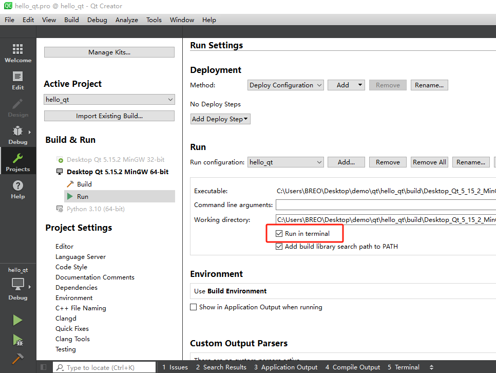

## 环境搭建

- **Qt官方下载地址**: https://download.qt.io/archive/qt/
- **参考教程文档**: https://subingwen.cn/qt/qt-primer/

<br>

## 问题汇总

### 打印问题

**问题现象：**

- 在Qt Creater中，使用`qDebug()`打印信息时，在调试界面中，`qDebug()`的输出信息会显示在调试终端，当直接运行`.exe`文件时，`qDebug()`的输出信息会丢失。

```cpp
MainWindow::MainWindow(QWidget *parent)
    : QMainWindow(parent)
    , ui(new Ui::MainWindow)
{
    ui->setupUi(this);
    qDebug() << "这是测试打印程序" << " * " << 10000;
}
```

**解决方法：**

- 在`qt.pro`工程文件中中，添加如下代码：
```cpp
CONFIG += c++17 console			//添加console
```
- 勾选以下选项：



**总结：**

- 需要重新编译代码，`.exe`文件更新后生效。
- 再次编译运行时,会弹出`terminal`。

