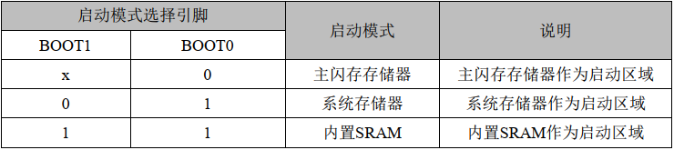

## 内核复位（kernel reset）

- **内核复位（kernel reset）时，要注意初始化代码，如 ADC：**

``` c
board init时先要反初始化：
DMA_DeInit(dma_chx);		//DMA开启循环接收后会持续接收字节
ADC_DeInit(adc_handler);

driver init:
int drv_adc_init(EADC_DEVICE adc_dev,EDMA_CHANNEL dma_ch)
{
	drv_adc_configuration(adc_dev);
	drv_dma_configuration(adc_dev,dma_ch);
	drv_adc_enable(adc_dev,DISABLE);
	return 0;
}

void kernel_reset(void)
{
    __DSB();
    __disable_irq();							//close irq
	drv_adc_deinit(EADC_DEV1,EDMA_CH6);			//disable adc data
    SCB->AIRCR = ((0x5FA << SCB_AIRCR_VECTKEY_Pos)      |
                  (SCB->AIRCR & SCB_AIRCR_PRIGROUP_Msk) |
                   SCB_AIRCR_VECTRESET_Msk);
    __DSB();
    while(1);
}

int drv_adc_deinit(EADC_DEVICE adc_dev,EDMA_CHANNEL dma_ch)
{
	ADC_Module *adc_handler = drv_get_adc_device(adc_dev)->ADC_Handler;
	DMA_ChannelType * dma_chx = drv_get_dma_channel(dma_ch);
	
	drv_adc_enable(adc_dev,DISABLE);
    DMA_EnableChannel(dma_chx,DISABLE);
	return 0;
}
```	

### MCU复位后状态
复位期间 和刚复位后,复用功能 未开启,I/O端口被配置成模拟功能模式(PCFGy[1:0]=00b, PMODEy[1:0]=00b)。
但有以下几个例外的信号：BOOT0、 NRST、 OSC_IN、 OSC_OUT 默认无 GPIO 功能：

	BOOT0 引脚默认输入下拉
	NRST 上拉输入输出

#### 复位后，调试系统相关的引脚默认状态为启动 SWD-JTAG， JTAG 引脚被置于输入上拉或下拉模式：
	PA15:JTDI 置于输入上拉模式 
	PA14:JTCK 置于输入下拉模式 
	PA13:JTMS 置于输入上拉模式
	PB4:NJTRST 置于输入上拉模式
	PB3:JTD0 置于推挽输出无上下拉

PD0 和 PD1
PD0 和 PD1 在 80 及以上引脚封装默认为模拟模式
PD0 和 PD1 在 80 以下引脚封装复用到 OSC_IN/OUT
PC13、 PC14、 PC15：
PC13～15 为备电域下的三个 IO， 备份域初次上电默认为模拟模式；

PB2/BOOT1：
PB2/BOOT1 默认处于下拉输入状态；

BOOT0 默认输入下拉，参照下表， 若 BOOT 的引脚未连接，则默认选择 Flash 主存储区。




## Linux 打开端口~/.bashrc不会自动刷新
解决linux每次打开新终端都要重新source ~/.bashrc问题
执行以下代码：

	vi ~/.bash_profile

有可能此文件是空白新建的，无所谓。然后在此文件末尾加入：
```c
if [ -f ~/.bashrc ];then
source ~/.bashrc
fi
```
然后:wq保存即可。
此时打开新终端可以自动执行source ~/.bashrc

## J-Link/J-Flash

**J-Flash批处理脚本配置烧录：**当然，前提是要添加J-Link的可执行程序路径到`$PATH`环境变量中
- program.bat脚本代码如下，参考修改即可：
```
echo start...

JLink -device N32L406CB -if swd -speed 4000 -CommanderScript "C:\Users\Breo\Desktop\Wireless moxibustion\Software\program.jlink"
```
- program.jlink文件代码如下，其中目标设备、文件路径、烧录地址等根据需要配置：
```
connect
device N32L406CB
si SWD
speed 4000
h		// halt-停止
r		// 复位，可以考虑去掉
erase		// 或 erase 0x8002800，去掉也行，但可能会出现error fail address 0x00000000错误提示

loadfile app.bin 0x8002800      // loadfile app.hex 或 loadfile app.bin 0x8000000
verifybin app.bin 0x8002800
r
go		// r go表示reset and run
q		// 退出J-Link命令行工具
```

## Ubantu 无法更新问题
Ubantu 无法使用apt update

### 更改软件源
编辑 /etc/apt/sources.list 文件，将以下内容添加到文件末尾

	deb https://mirrors.aliyun.com/ubuntu/ jammy main restricted universe multiverse
	deb-src https://mirrors.aliyun.com/ubuntu/ jammy main restricted universe multiverse

	deb https://mirrors.aliyun.com/ubuntu/ jammy-updates main restricted universe multiverse
	deb-src https://mirrors.aliyun.com/ubuntu/ jammy-updates main restricted universe multiverse

	deb https://mirrors.aliyun.com/ubuntu/ jammy-backports main restricted universe multiverse
	deb-src https://mirrors.aliyun.com/ubuntu/ jammy-backports main restricted universe multiverse

### 清除 apt 缓存

	sudo apt clean
	sudo apt autoclean

### 尝试更新系统

	sudo apt update

显示 ModuleNotFoundError: No module named 'apt_pkg'，重新安装 "apt_pkg" 模块：

	sudo apt install --reinstall python3-apt

显示 ERROR：

	E: Could not read response to hello message from hook [ ! -f /usr/bin/snap ] || /usr/bin/snap advise-snap --from-apt 2>/dev/null || true: Success

如果问题仍然存在，尝试修复 Python 包：

	sudo apt install --fix-broken

然后就更新系统了：

	sudo apt update
	sudo apt upgrade

执行sudo apt upgrade后显示ERROR：

	Errors were encountered while processing:
	/tmp/apt-dpkg-install-cQBLJW/626-linux-iot-tools-common_5.4.0-1030.31_all.deb
	E: Sub-process /usr/bin/dpkg returned an error code (1)

最后一步，修复损坏的软件包配置：

	sudo dpkg --configure -a
	sudo apt upgrade

## Breo蓝牙启动异常

### Breo蓝牙初始化
蓝牙初始化没完成，透传未开启，app就连接蓝牙了。
设置透传参数，开启透传的的状态中增加连接蓝牙接受指令。

### 心跳包回复超时
现在是接收/刷新设备数据200ms超时，延迟太长还可以缩短。

## SPI级联led灯调试小助手

产品名称：1209RGB幻彩雾状
产品型号：XTQ-016B.RGB-2307125-20

### SPI级联led灯问题汇总

#### 充电闪灯问题

##### 问题分析
	
充电中拔掉电源，立即再次插入，会闪一下灯；若等两秒再插入则不会出现，初步判断是此款芯片有锁存功能，会保存到寄存器中，未完全掉电再次插入则会继续执行上次的寄存器数据。

##### 解决方法

充电中拔掉电源，程序不要立即断电，持续两秒反初始化spi灯珠，即给spi寄存器写全灭数据。

#### 呼吸灯闪烁问题

##### 问题分析

程序中呼吸灯会跑偶尔闪烁，影响显示效果。分析发现，代码中有电机的FG检测，此检测开启了输入捕获功能，会持续中断触发，虽然spi灯的驱动是dma发送，但是也是由CPU来调度的，并不能与中断并行。spi呼吸灯效果需要持续发送数据，且时序要求很高，中断会抢占spi的dma发送，打断spi传输数据，导致数据传输出错，造成闪灯效果。

##### 解决方法
1、提高芯片主频，n32l403KB最高主频为64MHz，如果主频提高效果会好一些。
2、spi呼吸灯效果持续发送数据，不能与中断频繁的代码一起使用。

## Sclap 3s充电保护仍充电
修改代码：
``` bash
{-1, 1, PIN_CHARGE_CC_DETECT, PIN_MODE_INPUT},	//input/output switch

static void board_charge_cc_set(bool en)
{	
	struct pin_status_desc *pin = pin_handle(PIN_CHARGE_CC_DETECT);
	if(en)
	{
		pin->type = PIN_MODE_INPUT;
		drv_pin_mode(pin->pin_id,pin->type);
		pin->lvl_rt = -1;			//重置lvl_rt，以防止output出问题
	}else{
		pin->type = PIN_MODE_OUTPUT;
		drv_pin_mode(pin->pin_id,pin->type);
		pin_set_func(pin, PIN_HIGH);
	}
}
```

## Git小贴士

#### 执行 git pull 会覆盖本地的修改吗？
  
没有冲突的情况下，远端会直接更新至本地上，但不会改变本地未提交的变动；如果本地修改已提交，则会执行一个远端分支和本地分支的合并

#### git fetch 和 git pull 的区别与联系

`git fetch`用于从远程仓库获取最新的提交，保存到本地的远程跟踪分支中（`FETCH_HEAD`），可以通过查看此分支了解远程仓库的更新情况
- `git diff FETCH_HEAD`比较查看该分支和当前工作分支的内容

<br>

`git pull`会自动获取远程仓库的更新，并且合并到当前分支上，相当于`git fetch` + `git merge FETCH_HEAD`
- 将远程仓库中指定分支的最新提交 ID 保存到本地的 FETCH_HEAD 分支中
- 将 FETCH_HEAD 分支合并到当前工作分支中


### 基础非典型操作

#### 本地git配置
<br>

**配置本地与远端的SSH密钥连接流程：**
- 本地生成SSH公钥和私钥(如果没有的话，另，linux下公钥通常存放于`~/.ssh/*.pub`)
  - `ssh-keygen -t rsa -b 4096 -C xxx@xxx.com`
- 复制公钥，添加至远端平台的SSH设置上
<br>

**查看本地配置：**
- `git config --list`查看当前项目的所有配置
- `git config --global --list`查看全局配置
<br>

**修改用户名(全局/当前项目)**

此用户名即提交日志上所展示的用户名称

  - 修改全局用户名：`git config --global user.name "xxx"`，影响用户的所有仓库
  - 修改当前路径项目的用户名：`git config user.name "xxx"`
  - 查看全局用户名：`git config user.name`
<br>

**初始化本地工程并与远端已有仓库的main分支关联：**
- 进入工程根目录，`git init`初始化本地仓库
- 添加远程仓库：`git remote add origin <远程仓库地址>`
- `git branch -M main`将当前分支重命名为`main`，M即`--move --force`的缩写。（可以分别输入`git add --all`，`git commit -m "first commit"`完成对本地分支的首次提交）
- 使用`git pull origin main`，将远程仓库的main分支拉取到本地，或者`git push -u origin main -f`将本地的xxx分支强制推送到远端main分支，其中-u是`--set-upstream`的缩写，后续会保持这个跟踪关系

## makefile问题汇总

### 修改.h文件没有重新编译

原来的编译规则：

	-include $(wildcard $(OUTPUT_DIR)/*/*.d)	# 包含所有生成的依赖文件，避免重复编译、提高效率

	/*/*.d 意思是当前目录下的二级所有文件检索。


修改为以下编译规则：

	# 找到所有的 .d 文件
	DEP_FILES := $(shell find $(BUILD_DIR) -type f -name '*.d')# 包含所有生成的依赖文件，避免重复编译、提高效率

	# 包含所有的 .d 文件
	-include $(DEP_FILES)

或者：

	-include $(wildcard $(OUTPUT_DIR)/**/*.d)
	-include $(wildcard $(OUTPUT_DIR)/*/*/*.d)

	/**/*.d 意思是当前目录下的二级所有文件检索，根据具体情况修改。
	/*/*/*.d 意思是当前目录下的三级所有文件检索，根据具体情况修改。

## TFT屏ST7735S调试问题

### 硬件/软件spi初始化

```c
//头文件定义
#define HARDWARE_SPI_MODE 1	//1：hardware；0：software

#define LCD_SCLK_Clr() GPIO_ResetBits(GPIOA, GPIO_PIN_5)	//SCL=SCLK
#define LCD_SCLK_Set() GPIO_SetBits(GPIOA, GPIO_PIN_5)

#define LCD_MOSI_Clr() GPIO_ResetBits(GPIOA, GPIO_PIN_7)		//SDA=MOSI
#define LCD_MOSI_Set() GPIO_SetBits(GPIOA, GPIO_PIN_7)

#define LCD_RES_Clr()  GPIO_ResetBits(GPIOB, GPIO_PIN_0)		//RES
#define LCD_RES_Set()  GPIO_SetBits(GPIOB, GPIO_PIN_0)

#define LCD_DC_Clr()   GPIO_ResetBits(GPIOB, GPIO_PIN_1)		//DC
#define LCD_DC_Set()   GPIO_SetBits(GPIOB, GPIO_PIN_1)
 		     
#define LCD_CS_Clr()   GPIO_ResetBits(GPIOA, GPIO_PIN_4)		//CS
#define LCD_CS_Set()   GPIO_SetBits(GPIOA, GPIO_PIN_4)

#define LCD_BLK_Clr()											//BLK
#define LCD_BLK_Set()

void LCD_GPIO_Init(void)
{
	GPIO_InitType GPIO_InitStructure;
	RCC_EnableAPB2PeriphClk(RCC_APB2_PERIPH_GPIOA | RCC_APB2_PERIPH_GPIOB , ENABLE);

#if HARDWARE_SPI_MODE
	SPI_InitType SPI_InitStructure;
	RCC_EnableAPB2PeriphClk(RCC_APB2_PERIPH_SPI1 | RCC_APB2_PERIPH_AFIO, ENABLE);

    GPIO_InitStruct(&GPIO_InitStructure);
    GPIO_InitStructure.Pin        = GPIO_PIN_4 | GPIO_PIN_5 | GPIO_PIN_7;
    GPIO_InitStructure.GPIO_Alternate = GPIO_AF0_SPI1;
    GPIO_InitStructure.GPIO_Mode = GPIO_Mode_AF_PP;
    GPIO_InitPeripheral(GPIOA, &GPIO_InitStructure);

    /* SPIy Config -------------------------------------------------------------*/
    SPI_InitStructure.DataDirection = SPI_DIR_SINGLELINE_TX;
    SPI_InitStructure.SpiMode       = SPI_MODE_MASTER;
    SPI_InitStructure.DataLen       = SPI_DATA_SIZE_8BITS;
    SPI_InitStructure.CLKPOL        = SPI_CLKPOL_HIGH;
    SPI_InitStructure.CLKPHA        = SPI_CLKPHA_FIRST_EDGE;
    SPI_InitStructure.NSS           = SPI_NSS_HARD;
    SPI_InitStructure.BaudRatePres  = SPI_BR_PRESCALER_2;
    SPI_InitStructure.FirstBit      = SPI_FB_MSB;
    SPI_InitStructure.CRCPoly       = 7;
    SPI_Init(SPI1, &SPI_InitStructure);

	SPI_SSOutputEnable(SPI1, ENABLE);
	SPI_EnableCalculateCrc(SPI1, DISABLE);
    /* Enable SPIy */
    SPI_Enable(SPI1, ENABLE);
#else
	GPIO_InitStruct(&GPIO_InitStructure);
	GPIO_InitStructure.Pin = GPIO_PIN_4 | GPIO_PIN_5 | GPIO_PIN_7;
	GPIO_InitStructure.GPIO_Mode = GPIO_Mode_Out_PP;
	GPIO_InitPeripheral(GPIOA, &GPIO_InitStructure);
	
	GPIO_SetBits(GPIOA, GPIO_PIN_4 | GPIO_PIN_5 | GPIO_PIN_7);
#endif
	GPIO_InitStruct(&GPIO_InitStructure);
	GPIO_InitStructure.GPIO_Mode = GPIO_Mode_Out_PP;
	GPIO_InitStructure.Pin = GPIO_PIN_0 | GPIO_PIN_1;
	GPIO_InitPeripheral(GPIOB, &GPIO_InitStructure);
	
	GPIO_SetBits(GPIOB, GPIO_PIN_0 | GPIO_PIN_1);
}

void LCD_Writ_Bus(u8 dat) 
{	
	LCD_CS_Clr();

#if HARDWARE_SPI_MODE
	SPI_I2S_TransmitData(SPI1, dat);
	while (SPI_I2S_GetStatus(SPI1, SPI_I2S_TE_FLAG) == RESET); //必须等到SPI数据发完，才能拉高CS片选，发下一次数据，否则数据会出错
#else
	u8 i;
	for(i=0;i<8;i++)
	{			  
		LCD_SCLK_Clr();
		if(dat&0x80)
		{
		   LCD_MOSI_Set();
		}
		else
		{
		   LCD_MOSI_Clr();
		}
		LCD_SCLK_Set();
		dat<<=1;
	}
#endif

   LCD_CS_Set();	
}

void LCD_WR_DATA8(u8 dat)
{
	LCD_Writ_Bus(dat);
}

void LCD_WR_DATA(u16 dat)
{
	LCD_Writ_Bus(dat>>8);
	LCD_Writ_Bus(dat);
}
```

## windows子系统wsl

### arm-none-eabi-gcc工具链问题

arm-none-eabi-gcc工具链需加入用户变量：

	export PATH=/home/xuan/OpenHarmony/install-software/gcc-arm-none-eabi-9-2019-q4-major/bin:$PATH

注意：需确认路径，否则找不到用户路径会搜索系统自带编译链 /usr/lib/gcc/arm-none-eabi/10.3.1

## printf重定向

- MDK版本，勾选Use MicroLIB选项：

```c
 static int is_lr_sent = 0;
 int fputc(int ch, FILE* f)
 {
    if (ch == '\r')
    {
        is_lr_sent = 1;
    }
    else if (ch == '\n')
    {
        if (!is_lr_sent)
    	{
            USART_SendData(USART1, '\r');
            while (USART_GetFlagStatus(USART1, USART_FLAG_TXDE) == RESET);
    	}
    	is_lr_sent = 0;
    }
    else
    {
    	is_lr_sent = 0;
    }
    USART_SendData(USART1, ch);
    while (USART_GetFlagStatus(USART1, USART_FLAG_TXDE) == RESET);
    return ch;
 }
```

- GCC版本

```c
int _write(int fd, char* pBuffer, int size)
{
    for (int i = 0; i < size; i++)
    {
        USART_SendData(USART1, pBuffer[i]);
        while (USART_GetFlagStatus(USART1, USART_FLAG_TXDE) == RESET);
    }
    return size;
}
```

## RT-THREAD调试问题

### 串口通信异常

- 打开UART7接收为DMA IDLE中断，申请一个超时定时器，发送/接受各一个任务，发送/接受两个队列,以下是错误信息：

``` bash
psr: 0x60000000
r00: 0x00000000
r01: 0x20007978
r02: 0x20007978
r03: 0x00000000
r04: 0x00000000
r05: 0x00000000
r06: 0x00000000
r07: 0x20000920
r08: 0x20005908
r09: 0x20000568
r10: 0xdeadbeef
r11: 0xdeadbeef
r12: 0x00000000
 lr: 0x0801156f
 pc: 0x00000000
hard fault on thread: timer

E [00:00:07,324] (rtt-nano/src/kservice.c) rt_assert_handler [1340]: (rt_object_get_type(&mq->parent.parent) == RT_Object_Class_MessageQueue) assertion failed at function:rt_mq_send_wait, line number:2026 

E [00:00:00,659] (rtt-nano/src/kservice.c) rt_assert_handler [1340]: (rt_object_get_type(&timer->parent) == RT_Object_Class_Timer) assertion failed at function:rt_timer_control, line number:474 

E [00:00:39,282] (rtt-nano/src/kservice.c) rt_assert_handler [1340]: (rt_object_get_type((rt_object_t)thread) == RT_Object_Class_Thread) assertion failed at function:rt_thread_resume, line number:760 
```

- 问题定位到指针变量p_srx_mq[0]和&p_srx_mq[0]的区别，代码如下：

```bash
#define COMM_MAX_NUM     3
static uint8_t *p_srx_mq[COMM_MAX_NUM];
static struct comm_serial_mq srx_mq_data[COMM_MAX_NUM];
static struct rt_timer comm_rx_stimer[COMM_MAX_NUM];

static void comm_serial_recieve_data_deinit(uint8_t num)
{
	srx_mq_data[num].size = 0;
	p_srx_mq[num] = srx_mq_data[num].data;
}

static int usart_key_rx_indicate(ESERIAL_DEV serial_dev, uint16_t size)
{
	if(p_srx_mq[0] - srx_mq_data[0].data + size > sizeof(srx_mq_data[0].data))
	{
		comm_serial_recieve_data_deinit(0);
		return -1;
	}
	rt_timer_start(&comm_rx_stimer[0]);                   // 启动定时器
	drv_fifo_data_get(serial_dev, (uint8_t *)p_srx_mq[0], size);
	logPrintln("test = [%p][%p][%p]",p_srx_mq[0],&p_srx_mq[0],srx_mq_data[0].data);
	p_srx_mq[0] += size;
	srx_mq_data[0].size += size;
	return 0;
}
```

#### 指针取址符&与取值*的区别

**1. 指针取址符(&)**

	指针取址符 & 用于获取一个变量的地址，并将该地址存储在一个指针变量中。

**具体来说:**

- & 运算符位于变量名前面。
- & 运算符的返回值是一个指针，指向该变量的内存地址。

```c
int num = 10;
int *p = &num; // p 指向 num 的地址
```

**2. 取值符(*)**

	取值符 * 用于获取指针变量所指向的变量的值。

**具体来说:**

- 运算符位于指针变量名前面。
- 运算符的返回值是该指针变量所指向变量的值。

```c
int num = 10;
int *p = &num;
int value = *p;		// 访问 num 的值
```

**总结：**

- 指针取址符 & 用于获取变量的地址，并将该地址存储在一个指针变量中。
- 取值符 * 用于获取指针变量所指向的变量的值。

**需要注意的是：**

- 不能对不存在的变量进行取址。
- **`不能对指针变量进行取址`**。
- 取址操作可能会产生空指针，需要进行空指针检查。

#### 为什么不能对指针变量进行取址

**1. 指针变量本身也是一个变量**

指针变量也是一个变量，它存储的是另一个变量的地址。与其他变量一样，**`指针变量也存在于内存中，并拥有自己的地址`**。

**2. 取址操作会产生无限循环**

**`如果对指针变量进行取址，那么就会得到该指针变量的地址`**。但是，该指针变量本身也是一个变量，所以其地址也是存储在另一个变量中的。如此循环往复，就会产生无限循环。

**3. 违背了指针的定义**

指针的定义是指向另一个变量的地址。如果对指针变量进行取址，那么就意味着指针指向了它自己的地址，这违背了指针的定义。

**4. 可能导致程序崩溃**

在大多数情况下，对指针变量进行取址会导致程序崩溃。这是因为程序会试图访问一个不存在的内存地址。